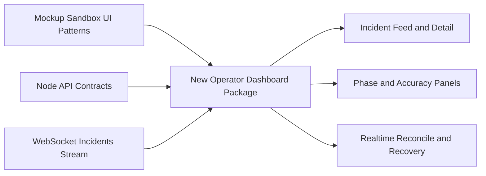

<!-- markdownlint-disable-file -->
# Task Research: Convert Mockup Sandbox Frontend to Operator Dashboard

Research to convert the Replit-style mockup canvas frontend into a production-grade operator dashboard application in fullstackapp/SRE-Command-Center.

Hard constraint enforced throughout this research:
- The frontend consumes only Node.js backend endpoints from the SRE Command Center API.
- The frontend does not know and must never depend on direct SRE-Agent internals.

## Task Implementation Requests

- Analyze current mockup-sandbox UI architecture and classify reusable vs disposable assets.
- Map backend API contracts in fullstackapp/SRE-Command-Center/lib and define strict integration boundaries.
- Reconcile implementation strategy with openspec/changes/phase-2-7-operator-dashboard.
- Produce exact, stepwise migration instructions that can become an actionable implementation plan.

## Scope and Success Criteria

* Scope: fullstackapp/SRE-Command-Center/artifacts/mockup-sandbox, openspec/changes/phase-2-7-operator-dashboard, fullstackapp/SRE-Command-Center/lib
* Assumptions:
  * Frontend runtime is under fullstackapp/SRE-Command-Center.
  * Backend API surface is authoritative from the Node.js app.
  * Existing OpenAPI and route handlers are sufficient to define dashboard data contracts.
  * Mockup sandbox contains UI patterns that can be selectively reused.
* Success Criteria:
  * This document provides plan-ready, exact migration steps and sequencing.
  * Frontend integration is fully bounded to Node.js backend contracts.
  * Multiple approaches are evaluated and one approach is selected with evidence-backed rationale.

## Outline

1. Baseline current mockup-sandbox structure and behavior.
2. Extract backend endpoint contracts and integration constraints.
3. Reconcile with phase-2-7 OpenSpec requirements and detect gaps.
4. Evaluate migration alternatives using weighted criteria.
5. Select one recommended approach.
6. Define exact migration steps, file-level changes, and verification checks.

## Potential Next Research

- Decide whether websocket transport should be formally published as a first-class contract artifact (OpenAPI extension vs AsyncAPI companion).
  - Reasoning: generated-client and test automation for realtime behavior.
  - Reference: fullstackapp/SRE-Command-Center/lib/api-spec/openapi.yaml:460-517
- Decide whether to normalize validation errors to 4xx with consistent error schema.
  - Reasoning: predictable frontend retry and error-boundary behavior.
  - Reference: fullstackapp/SRE-Command-Center/artifacts/api-server/src/middlewares/error-handler.ts:11-15
- Resolve phase wording drift (AUTONOMOUS/AUTOMATE/PREDICTIVE) across artifacts before UI labels are finalized.
  - Reasoning: stable operator mental model and analytics filters.
  - Reference: openspec/changes/autonomous-sre-agent/specs/operator-dashboard/spec.md:8-10

## Research Executed

### File Analysis

- fullstackapp/SRE-Command-Center/artifacts/mockup-sandbox/src/App.tsx
  - Current app shell is preview/gallery oriented, not production-routing oriented.
- fullstackapp/SRE-Command-Center/artifacts/mockup-sandbox/src/components/mockups/sre-dashboard/Dashboard.tsx
  - Static dashboard feed/KPI content and local mock state patterns.
- fullstackapp/SRE-Command-Center/artifacts/mockup-sandbox/src/components/mockups/sre-dashboard/IncidentDetail.tsx
  - Static detail/timeline/action rendering not bound to live API.
- fullstackapp/SRE-Command-Center/lib/api-spec/openapi.yaml
  - Contract coverage for incidents, timelines, phase status, accuracy summary, websocket message schemas.
- fullstackapp/SRE-Command-Center/artifacts/api-server/src/routes/incidents.ts
  - Runtime behavior for list/detail/timeline endpoints.
- fullstackapp/SRE-Command-Center/artifacts/api-server/src/ws/incidents.ts
  - Websocket endpoint path, sequence semantics, reconnect/resync support details.
- openspec/changes/phase-2-7-operator-dashboard/tasks.md
  - MVP task sequencing and acceptance intentions.

### Code Search Results

- search: incident endpoints and websocket implementation
  - Matched Node REST routes in artifacts/api-server and schemas in lib/api-spec.
- search: mockup dashboard data sources
  - Matched static constants and local state in mockup page components.
- search: generated frontend client
  - Matched lib/api-client-react generated hooks and custom fetch integration points.

### External Research

- None required. Findings are repository-grounded.

### Project Conventions

- Standards referenced:
  - CLAUDE.md architecture and workflow guidance.
  - AGENTS.md multi-agent boundary guidance.
- Instructions followed:
  - Task Researcher mode: delegated all research operations to Researcher Subagent.
  - Research document location and naming under .copilot-tracking/research/2026-05-31.

## Key Discoveries

### Project Structure

- Mockup frontend currently exists as artifacts/mockup-sandbox and is explicitly sandbox-oriented.
  - Evidence: fullstackapp/SRE-Command-Center/README.md:81
- API backend is implemented in artifacts/api-server and mounted under /api.
  - Evidence: fullstackapp/SRE-Command-Center/artifacts/api-server/src/app.ts:109-114
- Contract-first shared libraries exist and are usable now:
  - fullstackapp/SRE-Command-Center/lib/api-spec
  - fullstackapp/SRE-Command-Center/lib/api-zod
  - fullstackapp/SRE-Command-Center/lib/api-client-react

### Implementation Patterns

- Pattern 1: Reusable UI primitives + theming are production-viable.
  - Evidence: fullstackapp/SRE-Command-Center/artifacts/mockup-sandbox/src/index.css:6-137
  - Evidence: fullstackapp/SRE-Command-Center/artifacts/mockup-sandbox/src/components/ui/button.tsx:7-52
- Pattern 2: Page-level mock screens are static and need contract-backed refactor/replacement.
  - Evidence: fullstackapp/SRE-Command-Center/artifacts/mockup-sandbox/src/components/mockups/sre-dashboard/Dashboard.tsx:21-241
- Pattern 3: Backend endpoint surface for MVP already exists and is adequate for first production slice.
  - Evidence: fullstackapp/SRE-Command-Center/lib/api-spec/openapi.yaml:31-132
- Pattern 4: Realtime stream exists in implementation but path is not first-class in OpenAPI paths.
  - Evidence: fullstackapp/SRE-Command-Center/artifacts/api-server/src/ws/incidents.ts:14-16
  - Evidence: fullstackapp/SRE-Command-Center/lib/api-spec/openapi.yaml:460-517

### Complete Examples

```ts
// Example: strictly contract-bounded data access using generated hooks.
import {
  useListIncidents,
  useGetIncidentTimeline,
  useGetPhaseStatus,
} from "@workspace/api-client-react";

export function useDashboardData(incidentId?: string) {
  const incidents = useListIncidents({ limit: 50, offset: 0 });
  const phase = useGetPhaseStatus();
  const timeline = useGetIncidentTimeline(incidentId ?? "", {
    query: { enabled: Boolean(incidentId) },
  });

  return { incidents, phase, timeline };
}
```

### API and Schema Documentation

- REST endpoints verified for operator dashboard MVP:
  - GET /api/v1/incidents
  - GET /api/v1/incidents/:id
  - GET /api/v1/incidents/:id/timeline
  - GET /api/v1/phases/status
  - GET /api/v1/accuracy/summary
  - Source: fullstackapp/SRE-Command-Center/lib/api-spec/openapi.yaml:31-132
- Realtime channel implemented:
  - WS /api/ws/incidents with initial_state + incident_update and sequence/resync semantics.
  - Source: fullstackapp/SRE-Command-Center/artifacts/api-server/src/ws/incidents.ts:14-337
- Contract inconsistency found:
  - Invalid uuid/query currently surfaces as generic 500 payload instead of structured validation 4xx.
  - Source: fullstackapp/SRE-Command-Center/artifacts/api-server/src/middlewares/error-handler.ts:11-15

### Configuration Examples

```yaml
# Frontend runtime config target should remain Node API only.
api:
  baseUrl: "http://localhost:8081/api"
  realtime:
    incidentsSocketPath: "/ws/incidents"
ui:
  reconnectBanner: true
  strictContractMode: true
```

## Technical Scenarios

### Mockup-to-Production Dashboard Migration

Convert a preview-oriented mockup package into a production operator dashboard with low-risk incremental delivery while preserving a separate sandbox for design iteration.

**Requirements:**

* Frontend consumes only Node.js backend endpoints.
* Frontend has no direct coupling to SRE-Agent internals.
* Migration is incremental and testable with minimal user-facing regressions.
* Delivery aligns with phase-2-7 MVP behavior targets (realtime, responsiveness, reconnect/reconcile).

**Preferred Approach:**

* Create a new production dashboard package under artifacts, keep mockup-sandbox as design sandbox.
* Rationale:
  - Highest weighted alternative score (4.65).
  - Best alignment with current monorepo conventions.
  - Lowest migration blast radius while satisfying MVP needs from existing Node contracts.
  - Evidence: .copilot-tracking/research/subagents/2026-05-31/migration-alternatives-analysis-research.md

```text
fullstackapp/SRE-Command-Center/
  artifacts/
    mockup-sandbox/                     # retained for design and rapid visual iteration
    operator-dashboard/                 # new production runtime package
      package.json
      src/main.tsx
      src/app/router.tsx
      src/app/providers.tsx
      src/features/incidents/
        incident-feed-page.tsx
        incident-detail-page.tsx
        timeline-panel.tsx
      src/features/phases/
        phase-status-panel.tsx
      src/features/accuracy/
        accuracy-summary-panel.tsx
      src/lib/api/
        client.ts
        mappers.ts
      src/lib/realtime/
        incidents-socket.ts
        reconcile.ts
      src/shared/ui/                    # imported/copied primitives from sandbox as needed
      src/shared/state/
        query-client.ts
      src/test/
        contract-mappers.test.ts
        realtime-reconcile.test.ts
```



**Implementation Details:**

Exact migration steps (implementation-ready):

1. Establish production package shell
- Create artifacts/operator-dashboard with scripts mirroring workspace package conventions.
- Reuse React/Tailwind stack from mockup-sandbox, but do not include preview plugin mechanics.
- References:
  - fullstackapp/SRE-Command-Center/pnpm-workspace.yaml:37-41
  - fullstackapp/SRE-Command-Center/artifacts/mockup-sandbox/vite.config.ts:21-30

2. Wire strict contract-only API access
- Configure api client base URL to Node API server (/api).
- Use generated hooks from lib/api-client-react for all REST calls.
- Add a small mapper layer to convert DTOs into stable UI view models.
- References:
  - fullstackapp/SRE-Command-Center/lib/api-client-react/src/index.ts:1-4
  - fullstackapp/SRE-Command-Center/lib/api-spec/openapi.yaml:31-132

3. Implement MVP page sequence in this order
- 3.1 Incident feed page backed by GET /api/v1/incidents.
- 3.2 Incident detail page backed by GET /api/v1/incidents/:id and timeline endpoint.
- 3.3 Phase status panel and accuracy summary panel.
- References:
  - fullstackapp/SRE-Command-Center/lib/api-spec/openapi.yaml:31-132
  - openspec/changes/phase-2-7-operator-dashboard/tasks.md:1-40

4. Add realtime stream and reconciliation logic
- Connect to WS /api/ws/incidents.
- Apply initial_state snapshot, then ordered incident_update events.
- Detect sequence/resync mismatch and recover by refetching incidents list.
- Show reconnect status banner and post-recovery notice.
- References:
  - fullstackapp/SRE-Command-Center/artifacts/api-server/src/ws/incidents.ts:14-337
  - openspec/changes/phase-2-7-operator-dashboard/specs/dashboard-mvp/spec.md:37-42

5. Port visuals from mockup selectively
- Reuse component primitives and visual structure.
- Remove or redact any mock content implying direct internal SRE-Agent knowledge not present in Node API payloads.
- References:
  - fullstackapp/SRE-Command-Center/artifacts/mockup-sandbox/src/components/mockups/sre-dashboard/AgentStatus.tsx:214-224
  - fullstackapp/SRE-Command-Center/lib/api-spec/openapi.yaml:160-459

6. Implement resilience and UX states
- Add loading/empty/error/offline states for every page.
- Normalize mixed backend error payloads ({code,message} and {error}) in one adapter.
- References:
  - fullstackapp/SRE-Command-Center/artifacts/api-server/src/routes/response-helpers.ts:24-29
  - fullstackapp/SRE-Command-Center/artifacts/api-server/src/middlewares/error-handler.ts:11-15

7. Testing and acceptance verification
- Add component tests for feed/detail/reconnect behaviors.
- Add realtime reconciliation tests with simulated sequence gaps.
- Add E2E checks for phase-2-7 SHALL behaviors and performance budgets.
- References:
  - openspec/changes/phase-2-7-operator-dashboard/specs/dashboard-mvp/spec.md:7-56
  - openspec/changes/phase-2-7-operator-dashboard/tasks.md:42-46

8. Keep sandbox alive and decoupled
- Retain mockup-sandbox for design exploration.
- Avoid shared runtime coupling by keeping production logic in operator-dashboard package.
- References:
  - fullstackapp/SRE-Command-Center/README.md:76-86

```ts
// Realtime reconciliation skeleton aligned to Node WS contract.
type InitialState = {
  type: "initial_state";
  sequence: number;
  resyncToken: string;
  incidents: Array<{ incidentId: string; version: number }>;
};

type IncidentUpdate = {
  type: "incident_update";
  sequence: number;
  resyncToken: string;
  incident: { incidentId: string; version: number };
};

export function shouldResync(lastSeq: number, nextSeq: number, tokenChanged: boolean) {
  return tokenChanged || nextSeq !== lastSeq + 1;
}
```

#### Considered Alternatives

1. In-place refactor of artifacts/mockup-sandbox
- Rejected because it couples production runtime with preview/gallery architecture and raises long-term maintenance risk.
- Evidence:
  - fullstackapp/SRE-Command-Center/artifacts/mockup-sandbox/src/App.tsx:99-144
  - fullstackapp/SRE-Command-Center/README.md:81

2. New production package, keep sandbox (selected)
- Selected for best weighted score, clean separation of concerns, and lowest practical migration risk.
- Evidence:
  - .copilot-tracking/research/subagents/2026-05-31/migration-alternatives-analysis-research.md

3. Greenfield replacement of sandbox
- Rejected because it creates high disruption and removes useful design workflow with limited MVP upside over approach 2.
- Evidence:
  - fullstackapp/SRE-Command-Center/README.md:76-86

## Evidence Log (Consolidated)

- .copilot-tracking/research/subagents/2026-05-31/mockup-sandbox-analysis-research.md
- .copilot-tracking/research/subagents/2026-05-31/backend-api-contracts-analysis-research.md
- .copilot-tracking/research/subagents/2026-05-31/openspec-phase-2-7-analysis-research.md
- .copilot-tracking/research/subagents/2026-05-31/migration-alternatives-analysis-research.md

## Final Recommendation

Proceed with a new production package at artifacts/operator-dashboard and keep artifacts/mockup-sandbox as a design sandbox.

Why this is the most precise path for this repository:
- It satisfies the backend-only integration constraint with zero dependency on SRE-Agent internals.
- It maps directly to already-implemented Node endpoints and websocket semantics.
- It minimizes risk while enabling strict, testable phase-2-7 acceptance progression.
