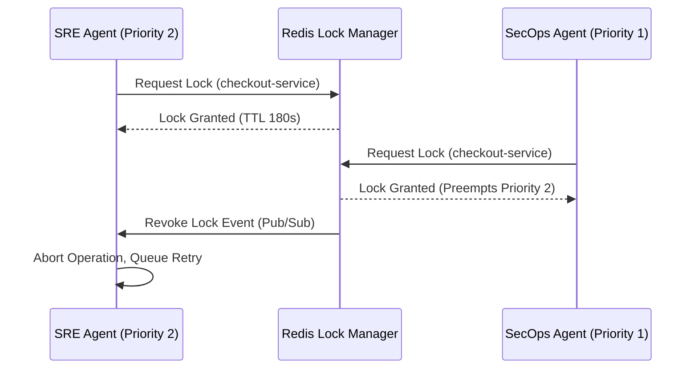

# Multi-Agent Ecosystem (AGENTS.md)

This document defines the overarching AI Agent ecosystem within this repository. While the primary focus is the **Autonomous SRE Agent**, this system is designed to operate in a shared, multi-agent environment where different specialized AI agents orchestrate distinct domains of the infrastructure.

To prevent agents from creating conflicting states (e.g., an SRE agent resolving a latency issue by scaling up, while a FinOps agent simultaneously resolves a cost alert by scaling down), all agents adhere to strict coordination protocols defined in the Orchestration Layer.

---

## 1. The Autonomous SRE Agent (Primary)

The core agent built and maintained within this repository. 

*   **Role:** Site Reliability / Infrastructure Health
*   **Mission:** Detect, diagnose, and remediate infrastructure incidents (OOM kills, high latency, errors, disk exhaustion) to minimize Mean Time to Recovery (MTTR).
*   **Operating Scope:** 
    *   Kubernetes Pods, Deployments, StatefulSets
    *   GitOps Repositories (ArgoCD / Flux)
    *   Certificate Managers
    *   AWS: ECS Tasks/Services, EC2 Auto Scaling Groups, Lambda Functions *(Phase 1.5)*
    *   Azure: App Services, Azure Functions (Premium Plan) *(Phase 1.5)*
*   **Required Permissions:** 
    *   `kubectl` `restart`, `scale`, `patch` on specific namespaces.
    *   Write access to Infrastructure Git Repositories (to generate Revert PRs).
    *   AWS IAM: `ecs:StopTask`, `ecs:UpdateService`, `autoscaling:SetDesiredCapacity`, `lambda:PutFunctionConcurrency` *(Phase 1.5)*
    *   Azure RBAC: `Microsoft.Web/sites/restart/Action`, `Microsoft.Web/serverfarms/write` (Web Plan Contributor) *(Phase 1.5)*
*   **Conflict Priority Level:** **Medium (Level 2)** 
    *   SRE actions supersede Cost/FinOps actions.
    *   SRE actions yield to Security/SecOps actions.

---

## 2. The Autonomous SecOps Agent (Hypothetical / External)

A specialized agent focused entirely on cluster and application security.

*   **Role:** Security Operations / Threat Response
*   **Mission:** Detect anomalous access patterns, unauthorized privilege escalations, and known CVE exploitations; execute immediate quarantines.
*   **Operating Scope:**
    *   Node cordoning / taint application
    *   Network Policy enforcement (isolation)
    *   IAM Role / ServiceAccount revokation
*   **Conflict Priority Level:** **High (Level 1 - Override)**
    *   If the SecOps Agent requires a lock on a Node to quarantine it, it will preempt or deny any lock request from the SRE Agent attempting to schedule pods on that node.

---

## 3. The Autonomous FinOps Agent (Hypothetical / External)

A specialized agent optimizing infrastructure for cost-efficiency.

*   **Role:** Cloud Cost Optimization
*   **Mission:** Identify over-provisioned resources and safe down-scaling opportunities during off-peak hours to minimize cloud spend.
*   **Operating Scope:**
    *   Horizontal Pod Autoscaler (HPA) min/max tuning
    *   Cluster Autoscaler node pool scaling
    *   Volume detachment/resizing
*   **Conflict Priority Level:** **Low (Level 3)**
    *   If a service is currently under active load/incident investigation by the SRE Agent, the FinOps Agent is denied locks to scale down resources. Reliability always trumps Cost during an active incident.

---

## Agent Coordination Guidelines

All agents within this ecosystem MUST adhere to the **Multi-Agent Lock Protocol** (backed by Redis/etcd).

### 1. The Lock Schema
When requesting a lock, the agent must write the following structured data to the distributed store:
```json
{
  "agent_id": "sre-agent-prod-01",
  "resource_type": "deployment",
  "resource_name": "checkout-service",
  "namespace": "prod",
  "compute_mechanism": "KUBERNETES",
  "resource_id": "deployment/checkout-service",
  "provider": "kubernetes",
  "priority_level": 2,
  "acquired_at": "2024-03-01T12:00:00Z",
  "ttl_seconds": 180,
  "fencing_token": 948271
}
```

> **Phase 1.5 Note:** For non-Kubernetes targets, `namespace` may be empty. The `resource_id` field (e.g., ECS Task ARN, Lambda Function ARN, Azure Resource URI) serves as the canonical identifier. The `compute_mechanism` field (`KUBERNETES`, `SERVERLESS`, `VIRTUAL_MACHINE`, `CONTAINER_INSTANCE`) and `provider` field (`kubernetes`, `aws`, `azure`) together determine which `CloudOperatorPort` adapter handles remediation.

Example for an AWS Lambda target:
```json
{
  "agent_id": "sre-agent-prod-01",
  "resource_type": "function",
  "resource_name": "payment-handler",
  "namespace": "",
  "compute_mechanism": "SERVERLESS",
  "resource_id": "arn:aws:lambda:us-east-1:123456789:function:payment-handler",
  "provider": "aws",
  "priority_level": 2,
  "acquired_at": "2024-03-01T12:00:00Z",
  "ttl_seconds": 180,
  "fencing_token": 948272
}
```

### 2. Preemption Protocol
Conflict resolution is handled deterministically based on `priority_level`.



### 3. Cooling Off Implementation
To prevent oscillation loops, once an agent completes an action and releases the primary lock, it MUST write a "Cooling Off" key.
*   **Key Format (Kubernetes):** `cooldown:{namespace}:{resource_type}:{resource_name}`
*   **Key Format (Non-K8s, Phase 1.5):** `cooldown:{provider}:{compute_mechanism}:{resource_id}`
    *   Example: `cooldown:aws:SERVERLESS:arn:aws:lambda:us-east-1:123456789:function:payment-handler`
*   **Value:** `{"last_actor": "sre-agent", "action": "scale_up", "compute_mechanism": "SERVERLESS", "timestamp": "..."}`
*   **TTL:** Configured per resource type (default 15 minutes).
*   **Enforcement:** The Lock Manager will deny any new lock requests for a resource while its Cooldown key exists, unless the request is from a higher-priority agent (e.g., SecOps overriding SRE).

### 4. Human Supremacy
Any human operator possessing elevated credentials can override agent locks, forcibly release them, or trigger the global agent **Kill Switch**. When human intervention is detected on a resource, all autonomous agents immediately back off and yield control.
