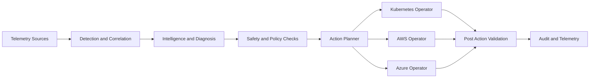

[](scripts/dev/run.sh)
[](pyproject.toml)
[](pyproject.toml)
[](pyproject.toml)

## Autonomous reliability operations for modern platforms

Autonomous SRE Agent is an AI-powered reliability system that executes the full incident loop from signal ingestion to controlled remediation. The project is built for production-minded teams who need faster recovery with strict operational guardrails.

What you get:

* Detection, diagnosis, and remediation in one cohesive system
* Cross-platform operators for Kubernetes, AWS, and Azure
* Safety controls designed for real infrastructure, not toy automation
* Clean architecture with testable domain logic and replaceable adapters

## Why this repository is high leverage

* Incident lifecycle automation reduces manual triage time and operational fatigue
* Retrieval-grounded intelligence improves diagnostic signal quality
* Locking, cooldown, and human override controls prevent conflicting actions
* Rich demo suite validates behavior across realistic failure scenarios

Start with [Architecture overview](docs/architecture/overview.md) and [Getting started](docs/getting-started.md).

## Core capabilities

| Capability area | What it does | Where to go deeper |
|---|---|---|
| Detection pipeline | Ingests and normalizes telemetry, detects anomalies, correlates signals | [Architecture overview](docs/architecture/overview.md) |
| Intelligence layer | Produces diagnosis and remediation intent with constrained execution | [System architecture deep dive](docs/architecture/architecture.md) |
| Remediation operators | Executes controlled actions for Kubernetes, AWS, and Azure | [Permissions and RBAC](docs/architecture/permissions-and-rbac.md) |
| Multi-agent coordination | Prevents action collisions via lock protocol, priority, and cooldown | [Multi-agent coordination](docs/architecture/multi-agent-coordination.md) |
| Safety controls | Enforces guardrails, kill switch, and blast-radius policies | [Guardrails configuration](docs/security/guardrails_configuration.md) |

## Architecture at a glance



Detailed sequence and trust model:

* [Incident lifecycle sequence](docs/architecture/sequence_incident_lifecycle.md)
* [Architecture overview](docs/architecture/overview.md)

## Quick start

```bash
bash scripts/dev/run.sh setup
cp .env.example .env
bash scripts/dev/setup_deps.sh start
bash scripts/dev/run.sh test:unit
bash scripts/dev/run.sh server --reload
```

Open API docs at <http://localhost:8080/docs>.

For deterministic setup, prerequisites, and troubleshooting, use [Getting started](docs/getting-started.md).

## Live demos that showcase full potential

This repository includes an execution-validated live demo suite for incident response workflows.

* Canonical guide: [Live incident response demonstrations](docs/operations/live_demo_guide.md)
* Validation summary in docs: full suite recorded as `PASS 25`, `FAIL 0`, `TIMEOUT 0`

Example run:

```bash
SKIP_PAUSES=1 .venv/bin/python scripts/demo/live_demo_06_http_optimizations.py
```

Demo categories include:

* Telemetry baseline and anomaly simulation
* HTTP incident diagnosis with token optimization and caching
* AWS and Azure operator behaviors
* Kubernetes operations with simulation and live execution modes
* Multi-agent lock protocol, preemption, cooldown, and human override

## Safety by design

> [!WARNING]
> This project can execute infrastructure actions. Use least-privilege credentials, keep kill-switch procedures ready, and validate guardrail policy before enabling autonomous behavior.

Operational safety references:

* [Permissions and RBAC](docs/architecture/permissions-and-rbac.md)
* [Guardrails configuration](docs/security/guardrails_configuration.md)
* [Kill switch runbook](docs/operations/runbooks/kill_switch.md)
* [Incident response runbook](docs/operations/runbooks/incident_response.md)

## Documentation map

| If you need to | Go here |
|---|---|
| Onboard quickly | [Getting started](docs/getting-started.md) |
| Understand system design | [Architecture docs](docs/architecture/) |
| Run and operate safely | [Operations runbooks](docs/operations/runbooks/) |
| Build and contribute features | [Development docs](docs/development/README.md) |
| Find commands and stable references | [Reference docs](docs/reference/README.md) |
| Browse full documentation index | [Documentation index](docs/README.md) |

## Project layout

```text
src/sre_agent/         # Domain, adapters, API, ports, events
tests/                 # Unit, integration, and end-to-end tests
scripts/               # Dev workflow, demos, validation utilities
config/                # Agent configuration
docs/                  # Architecture, operations, security, reference
infra/                 # Local and Kubernetes infrastructure assets
```

## Contributing

Contributions are welcome from reliability engineers, platform teams, and AI infra practitioners.

Before opening a pull request, read:

* [Contributing guide](CONTRIBUTING.md)
* [Release and security sign-off checklist](CONTRIBUTING.md#github-pr-checklist-for-release-and-security-sign-off)
* [Engineering standards](docs/project/standards/engineering_standards.md)
* [Testing strategy](docs/testing/testing_strategy.md)

## License

MIT License.
