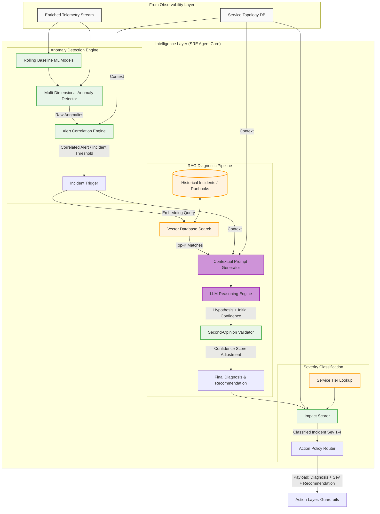

# Intelligence Layer Architecture

This document details the "brain" of the SRE Agent: The Intelligence Layer. This layer is responsible for ingesting enriched telemetry, detecting anomalies via ML baselines, diagnosing root causes using an LLM and Retrieval-Augmented Generation (RAG), and classifying incident severity.

## Component Details

1. **Anomaly Detection Engine:** Replaces static thresholds. It computes rolling baselines for metrics and flags multi-dimensional anomalies (e.g., latency spikes combined with error surges). The Alert Correlation Engine groups related anomalies using the Dependency Graph to prevent alert storms.
2. **RAG Diagnostic Pipeline:** Uses semantic search against a Vector DB containing past post-mortems and runbooks to ground the LLM's reasoning. A second-opinion validator acts as a check against LLM hallucination, adjusting the confidence score based on concrete evidence.
3. **Severity Classification:** Determines the business impact using service tiers and blast radius, categorizing the incident from Sev 1 (Critical, Human Only) to Sev 4 (Minor, Fully Autonomous).
