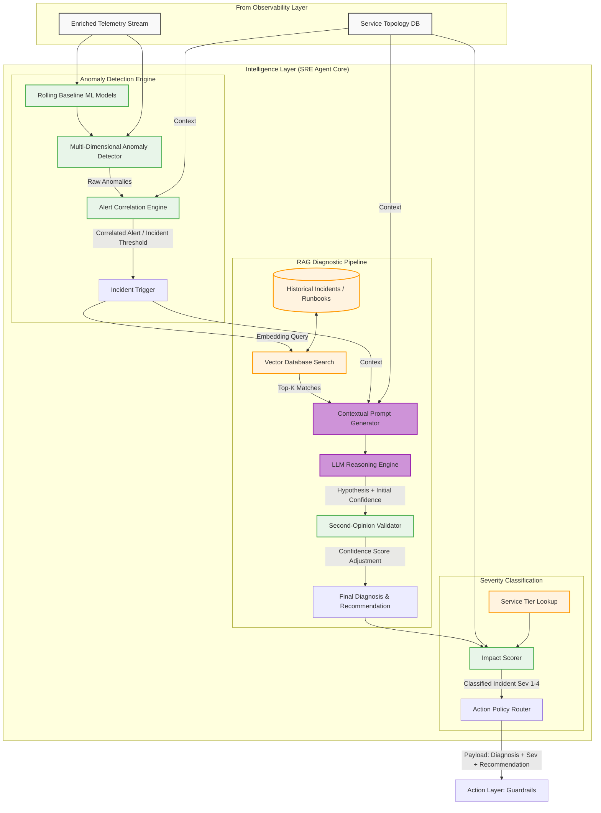

# Intelligence Layer Architecture

**Status:** DRAFT
**Version:** 1.0.0

This document details the "brain" of the SRE Agent: The Intelligence Layer. This layer is responsible for ingesting enriched telemetry, detecting anomalies via ML baselines, diagnosing root causes using an LLM and Retrieval-Augmented Generation (RAG), and classifying incident severity.

## Component Details

1. **Anomaly Detection Engine:** Replaces static thresholds. It computes rolling baselines for metrics and flags multi-dimensional anomalies (e.g., latency spikes combined with error surges). The Alert Correlation Engine groups related anomalies using the Dependency Graph to prevent alert storms.
2. **RAG Diagnostic Pipeline:** Uses semantic search against a Vector DB containing past post-mortems and runbooks to ground the LLM's reasoning. A second-opinion validator acts as a check against LLM hallucination, adjusting the confidence score based on concrete evidence.
3. **Severity Classification:** Determines the business impact using service tiers and blast radius, categorizing the incident from Sev 1 (Critical, Human Only) to Sev 4 (Minor, Fully Autonomous).

---

## Detailed Architecture

# Intelligence Layer: Detailed Breakdown

**Status:** DRAFT
**Version:** 1.0.0

This document provides a comprehensive breakdown of the **Intelligence (Cognitive) Layer** of the SRE Agent. It details the core features, external libraries, and dependencies required to detect anomalies, reason over historical data, and classify incident severity.

## 1. Core Features

The Intelligence Layer acts as the "brain," shifting the system from reactive alerting to proactive reasoning and diagnosis.

### 1.1 ML-Driven Anomaly Detection
*   **Rolling Baselines:** Continuously computes normal operating ranges for metrics instead of relying on static, hard-coded thresholds.
*   **Multi-Dimensional Correlation:** Identifies "soft" anomalies that only become critical when multiple metrics deviate simultaneously (e.g., slight latency + slight error increase).
*   **Predictive Exhaustion:** Projects current trends forward to predict when resources (disk, memory, connection pools) will be exhausted.

### 1.2 RAG Diagnostic Pipeline
*   **Semantic Alert Context:** Converts raw numeric alerts into rich vector embeddings.
*   **Historical Grounding (RAG):** Searches a knowledge base of past post-mortems and runbooks to find similar incidents.
*   **LLM Hypothesis Generation:** Feeds the retrieved historical evidence and the live telemetry into an LLM to generate a reasoned root cause path.
*   **Second-Opinion Validation:** An isolated secondary model or rule engine cross-checks the LLM's logic to mitigate hallucinations and adjust the confidence score.

### 1.3 Severity Classification & Impact Scoring
*   **Blast Radius Evaluation:** Uses the Dependency Graph (from the Observability Layer) to determine how many upstream users/services are affected.
*   **Tier Check:** Elevates severity if the affected component is a Tier-1 revenue-generating service.
*   **Action Routing:** Finalizes the incident as Sev 1–4, strictly gating whether the agent is allowed to act autonomously (Sev 3-4) or must wait for human approval (Sev 1-2).

---

## 2. External Libraries & Dependencies

The Intelligence Layer leverages modern ML frameworks, LLMs, and Vector databases to perform context-aware reasoning.

### 2.1 Large Language Models (LLMs) & Orchestration

| Dependency | Component Type | Purpose in the SRE Agent |
| :--- | :--- | :--- |
| **LangChain** (or LlamaIndex) | Orchestration Framework | Manages the complex multi-step prompt chains, coordinates RAG retrieval, and handles output parsing (forcing the LLM to return structured JSON). |
| **OpenAI GPT-4o / Anthropic Claude 3.5 Sonnet** | Cloud LLM Provider | The primary reasoning engine for generating root-cause hypotheses based on complex, multi-variable telemetry data. |
| **Meta Llama 3** (Optional) | Self-Hosted LLM | Used in high-security, air-gapped environments where telemetry data cannot legally leave the corporate network. |
| **Second-Opinion Model** | Alternative LLM / Rules Engine | A smaller, cheaper model (like GPT-4o-mini or rule-based heuristics) used strictly to double-check the primary LLM's logic and catch obvious hallucinations. |

### 2.2 Vector Storage & Retrieval (The Knowledge Base)

| Dependency | Component Type | Purpose in the SRE Agent |
| :--- | :--- | :--- |
| **Pinecone** (or Weaviate/Chroma) | Vector Database | Stores vector embeddings of all historical incidents, post-mortems, Slack conversations, and runbooks for fast semantic similarity search. |
| **OpenAI text-embedding-3-large** | Embedding Model | The mathematical model that translates textual incident data and numerical alerts into a massive array of numbers (vectors) so the database can measure "similarity." |

### 2.3 Machine Learning & Data Science (Python Core)

| Python Library | Purpose |
| :--- | :--- |
| `scikit-learn` | Used for statistical baseline modeling (e.g., Isolation Forests) to detect standard metric anomalies without deep learning overhead. |
| `prophet` (by Meta) | Specifically tuned for processing time-series data with strong seasonal effects (determining daily/weekly traffic patterns to detect off-hour anomalies). |
| `pandas` & `numpy` | The foundational data manipulation libraries utilized to clean, slice, and aggregate the raw telemetry streams before feeding them to the ML models or the LLM. |
| `pydantic` | Used continuously to enforce strict data validation. It ensures that output generated by the LLM strictly adheres to the required schema before it is passed to the Action Layer. |

---

## 3. Data Flow Example: Diagnosing a DB Connection Leak

1. **Ingestion:** The Anomaly Detector flags that `Service-X` connection pool utilization has crept from 40% to 95% over the last two hours.
2. **Context Gathering:** `LangChain` queries the Observability Layer and retrieves the logs for `Service-X`, revealing "Timeout acquiring connection" errors.
3. **Embedding & Search:** The prompt is embedded and sent to **Pinecone**. Pinecone returns a post-mortem from 6 months ago stating *"Version 4.1 introduced a connection leak when retrying failed payments."*
4. **Reasoning:** The **Claude 3.5** API is prompted with the current metrics, logs, and the historical post-mortem. It deduces a 92% probability that this is a recurring leak.
5. **Validation:** The `pydantic` parser checks the LLM output. The **Second-Opinion Validator** confirms that `Service-X` is indeed running a vulnerable version.
6. **Classification & Handoff:** The Impact Scorer marks this as a Sev-3 (single service, isolated leak). It routes a JSON payload to the Action Layer recommending a "Rolling restart of `Service-X` deployment."
