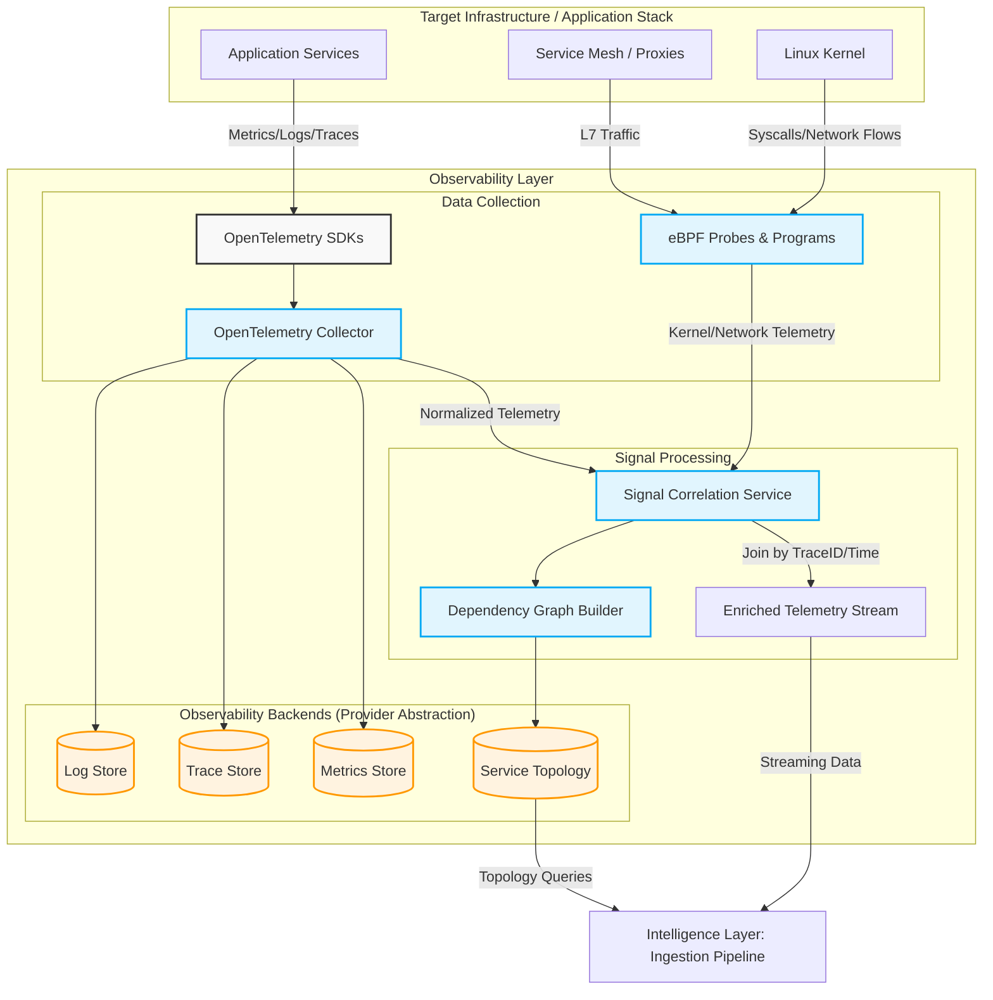

# Observability Layer Architecture

**Status:** DRAFT
**Version:** 1.0.0

This document details the first layer of the SRE Agent architecture: The Observability Layer. Its primary responsibility is gathering high-fidelity telemetry across the entire stack, correlating it, and constructing the service dependency graph before passing the data to the Intelligence Layer.

## Component Details

1. **OpenTelemetry Collection:** Handles application-layer metrics, structured logs, and distributed traces. 
2. **eBPF Programs:** Adds deep kernel-level visibility (network flows, process behavior, syscalls) without requiring sidecar proxies or code changes, operating at a ~1-2% CPU overhead.
3. **Signal Correlation Service:** The critical junction where application traces and kernel spans are joined by TraceID and time windows, creating a unified view of the system.
4. **Dependency Graph Builder:** Continuously analyzes trace spans to map out the real-time service topology, which is essential for determining blast radius and alert correlation later in the pipeline.

---

## Detailed Architecture

# Observability Layer: Detailed Breakdown

**Status:** DRAFT
**Version:** 1.0.0

This document provides a comprehensive breakdown of the **Observability Layer** of the SRE Agent. It details the core features, external libraries, and dependencies required to gather, process, and correlate high-fidelity telemetry.

## 1. Core Features

The Observability Layer must reliably ingest massive volumes of data and translate it into a structured, unified stream that the Intelligence Layer can reason over.

### 1.1 Multi-Signal Telemetry Ingestion
*   **Metrics Collection:** Gathers time-series data (CPU, memory, request rates, error rates, latency percentiles).
*   **Log Ingestion:** Collects structured application logs and system logs.
*   **Distributed Tracing:** Assembles end-to-end request traces across microservice boundaries.
*   **Kernel-Level Telemetry:** Captures deep system behavior (syscalls, raw network flows, thread state) transparently.

### 1.2 Signal Correlation
*   **Trace ID Stitching:** Stitches together logs and metrics that share the same Trace ID to provide a unified context for a single request.
*   **Time-Window Alignment:** Aligns disparate data streams (e.g., matching a spike in CPU usage with log errors occurring in the exact same 5-second window).

### 1.3 Topology & Dependency Discovery
*   **Real-time Service Graph:** Continuously maps which services communicate with each other by analyzing trace span parents and children.
*   **Blast Radius Calculation:** Uses the dependency graph to determine the potential downstream impact if a specific service degrades.

### 1.4 Provider Abstraction (Portability)
*   **Adapter Pattern:** Ensures the Intelligence Layer never queries "Prometheus" or "Jaeger" directly, but instead queries a canonical `MetricsPort` or `TracePort`.
*   **Degraded Mode Detection:** Automatically flags when a telemetry backend (like the OTel Collector) is down, preventing the agent from misdiagnosing a blind spot as "healthy."

---

## 2. External Libraries & Dependencies

The Observability Layer relies heavily on industry-standard open-source observability tools to avoid reinventing the wheel.

### 2.1 Application Telemetry (The OpenTelemetry Ecosystem)

| Dependency | Component Type | Purpose in the SRE Agent |
| :--- | :--- | :--- |
| **OpenTelemetry (OTel) SDKs** | Application Library (Java/Go/Python/Node) | Instrumented within the target applications to emit metrics, structured logs, and distributed traces. It is the raw data source. |
| **OpenTelemetry Collector** | Infrastructure Service | Acts as a vendor-agnostic proxy/router. Receives OTLP data from SDKs, processes/filters it, and exports it to the storage backends. Essential for decoupling the agent from specific vendors. |

### 2.2 Deep System Telemetry (The eBPF Ecosystem)

| Dependency | Component Type | Purpose in the SRE Agent |
| :--- | :--- | :--- |
| **Cilium / Tetragon** (or Pixie) | eBPF Agent / DaemonSet | Runs on K8s nodes to capture network flows (even within encrypted service meshes like Istio), DNS lookups, and critical syscalls without requiring application code changes. |
| **libbpf / bcc** | Kernel Libraries | The underlying Linux libraries that allow safe loading and execution of eBPF programs in the kernel space. |

### 2.3 Storage Backends (The Default Stack)

While the agent is provider-agnostic, it requires actual databases to store the ingested telemetry. The default, open-source stack includes:

| Dependency | Component Type | Purpose in the SRE Agent |
| :--- | :--- | :--- |
| **Prometheus** (or Grafana Mimir) | Time-Series Database (TSDB) | Stores the metrics exported by the OTel Collector. Queried via PromQL. |
| **Jaeger** (or Grafana Tempo) | Distributed Tracing Backend | Stores the trace spans. Crucial for the Dependency Graph Builder to reconstruct request paths. |
| **Loki** (or Elasticsearch/OpenSearch) | Log Aggregation System | Stores structured logs. Preferred Loki due to its tight integration with Prometheus labels. |
| **Neo4j** (or internal in-memory graph) | Graph Database | Stores the real-time Service Dependency Graph. Used by the Intelligence Layer to understand topology. |

### 2.4 Agent Internal Libraries (Python Core)

If the SRE Agent is built in Python (as proposed in the tech stack), the Observability Layer will utilize these specific libraries:

| Python Library | Purpose |
| :--- | :--- |
| `opentelemetry-api` & `opentelemetry-sdk` | Used internally by the agent to monitor its *own* health and trace its *own* decision-making loops. |
| `prometheus-api-client` | The concrete implementation of the `MetricsAdapter` used to query Prometheus for anomaly detection baselines. |
| `networkx` | A Python package for the creation, manipulation, and study of the structure, dynamics, and functions of complex graphs; used for building and traversing the Service Dependency Graph in memory. |
| `aiohttp` or `httpx` | Asynchronous HTTP clients for making high-concurrency requests to the various observability backends without blocking the agent's main event loop. |

---

## 3. Data Flow Example: A High-Latency Request

1. **Generation:** A user request hits `Service-A`. The **OTel SDK** intercepts the request, generates a `TraceID`, and records a latency of `2500ms`.
2. **Deep Context:** Simultaneously, the **eBPF Probe** on the node records that `Service-A` spent `2000ms` blocked on a DNS resolution syscall.
3. **Collection:** Both data points are sent to the **OpenTelemetry Collector**.
4. **Storage:** The Collector routes the trace span to **Jaeger** and the latency metric to **Prometheus**.
5. **Correlation (Inside SRE Agent):** The **Signal Correlation Service** queries both backends, matching the time window and TraceID. It constructs a unified event: *"Service-A latency spiked due to underlying DNS resolution failure, affecting dependent Service-B and Service-C (as per the Dependency Graph)."*
6. **Handoff:** This correlated, enriched event is passed to the Intelligence Layer for diagnosis.
