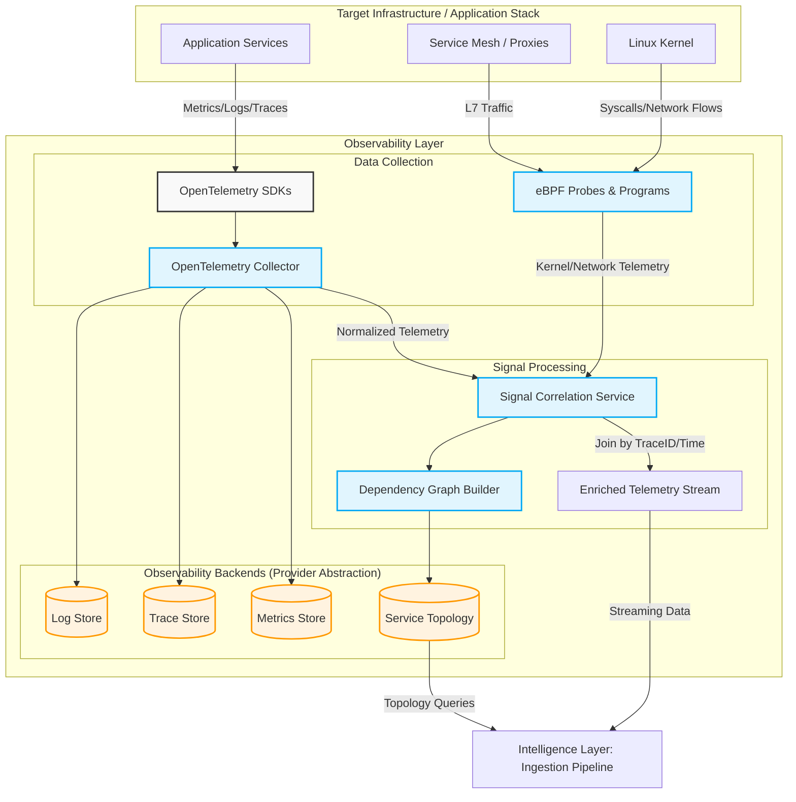

# Observability Layer Architecture

This document details the first layer of the SRE Agent architecture: The Observability Layer. Its primary responsibility is gathering high-fidelity telemetry across the entire stack, correlating it, and constructing the service dependency graph before passing the data to the Intelligence Layer.

## Component Details

1. **OpenTelemetry Collection:** Handles application-layer metrics, structured logs, and distributed traces. 
2. **eBPF Programs:** Adds deep kernel-level visibility (network flows, process behavior, syscalls) without requiring sidecar proxies or code changes, operating at a ~1-2% CPU overhead.
3. **Signal Correlation Service:** The critical junction where application traces and kernel spans are joined by TraceID and time windows, creating a unified view of the system.
4. **Dependency Graph Builder:** Continuously analyzes trace spans to map out the real-time service topology, which is essential for determining blast radius and alert correlation later in the pipeline.
