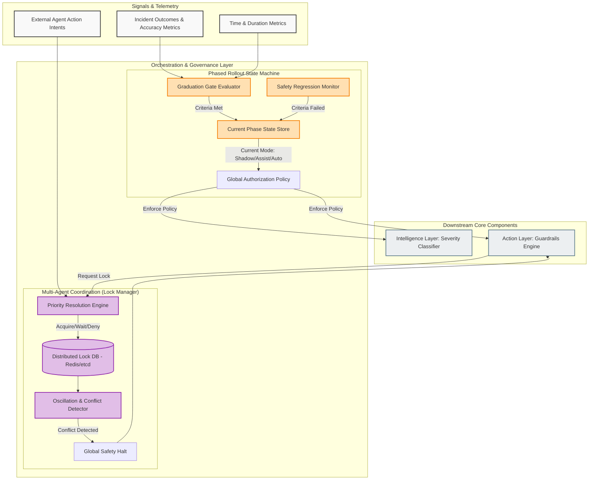

# Orchestration & Governance Layer

**Status:** DRAFT
**Version:** 1.0.0

This document details the Orchestration and Governance Layer of the SRE Agent. This layer does not diagnose specific incidents; rather, it governs the overall behavior of the agent, ensuring it adheres to its authorized autonomy level and does not conflict with other automated systems.

---

## Detailed Architecture

# Orchestration & Governance Layer: Detailed Breakdown

**Status:** DRAFT
**Version:** 1.0.0

This document provides a comprehensive breakdown of the **Orchestration & Governance Layer** of the SRE Agent. While the core pipeline (Observability → Intelligence → Action) handles individual incidents, this layer handles the *macro-level state* of the agent. 

## 1. Core Features

The Governance Layer ensures the agent stays within its authorized boundaries, graduates through its rollout phases safely, and plays nicely in an ecosystem that may contain other automated actors.

### 1.1 Phased Rollout State Machine
*   **State Persistence:** Maintains the current authorized mode of the agent (Phase 1: Shadow, Phase 2: Assist, Phase 3: Autonomous, Phase 4: Predictive).
*   **Graduation Gate Evaluation:** Continuously measures the agent's performance against the hard-coded requirements (detailed in [Graduation Criteria](../../operations/graduation_criteria.md)) to graduate to the next phase.
*   **Automatic Regression:** If the agent is in Phase 3 (Autonomous) but suddenly begins failing its safety criteria (e.g., causes a regression post-remediation), the State Machine automatically reverts the agent back to Phase 2 (Assist) and alerts engineering leadership.

### 1.2 Multi-Agent Coordination (Lock Manager)
*   **Distributed Mutex:** Before taking action on a service, the agent must acquire a lock on that resource. This prevents the SRE Agent from restarting a pod at the exact same moment a CD pipeline is deploying to it, or a FinOps agent is scaling it down.
*   **Priority Hierarchy:** Resolves contentions deterministically. If the SecOps Agent wants to quarantine a node, and the SRE Agent wants to restart a pod on that node, Security takes precedence.
*   **Oscillation Detection:** Monitors the history of locks. If a resource is locked, modified, unlocked, and locked again repeatedly (e.g., SRE scales up, FinOps scales down), it detects the "oscillation loop," halts all automated actions on that resource, and escalates to a human.

---

## 2. External Libraries & Dependencies

The Orchestration Layer requires highly reliable, strongly consistent datastores and logic frameworks to manage distributed state.

### 2.1 State & Lock Management

| Dependency | Component Type | Purpose in the SRE Agent |
| :--- | :--- | :--- |
| **Redis** (or **etcd**) | Distributed Datastore | The critical component for the Lock Manager. It provides fast, atomic operations required to implement distributed mutexes (e.g., using Redlock algorithm). Also stores the persistent Phase State. |
| **PostgreSQL** (or MySQL) | Relational Metadata Store | Stores the long-term historical data required for graduation evaluations (e.g., logging the outcome of the last 100 incidents to prove 95% accuracy). |

### 2.2 Agent Internal Libraries (Python Core)

| Python Library | Purpose |
| :--- | :--- |
| `redis-py` (with Redlock) | The Python client used to interact with Redis for acquiring and releasing distributed locks across the infrastructure. |
| `transitions` | A lightweight, object-oriented finite state machine implementation in Python. Used to codify the strict rules, triggers, and callbacks for moving between Phase 1 (Shadow) through Phase 4 (Predictive). |
| `sqlalchemy` | The Object Relational Mapper (ORM) used to query the PostgreSQL metadata store when evaluating if graduation criteria have been met. |

---

## 3. Data Flow Example: Multi-Agent Conflict Resolution

1. **Trigger:** The SRE Agent's Intelligence Layer diagnoses a memory leak in `cart-service` and determines it needs to be restarted.
2. **Lock Request:** The SRE Agent reaches out to the **Multi-Agent Coordinator (Redis)** requesting an exclusive write-lock on the `deployment/cart-service` resource.
3. **Conflict Detected:** The Coordinator checks the Redis store and sees that a **Continuous Deployment (ArgoCD)** process currently holds the lock because a new version is currently rolling out.
4. **Resolution (Priority):** The Coordinator's Priority Engine checks the rules. Rule: *CD Deployments > SRE Restarts*. 
5. **Denial & Wait:** The lock request is denied. The SRE Agent is instructed to hold its remediation until the CD lock is released.
6. **Re-Evaluation:** Five minutes later, the CD rollout completes and releases the lock. The SRE Agent re-evaluates the telemetry. If the memory leak is resolved by the new deployment, the incident auto-closes without the agent taking action. If the leak persists, the SRE Agent acquires the lock and executes the restart.
