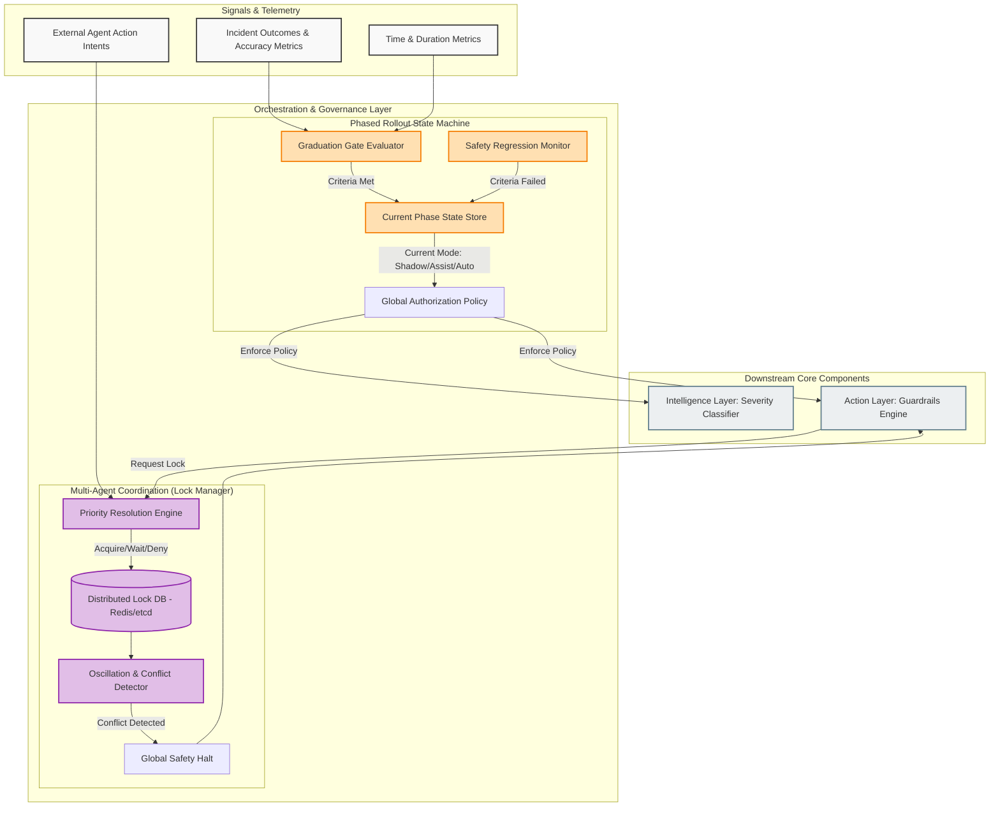

# Orchestration & Governance Layer

This document details the Orchestration and Governance Layer of the SRE Agent. This layer does not diagnose specific incidents; rather, it governs the overall behavior of the agent, ensuring it adheres to its authorized autonomy level and does not conflict with other automated systems.

