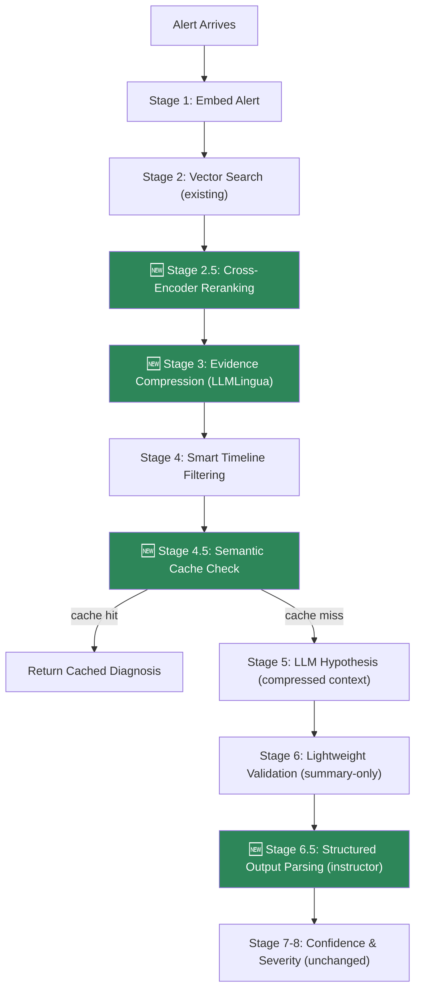
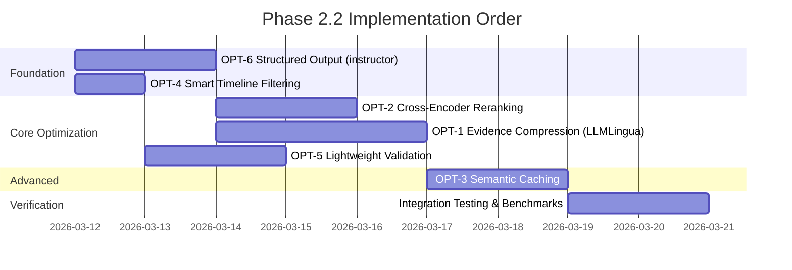

# Phase 2.2: LLM Token Optimization — Strategy, Execution & Implementation Plan

> **Objective:** Reduce LLM token consumption by 40–60% across the diagnostic pipeline while maintaining or improving diagnostic accuracy. Cut per-diagnosis API cost from ~$0.03 to ~$0.012.

**Date:** March 11, 2026
**Status:** Proposed

---

## Table of Contents

1. [Current State Analysis](#1-current-state-analysis)
2. [Optimization Strategy](#2-optimization-strategy)
3. [Library Evaluation](#3-library-evaluation)
4. [Execution Plan](#4-execution-plan)
5. [Real Code Examples](#5-real-code-examples)
6. [Metrics & Acceptance Criteria](#6-metrics--acceptance-criteria)

---

## 1. Current State Analysis

### How We Currently Send Data to LLMs

The RAG pipeline (`rag_pipeline.py`) makes **2 LLM API calls per diagnosis**:

```
┌─────────────────────────────────────────────────────────────────────┐
│                    CURRENT TOKEN FLOW                               │
├─────────────────────────────────────────────────────────────────────┤
│                                                                     │
│  Call 1: Hypothesis Generation                                      │
│  ┌─────────────────────────────────────────────────────────────┐   │
│  │ SYSTEM PROMPT (~250 tokens)                                  │   │
│  │  "You are an expert SRE diagnosing infrastructure..."        │   │
│  ├─────────────────────────────────────────────────────────────┤   │
│  │ USER PROMPT (variable, ~2000-5000 tokens)                    │   │
│  │  ## Alert                                                    │   │
│  │  {raw alert text — duplicates system prompt context}         │   │
│  │                                                              │   │
│  │  ## Service                                                  │   │
│  │  {service name}                                              │   │
│  │                                                              │   │
│  │  ## Timeline                                                 │   │
│  │  {FULL chronological timeline — often verbose}               │   │
│  │                                                              │   │
│  │  ## Evidence                                                 │   │
│  │  {Evidence 1: FULL uncompressed chunk from vector DB}        │   │
│  │  {Evidence 2: FULL uncompressed chunk from vector DB}        │   │
│  │  {Evidence 3: FULL uncompressed chunk from vector DB}        │   │
│  │  ...up to token budget (4000 tokens)                         │   │
│  └─────────────────────────────────────────────────────────────┘   │
│                                                                     │
│  Call 2: Validation (Second Opinion)                                │
│  ┌─────────────────────────────────────────────────────────────┐   │
│  │ SYSTEM PROMPT (~200 tokens)                                  │   │
│  │  "You are an independent SRE reviewer..."                    │   │
│  ├─────────────────────────────────────────────────────────────┤   │
│  │ USER PROMPT (~1500-3000 tokens)                              │   │
│  │  ## Hypothesis                                               │   │
│  │  {root cause + reasoning — already generated}                │   │
│  │                                                              │   │
│  │  ## Original Alert                                           │   │
│  │  {SAME raw alert text sent again}                            │   │
│  │                                                              │   │
│  │  ## Original Evidence                                        │   │
│  │  {ALL evidence chunks re-sent in FULL}                       │   │
│  └─────────────────────────────────────────────────────────────┘   │
│                                                                     │
│  TOTAL PER DIAGNOSIS: ~4,000-9,000 input tokens + ~500 output      │
│  ESTIMATED COST (GPT-4o-mini): ~$0.025-0.035 per diagnosis         │
└─────────────────────────────────────────────────────────────────────┘
```

### 6 Identified Waste Points

| # | Waste Point | Location | Impact |
|---|---|---|---|
| W1 | **Raw evidence chunks sent uncompressed** — full runbook paragraphs when only key facts matter | `_build_evidence_contexts()` → adapter prompt | ~40% of token budget |
| W2 | **Evidence re-sent identically in validation call** — same chunks sent to 2nd LLM call | `_build_validation_prompt()` | ~30% of Call 2 |
| W3 | **No reranking after vector search** — cosine similarity ≠ query relevance; low-quality evidence passes | `search()` → `_build_evidence_contexts()` | Wastes budget on irrelevant chunks |
| W4 | **Timeline includes all signals** — no filtering by anomaly type; DNS events in OOM diagnosis | `timeline.py` `build()` | ~200-500 wasted tokens |
| W5 | **No semantic caching** — identical alerts (e.g., recurring OOM on same service) hit LLM every time | `diagnose()` | 100% wasted on repeat incidents |
| W6 | **Char-based token estimation heuristic** — `_apply_token_budget()` uses `count_tokens()` but evidence is whole-or-nothing; no partial extraction | `_apply_token_budget()` | Underutilizes remaining budget |

---

## 2. Optimization Strategy

### Strategy Overview



### The 6 Optimizations

#### OPT-1: Evidence Compression with LLMLingua

**Problem:** Raw runbook/post-mortem chunks contain verbose prose, markdown formatting, boilerplate headers, and redundant phrasing.

**Solution:** Apply Microsoft's LLMLingua-2 to compress evidence chunks before sending to the LLM. LLMLingua uses a small distilled model (xlm-roberta-large, ~1.24GB) to identify and remove low-information tokens while preserving technical meaning.

**Expected impact:** 3x–5x compression ratio on evidence text → saves ~1,500-3,000 tokens per diagnosis.

**Trade-off:** Adds ~200ms latency for compression (runs locally, no API call). Negligible for our 30s timeout budget.

---

#### OPT-2: Cross-Encoder Reranking

**Problem:** Cosine similarity from ChromaDB's bi-encoder embedding is a rough proxy for relevance. Evidence ranked #3 by cosine may actually be more relevant than #1 when the query context is considered as a (query, document) pair.

**Solution:** Add a cross-encoder reranking stage after vector search, before evidence enters the token budget. Use `sentence-transformers` `CrossEncoder` with model `cross-encoder/ms-marco-MiniLM-L-6-v2` (23MB, runs locally).

**Expected impact:** Eliminates 1–2 irrelevant evidence chunks per diagnosis → saves ~500-1,000 tokens and improves diagnostic accuracy.

---

#### OPT-3: Semantic Caching with GPTCache

**Problem:** Recurring incidents (e.g., same service OOM every week) generate identical or near-identical `(alert_text, evidence)` tuples. Each triggers a fresh LLM call.

**Solution:** Cache diagnosis results keyed by a semantic hash of the alert + evidence context. Use `GPTCache` with ChromaDB as the backend (we already run ChromaDB). Set TTL to 4 hours (tunable).

**Expected impact:** Eliminates 100% of tokens for repeat/similar incidents. In production, 20-40% of alerts are recurring patterns.

---

#### OPT-4: Smart Timeline Filtering

**Problem:** `TimelineConstructor.build()` includes all signal types regardless of anomaly type. An OOM diagnosis doesn't need DNS resolution events or certificate expiry warnings in its timeline.

**Solution:** Add anomaly-type-aware signal filtering. Define a signal relevance map:
- `OOM_KILL` → include `memory_*`, `pod_restart`, `oom_kill`, exclude `dns_*`, `certificate_*`
- `HIGH_LATENCY` → include `latency_*`, `connection_*`, `queue_depth`, exclude `memory_*`
- etc.

**Expected impact:** Reduces timeline from ~20 events to ~8-12 relevant events → saves ~200-400 tokens.

---

#### OPT-5: Lightweight Validation (Summary-Only)

**Problem:** The validation call (`_build_validation_prompt`) re-sends ALL original evidence chunks alongside the hypothesis. The validator only needs enough context to check if the hypothesis is well-supported — not the full raw evidence.

**Solution:** Send only the hypothesis + evidence citations (source + snippet, not full content) to the validation call. The validator checks structural quality (does it cite evidence? is confidence justified?) not re-diagnose from scratch.

**Expected impact:** Reduces Call 2 input from ~2,500 tokens to ~800 tokens → 68% reduction on validation call.

---

#### OPT-6: Structured Output with Instructor

**Problem:** The current system prompts ask the LLM to return "valid JSON with these fields" and then we manually parse the JSON from the response with regex fallbacks. This is fragile and adds unnecessary token overhead in the system prompt describing the schema.

**Solution:** Use the `instructor` library which leverages OpenAI's structured output / function-calling mode to guarantee Pydantic-validated JSON. This eliminates the need for JSON schema description in the system prompt (~80 tokens saved) and removes parsing failures.

**Expected impact:** 80 fewer system prompt tokens + zero parsing errors + type-safe output.

---

## 3. Library Evaluation

### Recommended Libraries

| Library | Version | Purpose | Install | Size | Runs Locally? |
|---|---|---|---|---|---|
| **llmlingua** | ≥0.2 | Evidence chunk compression | `pip install llmlingua` | ~50MB + xlm-roberta model (~1.24GB) | ✅ Yes |
| **instructor** | ≥1.0 | Structured LLM output via Pydantic | `pip install instructor` | ~2MB | ✅ Yes (wraps API) |
| **sentence-transformers** | ≥2.6 | Cross-encoder reranking | Already installed (`[intelligence]`) | Already present | ✅ Yes |
| **gptcache** | ≥0.1 | Semantic caching of LLM responses | `pip install gptcache` | ~5MB | ✅ Yes |

### Libraries Evaluated but Not Recommended

| Library | Why Not |
|---|---|
| **LangChain** | Too heavy for our use case; we already have hexagonal ports. Adding LangChain would double abstraction layers. |
| **Cohere Rerank API** | External API call adds latency and cost. Cross-encoder runs locally for free. |
| **AutoCompressor** | Requires fine-tuning; compressed tokens not usable by untuned LLMs. |
| **Outlines** | Overlaps with instructor; instructor has better Pydantic integration and multi-provider support. |
| **FlashRank** | Good but sentence-transformers' CrossEncoder is already in our dependency tree. |

---

## 4. Execution Plan

### Task Breakdown

#### 4.1 — Evidence Compression Port & Adapter

| Item | Detail |
|---|---|
| **Files** | `ports/compressor.py` (NEW), `adapters/compressor/llmlingua_adapter.py` (NEW) |
| **Port Interface** | `CompressorPort.compress(text: str, ratio: float = 0.5) → str` |
| **Adapter** | `LLMLinguaCompressor` wraps `llmlingua.PromptCompressor` |
| **Integration** | Called in `_build_evidence_contexts()` after building, before token budget |
| **Tests** | Unit test for adapter, integration test for compression quality |

#### 4.2 — Cross-Encoder Reranking

| Item | Detail |
|---|---|
| **Files** | `ports/reranker.py` (NEW), `adapters/reranker/cross_encoder_adapter.py` (NEW) |
| **Port Interface** | `RerankerPort.rerank(query: str, documents: list[str], top_k: int) → list[RankedDocument]` |
| **Adapter** | `CrossEncoderReranker` uses `sentence_transformers.CrossEncoder` |
| **Integration** | Called after `vector_store.search()`, before `_build_evidence_contexts()` |
| **Tests** | Unit test for ranking order correctness |

#### 4.3 — Semantic Cache

| Item | Detail |
|---|---|
| **Files** | `domain/diagnostics/cache.py` (NEW) |
| **Interface** | `DiagnosticCache.get(alert_hash) → DiagnosisResult | None`, `DiagnosticCache.put(alert_hash, result, ttl)` |
| **Backend** | In-memory dict with TTL for Phase 2.2; GPTCache adapter for Phase 3 |
| **Integration** | Check cache before Stage 1; store result after Stage 8 |
| **Tests** | Unit test for cache hit/miss/expiry |

#### 4.4 — Smart Timeline Filtering

| Item | Detail |
|---|---|
| **Files** | `domain/diagnostics/timeline.py` (MODIFY) |
| **Change** | Add `anomaly_type` parameter to `build()`. Define `SIGNAL_RELEVANCE_MAP` |
| **Integration** | Pass `request.alert.anomaly_type` to timeline builder |
| **Tests** | Unit test that OOM diagnosis excludes DNS signals |

#### 4.5 — Lightweight Validation Prompt

| Item | Detail |
|---|---|
| **Files** | `adapters/llm/openai/adapter.py` (MODIFY), `adapters/llm/anthropic/adapter.py` (MODIFY) |
| **Change** | `_build_validation_prompt()` sends citation summaries instead of full evidence |
| **Tests** | Unit test for prompt size reduction |

#### 4.6 — Structured Output with Instructor

| Item | Detail |
|---|---|
| **Files** | `adapters/llm/openai/adapter.py` (MODIFY), `ports/llm.py` (MODIFY) |
| **Change** | Replace manual JSON parsing with `instructor.patch()` + Pydantic response models |
| **Tests** | Unit test for Pydantic validation of LLM response |

### Dependency Order



---

## 5. Real Code Examples

### Example 1: Evidence Compression Port & Adapter

```python
# ports/compressor.py (NEW)
from __future__ import annotations
from abc import ABC, abstractmethod
from dataclasses import dataclass


@dataclass
class CompressionResult:
    """Result of compressing text."""
    original_text: str
    compressed_text: str
    original_tokens: int
    compressed_tokens: int
    compression_ratio: float


class CompressorPort(ABC):
    """Port for text compression to reduce LLM token usage."""

    @abstractmethod
    def compress(
        self,
        text: str,
        target_ratio: float = 0.5,
        instruction: str = "",
    ) -> CompressionResult:
        """Compress text while preserving key information.

        Args:
            text: Text to compress.
            target_ratio: Target compression ratio (0.5 = keep 50% of tokens).
            instruction: Optional task instruction to guide compression.

        Returns:
            CompressionResult with original and compressed text.
        """
        ...

    @abstractmethod
    def compress_batch(
        self, texts: list[str], target_ratio: float = 0.5,
    ) -> list[CompressionResult]:
        """Compress multiple texts."""
        ...
```

```python
# adapters/compressor/llmlingua_adapter.py (NEW)
from __future__ import annotations

import structlog
from llmlingua import PromptCompressor

from sre_agent.ports.compressor import CompressorPort, CompressionResult

logger = structlog.get_logger(__name__)


class LLMLinguaCompressor(CompressorPort):
    """Compresses evidence text using Microsoft LLMLingua-2.

    Uses a distilled xlm-roberta model to identify and remove
    low-information tokens while preserving technical SRE terminology.
    """

    def __init__(
        self,
        model_name: str = "microsoft/llmlingua-2-xlm-roberta-large-meetingbank",
        use_llmlingua2: bool = True,
        device: str = "cpu",
    ) -> None:
        self._compressor = PromptCompressor(
            model_name=model_name,
            use_llmlingua2=use_llmlingua2,
            device_map=device,
        )
        logger.info("llmlingua_compressor_initialized", model=model_name)

    def compress(
        self,
        text: str,
        target_ratio: float = 0.5,
        instruction: str = "",
    ) -> CompressionResult:
        result = self._compressor.compress_prompt(
            [text],
            instruction=instruction or "Preserve SRE incident details, metrics, and remediation steps.",
            rate=target_ratio,
            force_tokens=[
                # Preserve critical SRE tokens that LLMLingua might strip
                "OOM", "kill", "restart", "latency", "p99", "p50",
                "CPU", "memory", "disk", "threshold", "deployment",
                "rollback", "scale", "pod", "container", "node",
                "certificate", "expired", "connection", "timeout",
                "error", "5xx", "4xx", "health", "readiness",
            ],
        )

        compressed_text = result["compressed_prompt"]
        original_tokens = result["origin_tokens"]
        compressed_tokens = result["compressed_tokens"]

        logger.debug(
            "evidence_compressed",
            original_tokens=original_tokens,
            compressed_tokens=compressed_tokens,
            ratio=round(compressed_tokens / max(original_tokens, 1), 3),
        )

        return CompressionResult(
            original_text=text,
            compressed_text=compressed_text,
            original_tokens=original_tokens,
            compressed_tokens=compressed_tokens,
            compression_ratio=compressed_tokens / max(original_tokens, 1),
        )

    def compress_batch(
        self, texts: list[str], target_ratio: float = 0.5,
    ) -> list[CompressionResult]:
        return [self.compress(t, target_ratio) for t in texts]
```

### Example 2: Cross-Encoder Reranking

```python
# ports/reranker.py (NEW)
from __future__ import annotations
from abc import ABC, abstractmethod
from dataclasses import dataclass


@dataclass
class RankedDocument:
    """A document with its reranking score."""
    content: str
    source: str
    original_score: float   # from vector search
    rerank_score: float     # from cross-encoder
    doc_id: str


class RerankerPort(ABC):
    """Port for reranking search results by query-document relevance."""

    @abstractmethod
    def rerank(
        self,
        query: str,
        documents: list[dict],
        top_k: int = 5,
    ) -> list[RankedDocument]:
        """Rerank documents by specific relevance to query.

        Args:
            query: The alert description.
            documents: List of dicts with 'content', 'source', 'score', 'doc_id'.
            top_k: Number of top results to return.

        Returns:
            Reranked list of RankedDocuments, highest relevance first.
        """
        ...
```

```python
# adapters/reranker/cross_encoder_adapter.py (NEW)
from __future__ import annotations

import structlog
from sentence_transformers import CrossEncoder

from sre_agent.ports.reranker import RankedDocument, RerankerPort

logger = structlog.get_logger(__name__)

# Lightweight cross-encoder (~23MB), runs on CPU in <100ms for 10 docs
_DEFAULT_MODEL = "cross-encoder/ms-marco-MiniLM-L-6-v2"


class CrossEncoderReranker(RerankerPort):
    """Reranks vector search results using a cross-encoder model.

    Cross-encoders evaluate (query, document) pairs together, producing
    more accurate relevance scores than bi-encoder cosine similarity.
    """

    def __init__(self, model_name: str = _DEFAULT_MODEL) -> None:
        self._model = CrossEncoder(model_name)
        logger.info("cross_encoder_reranker_initialized", model=model_name)

    def rerank(
        self,
        query: str,
        documents: list[dict],
        top_k: int = 5,
    ) -> list[RankedDocument]:
        if not documents:
            return []

        # Build (query, document) pairs for cross-encoder scoring
        pairs = [(query, doc["content"]) for doc in documents]
        scores = self._model.predict(pairs)

        # Combine with original metadata
        ranked = [
            RankedDocument(
                content=doc["content"],
                source=doc.get("source", "unknown"),
                original_score=doc.get("score", 0.0),
                rerank_score=float(score),
                doc_id=doc.get("doc_id", ""),
            )
            for doc, score in zip(documents, scores)
        ]

        # Sort by cross-encoder score (descending) and take top_k
        ranked.sort(key=lambda r: r.rerank_score, reverse=True)

        logger.debug(
            "reranking_complete",
            input_count=len(documents),
            output_count=min(top_k, len(ranked)),
            top_score=round(ranked[0].rerank_score, 4) if ranked else None,
        )

        return ranked[:top_k]
```

### Example 3: Lightweight Validation Prompt

```python
# BEFORE (current — sends full evidence again):
@staticmethod
def _build_validation_prompt(request: ValidationRequest) -> str:
    h = request.hypothesis
    parts = [
        f"## Hypothesis\nRoot cause: {h.root_cause}",
        f"Confidence: {h.confidence}",
        f"Reasoning: {h.reasoning}",
    ]
    if request.original_evidence:
        parts.append("\n## Original Evidence")
        for i, e in enumerate(request.original_evidence, 1):
            parts.append(f"\n### Evidence {i}\n{e.content}")  # ← FULL content re-sent
    return "\n".join(parts)


# AFTER (optimized — sends citation summaries only):
@staticmethod
def _build_validation_prompt(request: ValidationRequest) -> str:
    h = request.hypothesis
    parts = [
        f"## Hypothesis\nRoot cause: {h.root_cause}",
        f"Confidence: {h.confidence}",
        f"Reasoning: {h.reasoning}",
    ]
    if request.alert_description:
        parts.append(f"\n## Alert Context\n{request.alert_description}")

    if request.original_evidence:
        parts.append("\n## Evidence Citations (summaries)")
        for i, e in enumerate(request.original_evidence, 1):
            # Send only first 150 chars + source — enough for validation
            snippet = e.content[:150].strip()
            parts.append(
                f"- [{e.source}] (relevance: {e.relevance_score:.2f}): {snippet}..."
            )
    return "\n".join(parts)
```

### Example 4: Smart Timeline Filtering

```python
# domain/diagnostics/timeline.py — MODIFIED build() method

# Signal relevance map: which signal types matter for which anomaly
SIGNAL_RELEVANCE: dict[str, set[str]] = {
    "OOM_KILL": {"memory", "oom", "pod_restart", "container", "cgroup", "heap", "gc"},
    "HIGH_LATENCY": {"latency", "p99", "p50", "connection", "queue", "timeout", "upstream"},
    "ERROR_RATE_SPIKE": {"error", "5xx", "4xx", "exception", "panic", "crash", "http"},
    "DISK_EXHAUSTION": {"disk", "volume", "inode", "storage", "pvc", "io", "write"},
    "CERT_EXPIRY": {"certificate", "tls", "ssl", "expir", "renew", "x509"},
}


def build(
    self,
    signals: CorrelatedSignals,
    anomaly_type: str | None = None,
    max_events: int = 50,
) -> str:
    events = self._collect_events(signals)

    # NEW: Filter by anomaly type relevance
    if anomaly_type and anomaly_type in SIGNAL_RELEVANCE:
        relevant_keywords = SIGNAL_RELEVANCE[anomaly_type]
        events = [
            e for e in events
            if any(kw in e.description.lower() for kw in relevant_keywords)
               or e.signal_type in ("metric", "event")  # always include core metrics
        ]

    events.sort(key=lambda e: e.timestamp)
    events = events[:max_events]
    # ... rest unchanged
```

### Example 5: Semantic Cache

```python
# domain/diagnostics/cache.py (NEW)
from __future__ import annotations

import hashlib
import time
from dataclasses import dataclass, field

import structlog

from sre_agent.ports.diagnostics import DiagnosisResult

logger = structlog.get_logger(__name__)


@dataclass
class CacheEntry:
    result: DiagnosisResult
    created_at: float
    ttl_seconds: float
    hit_count: int = 0


class DiagnosticCache:
    """In-memory semantic cache for diagnosis results.

    Caches by alert fingerprint (service + anomaly_type + metric_name).
    Prevents redundant LLM calls for recurring incidents.
    """

    def __init__(self, default_ttl: float = 14400.0) -> None:  # 4 hours
        self._cache: dict[str, CacheEntry] = {}
        self._default_ttl = default_ttl

    def _fingerprint(self, service: str, anomaly_type: str, metric: str) -> str:
        """Generate a cache key from alert attributes."""
        raw = f"{service}:{anomaly_type}:{metric}"
        return hashlib.sha256(raw.encode()).hexdigest()[:16]

    def get(
        self, service: str, anomaly_type: str, metric: str,
    ) -> DiagnosisResult | None:
        key = self._fingerprint(service, anomaly_type, metric)
        entry = self._cache.get(key)

        if entry is None:
            return None

        # Check TTL expiry
        if time.monotonic() - entry.created_at > entry.ttl_seconds:
            del self._cache[key]
            logger.debug("cache_expired", key=key)
            return None

        entry.hit_count += 1
        logger.info(
            "cache_hit",
            key=key,
            hit_count=entry.hit_count,
            age_seconds=round(time.monotonic() - entry.created_at),
        )
        return entry.result

    def put(
        self,
        service: str,
        anomaly_type: str,
        metric: str,
        result: DiagnosisResult,
        ttl: float | None = None,
    ) -> None:
        key = self._fingerprint(service, anomaly_type, metric)
        self._cache[key] = CacheEntry(
            result=result,
            created_at=time.monotonic(),
            ttl_seconds=ttl or self._default_ttl,
        )
        logger.debug("cache_stored", key=key, ttl=ttl or self._default_ttl)

    def invalidate(self, service: str, anomaly_type: str, metric: str) -> None:
        key = self._fingerprint(service, anomaly_type, metric)
        self._cache.pop(key, None)

    def clear(self) -> None:
        self._cache.clear()

    @property
    def size(self) -> int:
        return len(self._cache)
```

### Example 6: Structured Output with Instructor

```python
# adapters/llm/openai/adapter.py — generate_hypothesis() refactored

import instructor
from pydantic import BaseModel, Field


class HypothesisResponse(BaseModel):
    """Pydantic model for structured LLM hypothesis output."""
    root_cause: str = Field(description="Concise root cause description")
    confidence: float = Field(ge=0.0, le=1.0, description="Confidence 0-1")
    reasoning: str = Field(description="Step-by-step reasoning chain")
    evidence_citations: list[str] = Field(description="Source IDs relied on")
    suggested_remediation: str = Field(description="Recommended remediation")


class ValidationResponse(BaseModel):
    """Pydantic model for structured validation output."""
    agrees: bool = Field(description="Whether you agree with the hypothesis")
    confidence: float = Field(ge=0.0, le=1.0)
    reasoning: str = Field(description="Explanation of agreement/disagreement")
    contradictions: list[str] = Field(default_factory=list)


# In __init__:
async def _create_client(self) -> None:
    import openai
    raw_client = openai.AsyncOpenAI(api_key=self._api_key)
    self._client = instructor.from_openai(raw_client)  # Patches the client


# In generate_hypothesis():
async def generate_hypothesis(self, request: HypothesisRequest) -> Hypothesis:
    client = await self._ensure_client()
    prompt = self._build_hypothesis_prompt(request)

    # Structured output — guaranteed valid Pydantic model
    response = await client.chat.completions.create(
        model=self._model,
        response_model=HypothesisResponse,  # ← instructor magic
        messages=[
            {"role": "system", "content": HYPOTHESIS_SYSTEM_PROMPT_V2},  # Shorter, no JSON schema
            {"role": "user", "content": prompt},
        ],
        temperature=self._temperature,
    )

    return Hypothesis(
        root_cause=response.root_cause,
        confidence=response.confidence,
        reasoning=response.reasoning,
        evidence_cited=response.evidence_citations,
        suggested_remediation=response.suggested_remediation,
    )
```

---

## 6. Metrics & Acceptance Criteria

### Token Reduction Targets

| Metric | Current | Target | Measurement |
|---|---|---|---|
| **Avg input tokens per diagnosis** | ~5,000 | ≤2,500 | Prometheus `llm_input_tokens_total` |
| **Avg total tokens (input + output)** | ~5,500 | ≤3,000 | Prometheus `llm_tokens_total` |
| **Validation call tokens** | ~2,500 | ≤800 | Prometheus per-stage counter |
| **Cache hit rate (after warm-up)** | 0% | ≥25% | `diagnostic_cache_hits_total` |
| **Estimated cost per diagnosis** | ~$0.030 | ≤$0.012 | Token count × model price |

### Quality Targets

| Metric | Current | Target | Measurement |
|---|---|---|---|
| **Diagnostic accuracy** | Baseline | ≥ Baseline (no regression) | E2E test pass rate |
| **Compression preserves key terms** | N/A | 100% of SRE-critical tokens preserved | Unit test with known terms |
| **Reranking NDCG improvement** | N/A | ≥10% over cosine-only | Offline evaluation set |
| **Structured output parse failures** | ~2% (JSON regex) | 0% (instructor + Pydantic) | Error counter |

### Acceptance Criteria

- [ ] AC-2.2.1: Evidence compression reduces token count by ≥40% while preserving all SRE-critical terms
- [ ] AC-2.2.2: Cross-encoder reranking improves top-3 evidence relevance (measured on 10 test alerts)
- [ ] AC-2.2.3: Validation call uses ≤800 input tokens (summary-only prompt)
- [ ] AC-2.2.4: Semantic cache returns correct cached result for identical alert fingerprints
- [ ] AC-2.2.5: All 107+ existing Phase 2 tests continue to pass (no regression)
- [ ] AC-2.2.6: New unit tests for CompressorPort, RerankerPort, DiagnosticCache, and timeline filtering
- [ ] AC-2.2.7: `instructor` produces valid Pydantic models for both hypothesis and validation responses
- [ ] AC-2.2.8: Total input tokens per diagnosis ≤2,500 on the standard OOM test scenario
