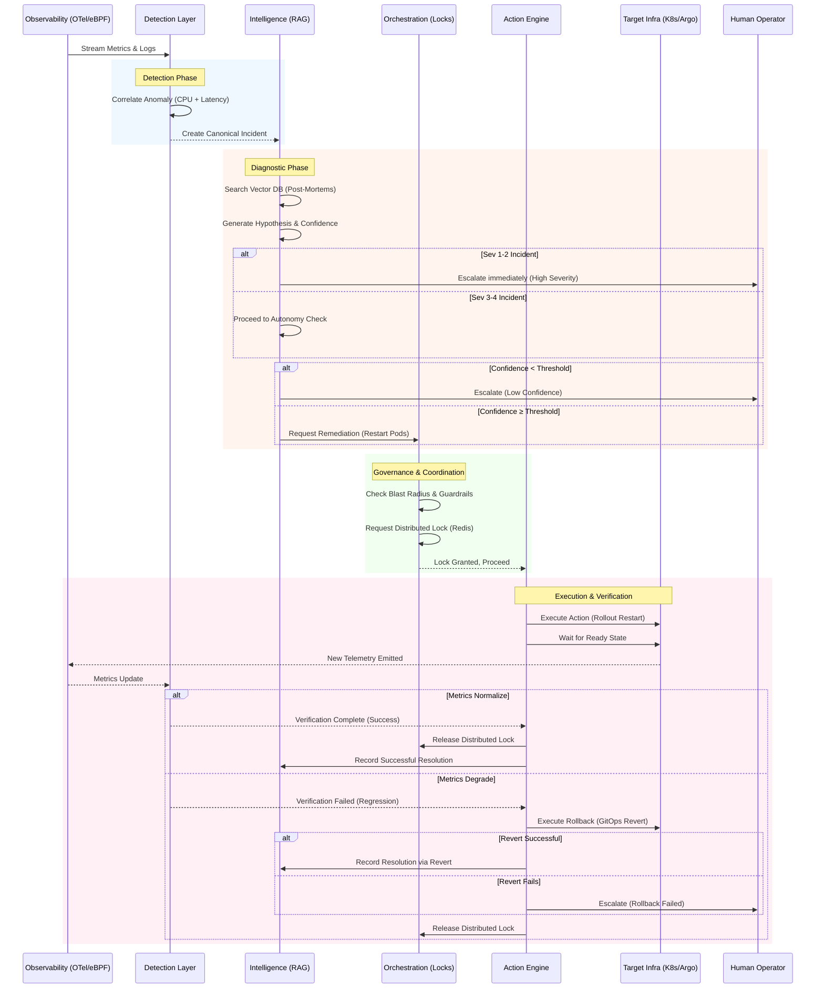

# Sequence: Incident Lifecycle

**Status:** DRAFT
**Version:** 1.0.0

This diagram outlines the end-to-end flow of an incident, from initial detection through autonomous remediation and resolution verification.

