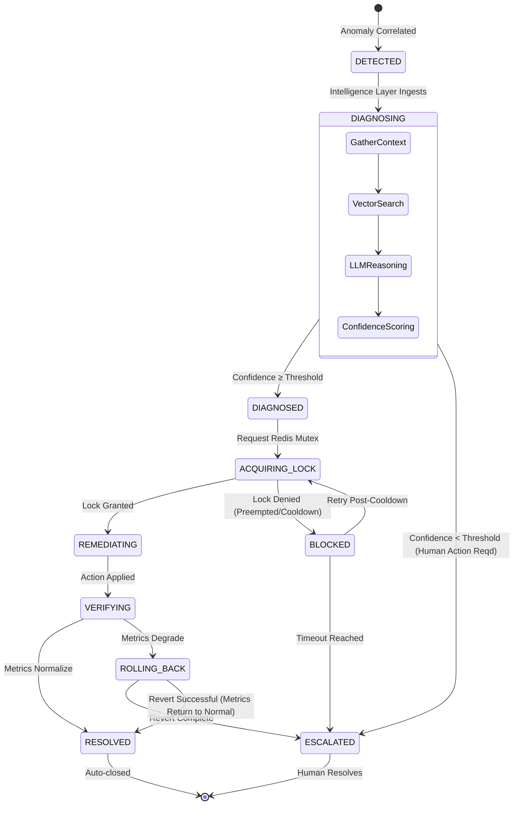

# State Machine: Canonical Incident

This diagram represents the strict lifecycle states of a `Canonical Incident` object as it moves through the SRE Agent's architectural layers.

```mermaid
stateDiagram-v2
    [*] --> DETECTED: Anomaly Correlated
    
    DETECTED --> DIAGNOSING: Intelligence Layer Ingests
    
    state DIAGNOSING {
        GatherContext --> VectorSearch
        VectorSearch --> LLMReasoning
        LLMReasoning --> ConfidenceScoring
    }
    
    DIAGNOSING --> DIAGNOSED: Confidence ≥ Threshold
    DIAGNOSING --> ESCALATED: Confidence < Threshold (Human Action Reqd)
    
    DIAGNOSED --> ACQUIRING_LOCK: Request Redis Mutex
    
    ACQUIRING_LOCK --> REMEDIATING: Lock Granted
    ACQUIRING_LOCK --> BLOCKED: Lock Denied (Preempted/Cooldown)
    
    BLOCKED --> ACQUIRING_LOCK: Retry Post-Cooldown
    BLOCKED --> ESCALATED: Timeout Reached
    
    REMEDIATING --> VERIFYING: Action Applied
    
    VERIFYING --> RESOLVED: Metrics Normalize
    VERIFYING --> ROLLING_BACK: Metrics Degrade
    
    ROLLING_BACK --> ESCALATED: Revert Complete
    ROLLING_BACK --> RESOLVED: Revert Successful (Metrics Return to Normal)
    
    ESCALATED --> [*]: Human Resolves
    RESOLVED --> [*]: Auto-closed
```
