# System Architecture — With Persistence Layer

> **Status:** Current target state (post-persistence migration)
> **Date:** 2026-04-07
> **Audience:** Anyone — engineers, stakeholders, and on-call operators

---

## How to read this diagram

The system has five horizontal bands, each representing a concern:

| Band | What it is |
|---|---|
| **Infrastructure** | The Kubernetes, AWS, and Azure resources being monitored and remediated |
| **Telemetry** | The observability tools that feed signals into the agent |
| **SRE Agent** | Four sequential internal stages: Detect → Diagnose → Safety → Remediate |
| **Persistence** | Where all durable state lives — two stores, each with clear ownership |
| **Coordination** | Human operators and peer agents that can override or compete for locks |

Every arrow is labelled with what flows across it.

---

## End-to-End Architecture

```mermaid
flowchart TD

    %% ─────────────────────────────────────────
    %% BAND 1: Infrastructure
    %% ─────────────────────────────────────────
    subgraph INFRA["☁️  Monitored Infrastructure"]
        direction LR
        K8S["☸ Kubernetes\nPods · Deployments · StatefulSets"]
        AWS["⬡ AWS\nECS · Lambda · EC2 ASG"]
        AZ["⬡ Azure\nApp Service · Functions"]
    end

    %% ─────────────────────────────────────────
    %% BAND 2: Telemetry Sources
    %% ─────────────────────────────────────────
    subgraph TEL["📡  Telemetry Sources"]
        direction LR
        PROM["Prometheus\n(metrics)"]
        JAE["Jaeger\n(traces)"]
        LOKI["Loki\n(logs)"]
        CW["CloudWatch\n(metrics · traces · logs)"]
        NR["New Relic\n(metrics · traces)"]
    end

    %% ─────────────────────────────────────────
    %% BAND 3: SRE Agent
    %% ─────────────────────────────────────────
    subgraph SRE["🤖  SRE Agent  (FastAPI · Python · anyio)"]
        direction LR

        subgraph DET["① Detect"]
            direction TB
            ANOM["Anomaly Detector\nlatency · error rate\nOOM · disk · cert expiry"]
            CORR["Alert Correlator\ndeduplication · windowing"]
            ANOM --> CORR
        end

        subgraph INT["② Diagnose"]
            direction TB
            RAG["RAG Pipeline\nretrieves runbook evidence"]
            LLM["LLM Adapter\nAnthropic Claude · OpenAI GPT"]
            SEV["Severity Classifier\nImpactDimensions scoring"]
            RAG --> LLM --> SEV
        end

        subgraph SAF["③ Safety"]
            direction TB
            BLAST["Blast Radius Check"]
            GATE["Policy Gate\napproval · cooldown"]
            KSW["Kill Switch\nhuman override"]
            BLAST --> GATE --> KSW
        end

        subgraph REM["④ Remediate"]
            direction TB
            PLAN["Planner\ncreate RemediationPlan"]
            EXEC["Executor\nrestart · scale · GitOps revert"]
            VER["Verifier\nmetric check post-action"]
            PLAN --> EXEC --> VER
        end

        RELAY["⚙️ OutboxRelay\n(anyio background task)"]
        APIEP["REST API · CLI\nGET /incidents\nGET /agent-runs\nPOST /severity-override"]

        DET --> INT --> SAF --> REM
        REM --> RELAY
    end

    %% ─────────────────────────────────────────
    %% BAND 4: Persistence Layer
    %% ─────────────────────────────────────────
    subgraph PERSIST["💾  Persistence Layer"]
        direction LR

        subgraph PG["PostgreSQL 16"]
            direction TB

            subgraph PGOPS["Operational Store"]
                direction TB
                INC["incidents\n(mutable projection — current state)"]
                EVT["incident_events\n(append-only — full audit trail)"]
                DIAG["diagnoses · remediation_plans\nremediation_actions · audit_log"]
                TRACE["agent_runs · tool_calls\nretrieved_contexts\n(reasoning trace for postmortems)"]
                OBOX["outbox\n(transient — relay staging)"]
            end

            subgraph PGVEC["pgvector extension"]
                VDOC["vector_documents\nrunbook + incident embeddings\n(HNSW index — cosine similarity)"]
            end

            subgraph PGTS["TimescaleDB extension"]
                SNAP["metric_snapshots\n(hypertable — raw CanonicalMetric)"]
                BASE["metric_baselines\n(continuous aggregate — mean · stddev)"]
            end
        end

        subgraph RED["Redis 7"]
            direction TB
            RLOCK["Locks · Cooldowns\nsre-agent:lock:{resource}\ncooldown:{provider}:{compute_mechanism}:{id}"]
            RCACHE["DiagnosticCache\ndiagcache:{service}:{anomaly}:{metric}\n(TTL 4 h — avoids repeated LLM calls)"]
            RSTREAM["domain_events  (Redis Stream)\nanoaly.detected · diagnosis.generated\nremediation.started · remediation.completed\n…all DomainEvent types"]
        end
    end

    %% ─────────────────────────────────────────
    %% BAND 5: Coordination
    %% ─────────────────────────────────────────
    subgraph COORD["👥  Coordination"]
        direction LR
        HUM["👤 Human Operator\nkill switch · manual override\napproval gate"]
        SEC["🔐 SecOps Agent\nPriority 1 — preempts SRE"]
        FIN["💰 FinOps Agent\nPriority 3 — yields to SRE"]
    end

    %% ─────────────────────────────────────────
    %% DATA FLOWS
    %% ─────────────────────────────────────────

    %% Telemetry → Detection
    TEL -- "metrics · traces · logs\n(PromQL · Jaeger API · LogQL\nCloudWatch · NerdGraph)" --> DET
    INFRA -- "k8s events · health signals\neBPF events" --> DET

    %% Detection ↔ TimescaleDB (baseline loop)
    CORR -- "write CanonicalMetric snapshots" --> SNAP
    BASE -- "rolling baseline\n(mean · stddev)" --> ANOM

    %% Intelligence ↔ pgvector (RAG retrieval)
    RAG -- "embed query → vector search" --> VDOC
    VDOC -- "top-k evidence chunks\n(EvidenceCitation)" --> RAG

    %% Intelligence ↔ Redis DiagnosticCache
    INT -- "cache miss → run RAG + LLM" --> RCACHE
    RCACHE -- "cache hit → skip LLM\n(4 h TTL)" --> INT

    %% SRE Agent → PostgreSQL (all operational writes)
    CORR -- "write AnomalyAlert" --> INC
    INT -- "write Diagnosis\nwrite AuditEntry" --> DIAG
    REM -- "write RemediationPlan\nwrite RemediationAction" --> DIAG
    SRE -- "write DomainEvent\nto append-only log" --> EVT
    SRE -- "write reasoning trace\n(every LLM call · tool use · evidence)" --> TRACE
    SRE -- "stage event for relay" --> OBOX

    %% OutboxRelay → Redis Stream (at-least-once, idempotent consumers)
    RELAY -- "poll committed PENDING rows\nXADD to stream\n(at-least-once)" --> RSTREAM

    %% Redis Stream → SRE Agent (event-driven fan-out)
    RSTREAM -- "anomaly.detected\n→ triggers Intelligence pipeline" --> INT
    RSTREAM -- "remediation.approved\n→ triggers Executor" --> REM

    %% Remediation → Infrastructure (the action)
    EXEC -- "kubectl restart · scale\necs:StopTask · UpdateService\nlambda:PutConcurrency\nApp Service restart" --> INFRA

    %% Post-remediation: Verifier checks telemetry again
    VER -- "re-query metrics\n(confirm baseline restored)" --> TEL

    %% Safety ↔ Redis (lock/cooldown enforcement)
    SAF -- "acquire lock · check cooldown\ncheck kill switch flag" --> RLOCK

    %% Coordination ↔ Redis (multi-agent lock protocol)
    HUM -- "activate kill switch\nforce-release lock" --> RLOCK
    HUM -- "manual approval\n(approval gate)" --> GATE
    SEC -- "acquire lock\n(Priority 1 — preempts SRE)" --> RLOCK
    FIN -- "request lock\n(Priority 3 — yields to SRE)" --> RLOCK

    %% API reads from PostgreSQL
    APIEP -- "read incidents · audit trail\nreasoning traces" --> PGOPS

    %% ─────────────────────────────────────────
    %% STYLES
    %% ─────────────────────────────────────────
    style INFRA    fill:#fff7ed,stroke:#ea580c,stroke-width:2px,color:#000
    style TEL      fill:#f8fafc,stroke:#94a3b8,stroke-width:1px,color:#000
    style SRE      fill:#f0fdf4,stroke:#16a34a,stroke-width:2px,color:#000
    style PERSIST  fill:#eef2ff,stroke:#4f46e5,stroke-width:2px,color:#000
    style PG       fill:#dbeafe,stroke:#2563eb,stroke-width:1px,color:#000
    style PGOPS    fill:#eff6ff,stroke:#3b82f6,stroke-width:1px,color:#000
    style PGVEC    fill:#ede9fe,stroke:#7c3aed,stroke-width:1px,color:#000
    style PGTS     fill:#ecfdf5,stroke:#059669,stroke-width:1px,color:#000
    style RED      fill:#fff1f2,stroke:#e11d48,stroke-width:1px,color:#000
    style COORD    fill:#fdf4ff,stroke:#9333ea,stroke-width:1px,color:#000
    style DET      fill:#fefce8,stroke:#ca8a04,stroke-width:1px,color:#000
    style INT      fill:#f0f9ff,stroke:#0284c7,stroke-width:1px,color:#000
    style SAF      fill:#fff1f2,stroke:#e11d48,stroke-width:1px,color:#000
    style REM      fill:#f0fdf4,stroke:#16a34a,stroke-width:1px,color:#000
```



---

## What each store owns — in plain English

### PostgreSQL (the source of truth for everything that matters)

| Table / group | Plain English |
|---|---|
| `incidents` | Current status of every incident — is it open, being mitigated, or resolved? |
| `incident_events` | The permanent, uneditable record of everything that happened during an incident |
| `diagnoses` | What the AI concluded was the root cause, with confidence and severity |
| `remediation_plans / actions` | What the agent planned to do and what it actually executed |
| `audit_log` | Who did what and when — agent, human, or kill switch |
| `agent_runs / tool_calls / retrieved_contexts` | The full reasoning trace: every LLM call, every runbook chunk retrieved, every tool invoked |
| `outbox` | Staging table — events land here first, then the relay forwards them to Redis |
| `vector_documents` (pgvector) | Runbook and incident-history embeddings for RAG retrieval |
| `metric_snapshots` (TimescaleDB) | Raw time-series metric values from Prometheus / CloudWatch |
| `metric_baselines` (TimescaleDB) | Rolling 5-minute mean and standard deviation per metric — what "normal" looks like |

### Redis (fast, ephemeral coordination)

| Key pattern | Plain English |
|---|---|
| `sre-agent:lock:{resource}` | Who has the right to touch a given resource right now |
| `cooldown:{provider}:{compute_mechanism}:{id}` | "Don't touch this resource again for 15 minutes" |
| `diagcache:{service}:{anomaly}:{metric}` | A cached diagnosis — skip the LLM call if we've seen this recently |
| `domain_events` stream | The live event bus — events flow here after the outbox relay delivers them |

---

## The incident journey — step by step

```
① Telemetry arrives   →  Prometheus / CloudWatch / Loki push metrics, traces, logs
② Anomaly detected    →  Detector spots a deviation > N sigma from the TimescaleDB baseline
③ Alert correlated    →  Correlator groups related signals into one incident; writes to incidents table
④ Event published     →  DomainEvent appended to incident_events; staged in outbox
⑤ Outbox relay fires  →  OutboxRelay (background) reads committed row, XADDs to Redis Stream
⑥ Diagnosis triggered →  Intelligence pipeline subscribes to anomaly.detected on the stream
⑦ RAG retrieval       →  Pipeline embeds the anomaly context; pgvector returns matching runbook chunks
⑧ LLM diagnosis       →  Claude / GPT reasons over the evidence; produces root cause + confidence
⑨ Cache stored        →  Diagnosis written to DiagnosticCache in Redis (skip LLM next time)
⑩ Severity classified →  ImpactDimensions score computed; Diagnosis persisted to PostgreSQL
⑪ Safety checked      →  Blast radius evaluated; cooldown / kill switch checked in Redis
⑫ Plan approved       →  Human approves (if required) via API; approval written to audit_log
⑬ Action executed     →  Executor calls Kubernetes / AWS / Azure API
⑭ Outcome verified    →  Verifier re-queries telemetry; confirms metric returned to baseline
⑮ Incident resolved   →  incidents projection updated; remediation.completed event published
⑯ Cooldown set        →  Redis cooldown key written — no agent touches this resource for 15 min
```

---

## Key design guarantees

| Guarantee | How it is enforced |
|---|---|
| **No event is silently lost** | Outbox pattern — event is in PostgreSQL before it enters Redis; relay retries until delivered |
| **Full audit trail is immutable** | `incident_events` and `audit_log` — rows are never updated or deleted |
| **No two agents conflict** | Redis distributed lock with fencing tokens; priority-based preemption (SecOps > SRE > FinOps) |
| **Human can always override** | Kill switch flag in Redis; human lock release bypasses priority checks |
| **LLM outputs are advisory only** | Safety layer runs before any action; policy gates and blast radius check are mandatory |
| **Diagnosis is reproducible** | `agent_runs + tool_calls + retrieved_contexts` record every input and output of every LLM call |
| **Restarts do not lose state** | All state is in PostgreSQL or Redis — no critical data lives only in process memory |
