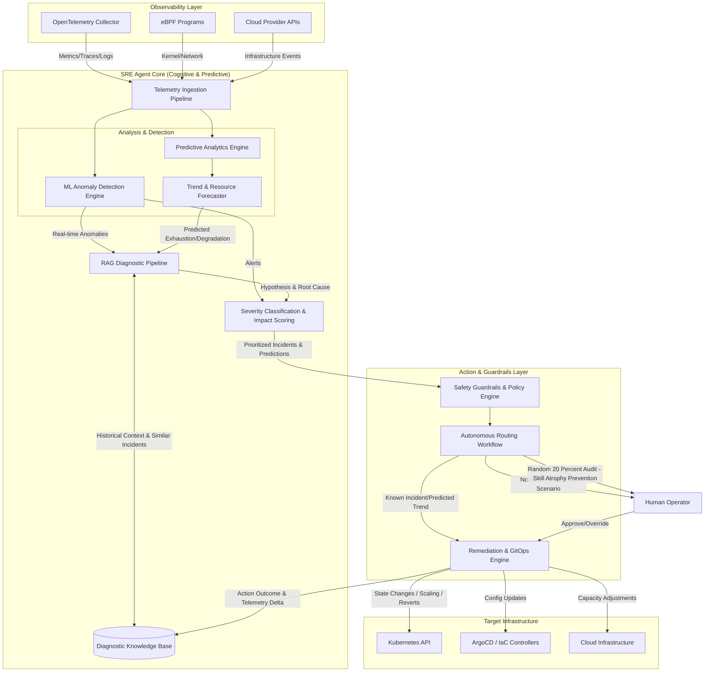

# Target Architecture (Phase 4 Final State)

This document visualizes the complete end-state architecture of the SRE Agent after Phase 4 (PREDICTIVE) is fully rolled out. It expands upon the initial architecture to include predictive tracking, structural degradation detection, and the feedback loop for the autonomous knowledge base.

