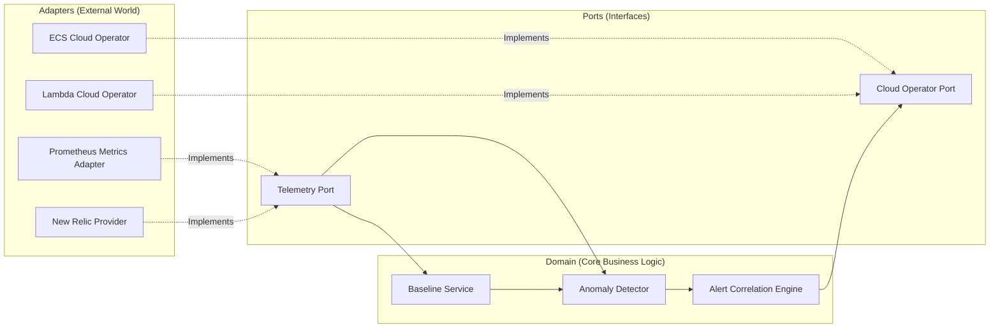

# Developer Onboarding Guide

**Status:** DRAFT
**Version:** 1.0.0

Welcome to the **SRE Agent**! This guide will get you up and running with the SRE Agent quickly. The system is designed to act as an autonomous agent that detects anomalies, proposes solutions via RAG, and safely executes remediations.

## Prerequisites
Ensure you have the following installed on your machine:
* **Python 3.11+**
* **Docker**
* **Kubernetes Environment** (`k3d`, `minikube`, or `kind`)
* **OpenTelemetry Tools** (for local telemetry ingestion)

## 1. Local Setup
We use `k3d` to run a local Kubernetes cluster with an observability stack for safe development and end-to-end testing.

1. **Start the local cluster:**
   ```bash
   cd infra/local
   # Start the k3d cluster with prometheus and observability tools
   ./setup.sh
   # To tear it down later, run: ./teardown.sh
   ```
2. **Setup virtual environment:**
   ```bash
   python3 -m venv .venv
   source .venv/bin/activate
   pip install -e ".[dev]"
   ```

## 2. Codebase Tour (Hexagonal Architecture)
The core logic resides in `src/sre_agent`, built around the **Hexagonal Architecture** (Ports & Adapters). This ensures the core domain logic remains abstracted from infrastructure details (like specific API tools or observability backends).



### Key Folders Structure
* `src/sre_agent/domain`: Contains core business logic (`AnomalyDetector`, `BaselineService`, `AlertCorrelationEngine`). Does NOT depend on any external tooling.
* `src/sre_agent/ports`: Contains abstract base classes/interfaces defining what the domain expects.
* `src/sre_agent/adapters`: Contains concrete implementations mapping abstract ports to actual external systems (e.g., K8s client, Prometheus, LLMs).
* `src/sre_agent/api`: API and entry points for the agent (FastAPI/CLI).
* `src/sre_agent/events`: Internal event bus for async coordination.

## 3. Running Tests
The project relies heavily on testing for safety.

* **Unit Tests:** Find these under `tests/unit/`. These test domain logic in isolation.
  ```bash
  pytest tests/unit
  ```
* **Integration Tests:** Find these under `tests/integration/`. Validates adapter connectivity via `testcontainers`.
  ```bash
  pytest tests/integration
  ```
* **E2E Tests:** Find these under `tests/e2e/`. These test the agent against the live (local) K8s cluster and inject chaos faults.
  ```bash
  pytest tests/e2e/live_cluster_demo.py
  ```

## 4. Next Steps
* Understand how data flows through the system by reading the [Architecture Overview](../architecture/architecture.md).
* Learn what the agent can actually do from the [Features & Safety Guide](../security/features_and_safety.md).
