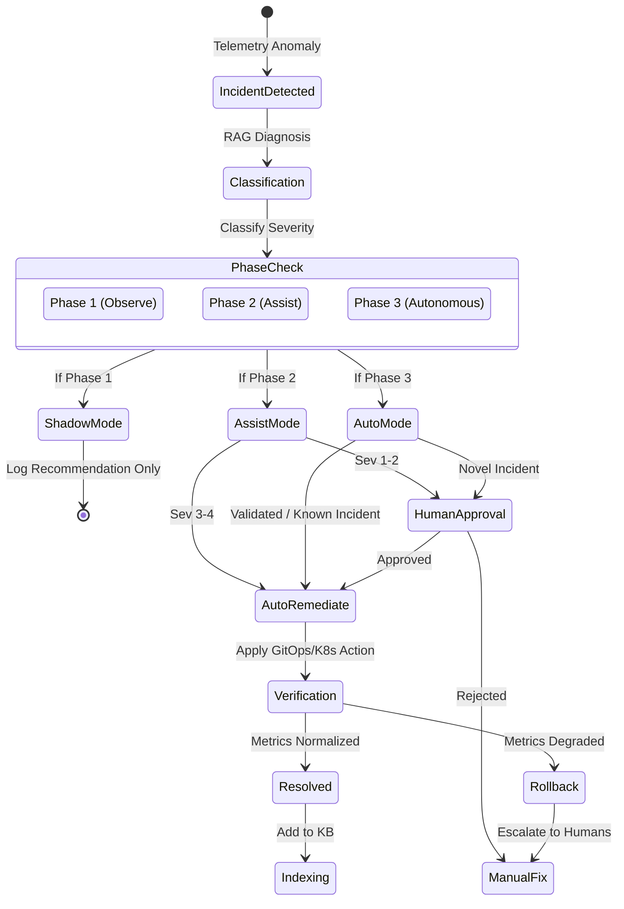

# Project Roadmap & Phased Rollout

**Status:** DRAFT
**Version:** 1.0.0

The SRE Agent operates using a strictly phased rollout to establish baseline telemetry reliability, build an initial knowledge base (KB), and earn operator trust before acting autonomously.

## Incident Lifecycle and Phased States

The agent's state-machine handles telemetry incidents relative to its current rollout phase authorization.

## Phase 1: OBSERVE (Months 1–3)
The agent runs exclusively in **Read-Only / Shadow Mode**.

* **Capabilities:** Ingests data, creates baselines, triggers ML anomalies, and diagnoses via RAG. It then logs its prescribed runbook but **takes no action**.
* **Intent:** Humans resolve the incident; the system compares the human action against the agent's shadow recommendation to build an accuracy timeline.
* **Graduation Criteria:** See [Graduation Criteria](../operations/graduation_criteria.md) for detailed Phase 1 exit requirements.

## Phase 2: ASSIST (Months 4–6)
The agent operates with restricted autonomy.

* **Capabilities:** 
  * Sev 1-2 incidents: The agent suggests root cause and remediation via a Slack or Jira PR, waiting for **Human Approval** before acting.
  * Sev 3-4 incidents: The agent executes autonomously.
* **Intent:** Dial in the blast-radius hard limits and let operators get comfortable managing incidents via agent approvals.
* **Graduation Criteria:** See [Graduation Criteria](../operations/graduation_criteria.md) for detailed Phase 2 exit requirements.

## Phase 3: AUTONOMOUS (Months 7–12)
Full autonomous operation for known incident classes.

* **Capabilities:** The agent handles well-understood incident typologies fully autonomously. Humans are kept strictly out of the loop except to receive a Slack notification summarizing the resolution.
* **Exceptions:** 20% of autonomous incidents are randomly routed to humans to prevent "skill atrophy," and any novel/unrecognized issue is instantly escalated.

## Phase 4: PREDICTIVE (Year 2+)
Moving from reactive incident resolution to proactive infrastructure management.

* **Capabilities:** 
  * Resource exhaustion trend prediction (Disk space/Memory).
  * Traffic pattern prediction (scaling *before* the spike).
  * Degradation trend detection (finding structural performance creep before it triggers an anomaly).
* **Intent:** Eliminate low-severity incidents from occurring.
