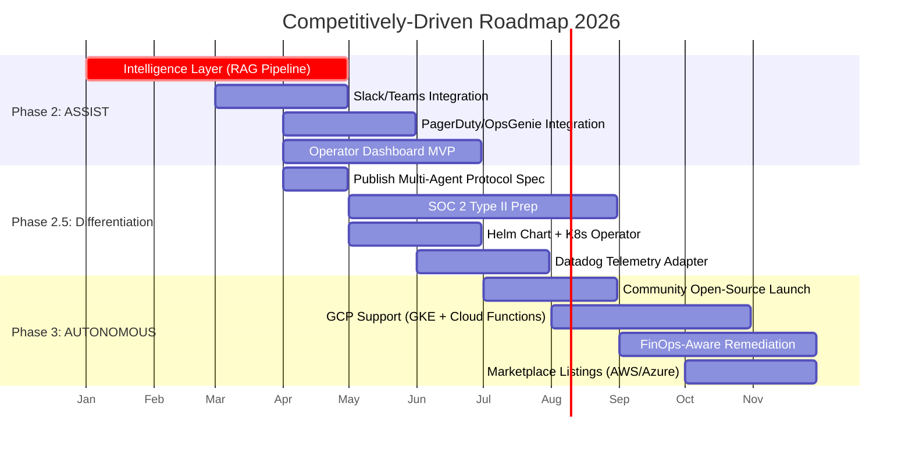

# Competitively-Driven Product Roadmap (2026)

**Status:** DRAFT  
**Version:** 1.0.0  
**Author:** SRE Agent Engineering Team  
**Last Updated:** 2026-03-25  
**Source:** [Competitive Analysis Report](../reports/competitive_analysis_report.md)

---

## Roadmap Overview

This roadmap translates competitive analysis findings into a phased execution plan aligned with the existing Phase 1–3 architecture defined in the [project roadmap](roadmap.md). Each item maps to a specific competitive gap and includes effort estimates, dependencies, and success metrics.

---

## Q1 2026 (January – March): Foundation Completion

*Aligns with: Phase 2 — ASSIST*

### 1. Complete Intelligence Layer (RAG Pipeline)

| Attribute | Details |
|---|---|
| **Competitive Gap** | Cannot compete on RCA quality without production RAG pipeline. Datadog (Bits AI), Dynatrace (Davis AI), and Robusta (HolmesGPT) all have production AI diagnosis |
| **Deliverable** | Intelligence Layer hardening and productionization: optimize the implemented RAG diagnostic pipeline (latency, stability, and operational readiness) |
| **Dependencies** | LLM provider selection, vector DB selection, embedding model selection (all from Technology Stack open decisions) |
| **Effort** | Medium (3-5 weeks) — hardening and validation cycle |
| **Success Metrics** | ≥90% diagnostic accuracy over the evaluation window; <30s diagnosis latency for Sev 3-4 incidents |
| **Phase Alignment** | Phase 2 core requirement |

> [!IMPORTANT]
> This is the #1 priority. Until the Intelligence Layer is production-ready, the agent cannot compete meaningfully on diagnostic capabilities against any commercial competitor.

---

## Q2 2026 (April – June): Enterprise Readiness

*Aligns with: Phase 2 — ASSIST*

### 2. Slack/Microsoft Teams Notification Integration

| Attribute | Details |
|---|---|
| **Competitive Gap** | Table-stakes feature — every competitor (PagerDuty, Rootly, BigPanda, Robusta) has deep Slack/Teams integration. Required for HITL approval workflows in Phase 2 |
| **Deliverable** | `adapters/notifications/slack.py` and `adapters/notifications/teams.py` implementing `NotificationPort` interface. Support for: incident alerts, approval buttons (Sev 1-2), resolution summaries |
| **Dependencies** | Intelligence Layer (for diagnosis content), Action Layer (for approval flow) |
| **Effort** | Medium (3-4 weeks) |
| **Success Metrics** | <5s notification delivery latency; >95% message delivery rate; functional approve/reject buttons |
| **Phase Alignment** | Phase 2 — required for human-in-the-loop workflows |

### 3. PagerDuty/OpsGenie On-Call Integration

| Attribute | Details |
|---|---|
| **Competitive Gap** | Enterprise adoption requires integration with existing on-call tools. PagerDuty is the market standard. Rootly and Datadog have native on-call |
| **Deliverable** | `adapters/oncall/pagerduty.py` implementing `EscalationPort` interface. Auto-create incidents for Sev 1-2 with full diagnosis context, confidence scores, and evidence links |
| **Dependencies** | Slack integration (for secondary channel), Intelligence Layer output format |
| **Effort** | Medium (2-3 weeks) |
| **Success Metrics** | PagerDuty incident creation <3s; structured payloads with diagnosis, confidence, and audit trail link |
| **Phase Alignment** | Phase 2 — notification layer (Technology Stack Phase 5, accelerated) |

### 4. Operator Dashboard MVP

| Attribute | Details |
|---|---|
| **Competitive Gap** | All commercial competitors offer visual dashboards. Operators expect: live incident timeline, confidence score visualization, phase state display, and remediation history. Sedai, Datadog, and Dynatrace all have polished UIs |
| **Deliverable** | React/Next.js dashboard with: real-time incident feed (WebSocket), confidence score decomposition, phase status, active remediation tracking, audit log viewer |
| **Dependencies** | API Layer (FastAPI endpoints), Event Store (historical data) |
| **Effort** | Large (6-8 weeks) |
| **Success Metrics** | <200ms page load; real-time updates <1s delay; mobile-responsive |
| **Phase Alignment** | Technology Stack Phase 5, accelerated to Phase 2 for competitive parity |

### 5. Publish Multi-Agent Lock Protocol as Open Specification

| Attribute | Details |
|---|---|
| **Competitive Gap** | **First-mover advantage** — no competitor addresses multi-agent coordination. Publishing AGENTS.md as an open standard can establish industry thought leadership and attract community interest |
| **Deliverable** | RFC-style specification document, reference implementation, blog post, submission to CNCF TAG-Runtime for review |
| **Dependencies** | Lock protocol implementation complete (currently planned Phase 3) |
| **Effort** | Small (2 weeks for spec doc; ongoing community engagement) |
| **Success Metrics** | Spec published on GitHub; ≥100 GitHub stars in first month; ≥2 external contributors in Q3 |
| **Phase Alignment** | Cross-cutting — establishes market positioning |

---

## Q3 2026 (July – September): Differentiation & Trust

*Aligns with: Phase 2.5 — Hardening + Phase 3 Start*

### 6. SOC 2 Type II Compliance Preparation

| Attribute | Details |
|---|---|
| **Competitive Gap** | Regulated industries (healthcare, finance, government) require compliance certifications. Dynatrace has strong compliance posture. Our event-sourced audit trail gives us a head start, but formal certification is needed |
| **Deliverable** | SOC 2 Type II readiness assessment, gap remediation, auditor engagement. Leverage existing: event sourcing, immutable audit trail (7-year retention), kill switch, RBAC |
| **Dependencies** | Event Store implementation, audit logging coverage, security review |
| **Effort** | Large (8-12 weeks for prep; 6-12 months for Type II observation period) |
| **Success Metrics** | SOC 2 Type II readiness assessment passed; zero critical findings; formal audit engagement started |
| **Phase Alignment** | Cross-cutting — enables regulated industry market entry |

### 7. Helm Chart + Kubernetes Operator

| Attribute | Details |
|---|---|
| **Competitive Gap** | Standard enterprise deployment model for K8s-native tools. Robusta deploys via Helm. Self-hosted deployment option differentiates from SaaS-only competitors (Datadog, Dynatrace, Sedai) |
| **Deliverable** | Production Helm chart with configurable values (telemetry provider, cloud provider, phase, resource limits). K8s Operator for lifecycle management (upgrades, backup, restoration) |
| **Dependencies** | Docker multi-stage build (existing), configuration injection via env vars (existing) |
| **Effort** | Medium (4-5 weeks) |
| **Success Metrics** | `helm install sre-agent` deploys fully functional agent in <5 minutes; passes Artifact Hub linting |
| **Phase Alignment** | Phase 3 — deployment infrastructure |

### 8. Datadog Telemetry Adapter

| Attribute | Details |
|---|---|
| **Competitive Gap** | Many enterprises already use Datadog for observability but want autonomous remediation. Providing a Datadog adapter means they can adopt our agent without changing their telemetry stack — directly competing with Datadog's own AIOps by offering better safety controls on top of their data |
| **Deliverable** | `adapters/telemetry/datadog/` implementing `TelemetryProvider` ABCs — MetricsQuery (Metrics API v2), TraceQuery (APM API), LogQuery (Logs API) |
| **Dependencies** | Canonical data model finalized, provider abstraction layer stable |
| **Effort** | Medium (4-6 weeks) |
| **Success Metrics** | Full metric, trace, and log ingestion from Datadog; parity with Prometheus adapter on canonical model output |
| **Phase Alignment** | Phase 1 — technology stack (planned as "Future") |

### 9. Community Open-Source Launch

| Attribute | Details |
|---|---|
| **Competitive Gap** | Robusta has 2.6K+ GitHub stars and an active community. Open-source credibility is essential for developer adoption and competitive positioning against closed-source solutions |
| **Deliverable** | Public GitHub repository, CONTRIBUTING.md, good-first-issue labels, community Slack/Discord, documentation site (Docusaurus/MkDocs), demo video, Product Hunt launch |
| **Dependencies** | Helm chart ready, dashboard MVP functional, Intelligence Layer working |
| **Effort** | Medium (4 weeks of prep + ongoing) |
| **Success Metrics** | ≥500 GitHub stars in first 3 months; ≥5 external contributors; ≥3 production deployments reported |
| **Phase Alignment** | Cross-cutting — go-to-market |

---

## Q4 2026 (October – December): Market Expansion

*Aligns with: Phase 3 — AUTONOMOUS*

### 10. GCP Support (GKE + Cloud Functions)

| Attribute | Details |
|---|---|
| **Competitive Gap** | Our agent has partial multi-cloud support today (AWS/Azure adapters and provider abstractions are implemented), but no GCP operator support. Enterprises with GCP-primary infrastructure cannot adopt us end-to-end yet. Datadog, Dynatrace, and Sedai all support tri-cloud |
| **Deliverable** | `adapters/cloud/gcp/` implementing `CloudOperatorPort` — GKE workload restart/scale, Cloud Functions concurrency management, Cloud Run scaling |
| **Dependencies** | CloudOperatorPort interface stable, GCP SDK (`google-cloud-*`) |
| **Effort** | Medium (5-6 weeks) — follows established AWS/Azure adapter patterns |
| **Success Metrics** | E2E tests passing against GCP emulator; remediation actions verified on GKE and Cloud Functions |
| **Phase Alignment** | Phase 1.5 extension (new cloud provider) |

### 11. FinOps-Aware Remediation

| Attribute | Details |
|---|---|
| **Competitive Gap** | Sedai's strongest differentiator is combining reliability + cost optimization. Our multi-agent protocol already defines FinOps Agent coordination, but the SRE Agent itself has no cost awareness |
| **Deliverable** | Cost-context enrichment for remediation decisions (e.g., "scaling up from 3→5 replicas costs ~$X/month"), cost impact in audit trail, integration with kubecost/OpenCost for K8s cost data |
| **Dependencies** | FinOps Agent protocol (from AGENTS.md), kubecost/OpenCost data source |
| **Effort** | Large (6-8 weeks) |
| **Success Metrics** | Cost impact displayed for every scale-up/down remediation; monthly cost projection within 10% accuracy |
| **Phase Alignment** | Phase 3 — extends remediation engine with cost context |

### 12. Marketplace Listings (AWS/Azure)

| Attribute | Details |
|---|---|
| **Competitive Gap** | Standard enterprise procurement channel. Sedai is on AWS Marketplace. Dynatrace and Datadog are on all major marketplaces. Marketplace presence signals enterprise maturity |
| **Deliverable** | AWS Marketplace AMI/Container listing, Azure Marketplace managed app listing, consumption-based billing integration |
| **Dependencies** | Helm chart, Docker image, billing/metering integration |
| **Effort** | Small (2-3 weeks per marketplace) |
| **Success Metrics** | Listed and approved on AWS and Azure marketplaces; ≥1 marketplace customer in first quarter |
| **Phase Alignment** | Phase 3 — go-to-market |

---

## Roadmap Summary

| Quarter | Theme | Items | Key Competitive Outcome |
|---|---|---|---|
| **Q1 2026** | Foundation | Intelligence Layer | Achieve RCA parity with competitors |
| **Q2 2026** | Enterprise Readiness | Slack, PagerDuty, Dashboard, Multi-Agent Spec | HITL workflow parity; thought leadership |
| **Q3 2026** | Trust & Differentiation | SOC 2, Helm, Datadog adapter, OSS launch | Enterprise trust; market entry |
| **Q4 2026** | Market Expansion | GCP, FinOps, Marketplaces | Tri-cloud parity; cost-aware differentiation |

---

## Risk Mitigation

| Risk | Probability | Impact | Mitigation |
|---|---|---|---|
| Datadog/Dynatrace add safety-first features | Medium | High | Accelerate multi-agent spec publication; build community moat |
| Sedai reaches open-source before us | Low | High | Fast-track Q3 2026 OSS launch |
| Enterprise customers require SOC 2 before evaluation | High | Medium | Start SOC 2 readiness assessment in Q2 (don't wait for Q3) |
| Nvidia-backed Shoreline pivots to autonomous remediation | Medium | Medium | Focus on GitOps-native and open-source differentiators |
| Intelligence Layer takes longer than estimated | Medium | Critical | De-risk by using proven RAG patterns; accept lower initial accuracy |

---

*This roadmap should be reviewed monthly and adjusted based on competitive developments and customer feedback. Cross-reference with [Competitive Analysis Report](../reports/competitive_analysis_report.md) for detailed competitor context.*

---

## Normalized Issue Log (P0/P1/P2)

### P0 — Critical (Credibility)

| ID | Area | Issue | Resolution Applied |
|---|---|---|---|
| ROADMAP-P0-001 | Phase 2 Intelligence | Item was framed as greenfield build despite implemented Phase 2 Intelligence components | Reframed deliverable to hardening/productionization and adjusted effort model |

### P1 — High (Strategy Impact)

| ID | Area | Issue | Resolution Applied |
|---|---|---|---|
| ROADMAP-P1-001 | Success Metrics | Accuracy target (≥70%) was below project graduation thresholds | Updated target to ≥90% accuracy to align with phase-gate expectations |
| ROADMAP-P1-002 | Multi-Cloud Positioning | Claim implied fully implemented K8s+AWS+Azure execution parity | Updated wording to partial multi-cloud support with explicit GCP gap |

### P2 — Medium (Quality Improvement)

| ID | Area | Issue | Resolution Applied |
|---|---|---|---|
| ROADMAP-P2-001 | Terminology Precision | Several statements blurred implementation status vs. strategic intent | Added explicit hardening and partial-support language in key rows |
