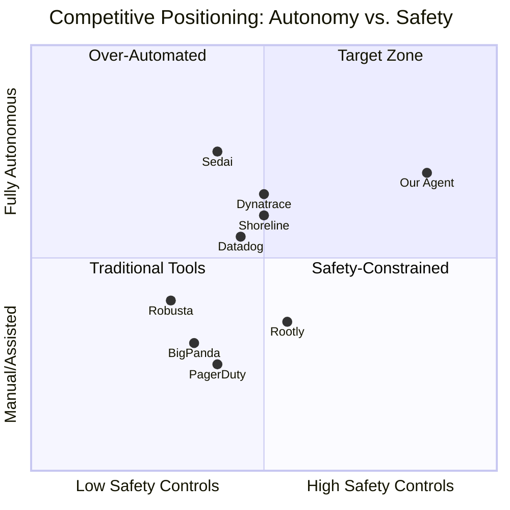
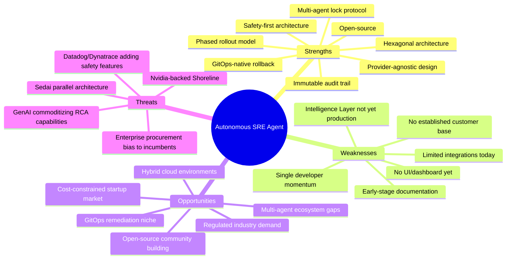

# Competitive Analysis Report: Autonomous SRE Agent

**Status:** DRAFT  
**Version:** 1.0.0  
**Author:** SRE Agent Engineering Team  
**Last Updated:** 2026-03-27  

---

## Executive Summary

The AIOps and SRE automation market is rapidly evolving, driven by enterprise demand for reduced MTTR, lower operational toil, and AI-powered incident response. This report benchmarks the **Autonomous SRE Agent** against 8 leading competitors across commercial AIOps platforms, open-source tools, cloud-native incident response, and AI-powered automation.

### Key Findings

1. **Market Gap: Safety-First Autonomous Remediation.** Few competitors publicly document a formalized multi-agent lock protocol with priority preemption, fencing tokens, and cooldown anti-oscillation. Our agent's safety-first architecture (phased rollout, blast-radius controls, HITL gates) is a design-level differentiator, with full runtime lock-governance implementation still maturing.

2. **Commercial Leaders (Datadog, Dynatrace) dominate on breadth**, with full-stack observability, massive integration ecosystems, and enterprise scale. However, their AIOps capabilities are tightly coupled to their proprietary telemetry stacks, creating vendor lock-in.

3. **Open-Source Alternatives (Robusta, Keptn) are narrowly scoped.** Robusta excels at Kubernetes alert enrichment but lacks autonomous remediation. Keptn (CNCF Archived, Sept 2025) focused on deployment lifecycle, not incident response.

4. **Incident Response Platforms (Rootly, PagerDuty) focus on human coordination**, not autonomous remediation. They orchestrate human workflows rather than replacing them.

5. **Our Primary Competitive Threat is Sedai**, which offers a similar datapilot/copilot/autopilot progression matching our Observe/Assist/Autonomous phases. However, Sedai is closed-source, single-agent, and lacks GitOps integration.

6. **Underserved Niches Present Clear Opportunities:** cost-constrained startups needing open-source solutions, hybrid on-prem/cloud environments, regulated industries requiring audit trails, and multi-agent coordination scenarios.

### Strategic Positioning

---

## Competitor Landscape

### 1. Datadog AIOps

| Attribute | Details |
|---|---|
| **Category** | Commercial AIOps Platform |
| **Founded** | 2010 |
| **Market Position** | Leader — Forrester Wave AIOps Platforms Q2 2025 |
| **Pricing** | Per-host: ~$15-34/host/mo (Infra); AIOps via Workflow Automation included in higher tiers |
| **Key Customers** | Samsung, Peloton, Whole Foods, Comcast |

**Capabilities:**
- **Anomaly Detection:** ML-based anomaly detection, outlier identification, and forecasting across metrics, traces, and logs. Natively integrated with their proprietary telemetry stack
- **Automated Remediation:** Workflow Automation (GA June 2023) enables end-to-end remediation flows — restart services, scale infrastructure, execute runbook automations. Pre-built templates available
- **Incident Management:** Bits AI SRE (announced DASH 2025) — an AI on-call teammate that autonomously investigates alerts and coordinates incident response, including an AI voice agent
- **Event Management:** Aggregates, correlates, and enriches alerts to reduce noise. Smart alert grouping and suppression
- **Multi-Cloud:** Full support for AWS, Azure, GCP, Kubernetes, and 750+ integrations
- **GitOps Integration:** Limited — no native GitOps rollback capability

**Strengths:** Unmatched breadth of observability data, massive integration ecosystem, strong brand recognition, Forrester Leader  
**Weaknesses:** Extreme vendor lock-in (requires Datadog agents everywhere), expensive at scale ($200K+/year for mid-size deployments), AIOps capabilities still maturing relative to observability core, no formalized safety protocols for autonomous actions

---

### 2. Dynatrace Davis AI

| Attribute | Details |
|---|---|
| **Category** | Commercial AIOps Platform |
| **Founded** | 2005 (rebranded 2014) |
| **Market Position** | Leader — Gartner APM & Observability Magic Quadrant |
| **Pricing** | Per-host: $21/host/mo (Infrastructure); Full-Stack: $69/host/mo |
| **Key Customers** | SAP, Kroger, U.S. Air Force, Experian |

**Capabilities:**
- **Anomaly Detection:** Davis AI provides causal AI — deterministic root cause analysis using topology-aware dependency mapping. Not probabilistic ML, but causal inference
- **Automated Remediation:** AutomationEngine-based workflows generate K8s deployment artifacts and adjust limits based on actual usage. Integration with Red Hat Ansible for flexible remediation
- **Predictive Operations:** Expanding from reactive to preventive — AI forecasts future behavior and generates artifacts to prevent issues before they occur
- **Agentic AI Platform:** Evolving towards agents that reason, act, and learn. Self-healing and self-optimizing systems
- **Security Integration:** Proactive firewall configuration, CSPM with continuous monitoring and automated remediation
- **Multi-Cloud:** Full support including OneAgent auto-instrumentation

**Strengths:** Best-in-class causal AI (not just correlation), automatic topology discovery via OneAgent, strong enterprise compliance posture, single-agent deployment model  
**Weaknesses:** Very expensive ($500K+/year for enterprise), OneAgent is deeply invasive, limited open-source ecosystem, remediation workflows still require significant custom development

---

### 3. PagerDuty AIOps

| Attribute | Details |
|---|---|
| **Category** | Incident Management + AIOps |
| **Founded** | 2009 |
| **Market Position** | Market leader in incident management, expanding into AIOps |
| **Pricing** | Professional: $21/user/mo; Business: $41/user/mo; AIOps add-on: $699+/mo + usage-based |
| **Key Customers** | Slack, Lululemon, Box, Cox Automotive |

**Capabilities:**
- **Alert Noise Reduction:** Intelligent Alert Grouping (ML-based), Content-Based Grouping, Auto-Pause Incident Notifications, Event Orchestration with suppression
- **Root Cause Analysis:** ML identifies probable origin, prior occurrences, and recent changes that might be causal
- **Automation:** Event Orchestration automates routine tasks. Fall '25 AI agent suite (Scribe, Shift, Insights Agents)
- **Incident Coordination:** Best-in-class on-call management, escalation policies, Slack/Teams integration
- **Multi-Cloud:** Agnostic — ingests from any monitoring source via 700+ integrations

**Strengths:** Dominant in incident management, excellent on-call workflows, strong Slack/Teams integration, mature escalation policies  
**Weaknesses:** Fundamentally a human-coordination tool, not an autonomous remediation engine. AIOps add-on is expensive and limited to noise reduction + triage. No direct infrastructure remediation capabilities — relies on third-party runbook tools

---

### 4. BigPanda AIOps

| Attribute | Details |
|---|---|
| **Category** | AIOps Event Correlation Platform |
| **Founded** | 2012 |
| **Market Position** | Recognized in 10 Gartner Hype Cycles 2025 |
| **Pricing** | Enterprise-only, not publicly listed (estimated $100K-500K+/year) |
| **Key Customers** | Intel, Travelport, TUI Group, Autodesk |

**Capabilities:**
- **Event Correlation:** "Open Box Machine Learning" — explainable AI correlates alerts at >95% accuracy. Ingests from monitoring, change, and topology tools
- **Noise Reduction:** Filtering, normalization, deduplication, aggregation, and enrichment pipeline
- **Root Cause Analysis:** Topology Assembly builds real-time infrastructure model. Biggy AI (GenAI assistant) provides automated incident analysis, guided remediation, and post-mortems
- **Level-0 Automation:** Workflow automations for remediation, ticketing, notifications, war-room creation. Connects to third-party runbook tools
- **Agentic AI:** BigPanda 25 event introduced AI agents that adapt, learn, and collaborate with human teams

**Strengths:** Best-in-class event correlation (>95% accuracy claim), explainable AI (Open Box ML), strong enterprise ITSM integrations (ServiceNow, Jira), topology-aware correlation  
**Weaknesses:** No direct infrastructure remediation (relies on third-party tools), extremely enterprise-focused (no SMB/startup tier), closed-source, complex onboarding (6-12 week implementations reported)

---

### 5. Robusta.dev

| Attribute | Details |
|---|---|
| **Category** | Open-Source Kubernetes Monitoring & Troubleshooting |
| **GitHub Stars** | ~2.6K (robusta); ~4.5K (KRR) |
| **License** | MIT (HolmesGPT); Open-source core with commercial SaaS |
| **Pricing** | Free tier (unlimited clusters/nodes); Pro: ~$50/cluster/mo |

**Capabilities:**
- **Alert Enrichment:** Automatically appends pod logs, graphs, and potential remediations to Prometheus alerts
- **AI Investigation:** HolmesGPT — open-source AI-powered root cause analysis agent (MIT licensed)
- **Self-Healing:** Auto-remediation rules for Kubernetes workloads
- **Resource Optimization:** KRR (Kubernetes Resource Recommender) — analyzes Prometheus data to right-size containers
- **Change Tracking:** Correlates alerts with Kubernetes resource changes
- **Multi-Cluster:** Supports multi-cluster operations with cluster timeline view
- **Integrations:** Slack, Teams, PagerDuty, Datadog, ServiceNow, Jira

**Strengths:** Open-source core (HolmesGPT), Kubernetes-native, low barrier to entry, excellent alert enrichment, active community  
**Weaknesses:** Kubernetes-only (no ECS, Lambda, Azure App Service support), limited autonomous remediation (mostly alert enrichment), no phased rollout or safety guardrails, no multi-agent coordination, SaaS-dependent for full experience

---

### 6. Keptn (CNCF Archived)

| Attribute | Details |
|---|---|
| **Category** | Open-Source Cloud-Native Application Lifecycle Management |
| **GitHub Stars** | ~2.4K (combined lifecycle-toolkit + main repo) |
| **License** | Apache 2.0 |
| **CNCF Status** | **Archived** (September 3, 2025) |
| **Pricing** | Free (open-source) |

**Capabilities:**
- **Metrics:** Keptn Metrics Operator — define metrics from multiple sources (Prometheus, Dynatrace, AWS)
- **Observability:** Deployment observability, DORA metrics capture, OpenTelemetry integration
- **Release Lifecycle:** Pre/post-deployment evaluations, quality gates via SLO analysis, multi-stage delivery
- **GitOps Integration:** Tool-agnostic, integrates with ArgoCD, Flux, GitLab

**Strengths:** Strong GitOps integration, SLO-based quality gates, CNCF pedigree, declarative approach  
**Weaknesses:** **Project archived by CNCF (Sept 2025)** — no longer actively maintained, focused on deployment lifecycle rather than incident response, no anomaly detection or RCA, no remediation capabilities, declining community

> [!CAUTION]
> Keptn's CNCF archival makes it a declining competitor. However, its SLO-based quality gate pattern remains influential and worth studying for our Phase 2 design.

---

### 7. Shoreline.io (acquired by Nvidia)

| Attribute | Details |
|---|---|
| **Category** | SRE Automation Platform |
| **Founded** | 2019 |
| **Acquired By** | Nvidia (~$100M, June 2024) |
| **Pricing** | Not publicly listed (enterprise sales) |

**Capabilities:**
- **Fleet-Wide Debugging:** Real-time, fleet-wide interactive debugging — run any shell command across entire infrastructure
- **Automated Runbooks:** Pre-built and customizable runbooks for end-to-end incident repair, auto-executed on monitor triggers
- **Multi-Cloud:** AWS, Azure, GCP support
- **Infrastructure-as-Code:** Terraform Provider for operations automation
- **Observability Integration:** Datadog, SumoLogic, New Relic, plus custom monitors
- **Toil Reduction:** Focus on automating repetitive known issues

**Strengths:** Powerful fleet-wide execution engine, strong Terraform integration, Nvidia acquisition brings resources and AI capabilities  
**Weaknesses:** Nvidia acquisition creates strategic uncertainty (may be absorbed into Nvidia ecosystem), not open-source, no AI-driven anomaly detection (relies on external monitors), no multi-agent coordination, runbook-centric (not learning-based)

---

### 8. Sedai

| Attribute | Details |
|---|---|
| **Category** | AI-Powered Autonomous Cloud Management |
| **Founded** | 2019 |
| **Market Position** | Niche leader in autonomous optimization |
| **Pricing** | Not publicly listed (enterprise sales, available on AWS Marketplace) |

**Capabilities:**
- **Autonomous Optimization:** Automatically adjusts compute resources (vCPU, Memory) at workload and cluster levels, selects instance types, scales based on real-time latency/traffic
- **Autonomous Remediation:** Predicts and detects OOM, CPU throttling in real-time. Proactive corrective actions to meet SLAs/SLOs
- **Release Intelligence:** Automated performance scoring for every deployment
- **Cost Observability:** FinOps insights with anomaly detection and unit cost analysis
- **Operational Modes:** Datapilot (observe), Copilot (approve), Autopilot (autonomous) — directly parallels our Phase 1/2/3 model
- **Multi-Cloud:** EKS, AKS, GKE, self-managed K8s, AWS services, Azure

**Strengths:** Most similar phased autonomy model to ours, strong FinOps integration, multi-cloud K8s support, reinforcement learning from feedback loops  
**Weaknesses:** Closed-source (no community contributions), single-agent architecture (no multi-agent coordination), no GitOps rollback integration, limited transparency in AI decision-making, no HITL gates for high-severity incidents, no audit trail standards for regulated industries

---

## Feature Comparison Matrix

Scoring: ● Full Support (3) | ◐ Partial Support (2) | ○ Minimal/No Support (1)

| Feature | Our Agent | Datadog | Dynatrace | PagerDuty | BigPanda | Robusta | Shoreline | Sedai |
|---|:---:|:---:|:---:|:---:|:---:|:---:|:---:|:---:|
| **Anomaly Detection (ML)** | ◐ | ● | ● | ○ | ○ | ◐ | ○ | ● |
| **Root Cause Analysis** | ◐ | ● | ● | ◐ | ● | ◐ | ○ | ◐ |
| **Automated Remediation** | ◐ | ◐ | ◐ | ○ | ○ | ◐ | ● | ● |
| **Multi-Cloud (K8s+AWS+Azure)** | ● | ● | ● | ● | ● | ○ | ● | ● |
| **GitOps Integration** | ● | ○ | ○ | ○ | ○ | ○ | ◐ | ○ |
| **HITL Workflows** | ● | ◐ | ◐ | ● | ◐ | ○ | ○ | ◐ |
| **Multi-Agent Coordination** | ◐ | ○ | ○ | ○ | ○ | ○ | ○ | ○ |
| **Safety Guardrails** | ◐ | ◐ | ◐ | ◐ | ○ | ○ | ○ | ◐ |
| **Phased Rollout** | ● | ○ | ○ | ○ | ○ | ○ | ○ | ● |
| **Provider-Agnostic Telemetry** | ● | ○ | ○ | ● | ● | ○ | ◐ | ◐ |
| **Open-Source** | ● | ○ | ○ | ○ | ○ | ● | ○ | ○ |
| **Event Correlation** | ◐ | ● | ● | ◐ | ● | ◐ | ○ | ◐ |
| **Blast Radius Controls** | ● | ○ | ◐ | ○ | ○ | ○ | ○ | ◐ |
| **Audit Trail / Compliance** | ● | ◐ | ● | ◐ | ◐ | ○ | ○ | ○ |
| **Kill Switch / Override** | ◐ | ○ | ◐ | ◐ | ○ | ○ | ○ | ○ |
| **FinOps Integration** | ○ | ● | ◐ | ○ | ○ | ◐ | ○ | ● |
| | | | | | | | | |
| **Composite Score** | **37/48** | **31/48** | **33/48** | **24/48** | **21/48** | **18/48** | **18/48** | **33/48** |

> [!NOTE]
> Our agent remains highly differentiated in architecture and safety design. Scores in coordination and guardrails include components that are partially implemented and should be interpreted as trajectory, not full production parity.

---

## Strengths & Weaknesses Analysis

### Our Agent — SWOT Analysis

### Detailed Assessment

#### Strengths (Competitive Moats)

| Strength | Competitive Advantage | Threat of Replication |
|---|---|---|
| **Multi-Agent Lock Protocol** | Strong design-level inter-agent coordination model (SRE/SecOps/FinOps priority preemption, fencing tokens, cooldown), with runtime maturity still in progress | Medium — complex to replicate correctly, requires distributed systems expertise |
| **Phased Rollout (Observe→Assist→Autonomous)** | Builds operator trust systematically; matches Sedai but with stronger safety gates | High — Sedai already has similar model, others could adopt |
| **Provider-Agnostic Architecture** | No vendor lock-in; canonical data model with pluggable adapters for Prometheus, New Relic, Datadog backends | Medium — requires significant adapter development effort |
| **GitOps-Native Rollback** | Deterministic, auditable rollbacks via ArgoCD/Flux Git reverts. No competitor offers this natively | Low — unique architectural decision with deep GitOps integration |
| **Blast Radius Controls** | Hard limits on remediation scope (e.g., "never restart >20% of pods") with OPA policy enforcement | Medium — others have ad-hoc limits but not policy-driven |
| **Event Sourcing Audit Trail** | Immutable, 7-year-retention event log for incident lifecycle reconstruction. Critical for regulated industries | Low — requires architectural commitment from Day 1 |
| **Open-Source** | Community contributions, transparency, no vendor lock-in, self-hosting option | N/A — structural advantage |

#### Weaknesses (Gaps to Address)

| Weakness | Impact | Priority |
|---|---|---|
| **Intelligence Layer (RAG) not yet production** | Cannot compete on RCA quality until live | **P0 — Critical** |
| **No established customer base** | Zero social proof; enterprises require references | P1 — High |
| **Limited integration ecosystem** | Only Prometheus/K8s/AWS/Azure adapters today; competitors have 400-750+ | P1 — High |
| **No UI/Dashboard** | Operators expect visual incident timeline, confidence visualization | P2 — Medium |
| **No Slack/PagerDuty integration** | Missing critical notification channels for HITL workflows | P1 — High |
| **Single-developer velocity** | Can't match enterprise R&D budgets of Datadog ($600M+/year) or Dynatrace | P2 — Medium |

---

## Market Gaps & Opportunities

### Underserved Niches

#### 1. Cost-Constrained Startups (TAM: ~50,000 companies)

**Problem:** Datadog costs $200K+/year, Dynatrace $500K+. Startups with 10-50 engineers can't afford AIOps but desperately need reduced MTTR.

**Our Opportunity:** Open-source core with self-hosting option. Free tier for small clusters. Premium support / managed SaaS for revenue. Robusta's pricing (~$50/cluster/mo) validates this market.

**Competitive Position:** Only open-source solution offering autonomous remediation + safety guardrails.

#### 2. Regulated Industries (TAM: Healthcare $12B, Finance $8B, Government $5B)

**Problem:** HIPAA, SOC 2, PCI-DSS, and FedRAMP compliance require immutable audit trails, deterministic actions, and human override guarantees. Most AIOps platforms treat compliance as an afterthought.

**Our Opportunity:** Event-sourced auditability, kill switch policy, human supremacy protocol, deterministic GitOps rollback design, and phased rollout provide a strong compliance direction. Full production evidence should be tracked and published per capability as implementation matures.

**Competitive Position:** Strongest compliance-ready architecture of any SRE automation tool.

#### 3. Hybrid On-Prem/Cloud Environments

**Problem:** Enterprises with legacy on-prem infrastructure (k3s, Rancher, bare-metal K8s) can't use cloud-only SaaS tools. Datadog and Dynatrace require outbound internet connectivity.

**Our Opportunity:** Self-hosted deployment, provider-agnostic architecture, support for self-managed K8s (kubeadm/k3s/Rancher), on-prem secrets management via HashiCorp Vault.

**Competitive Position:** Only solution equally capable on-prem and in-cloud.

#### 4. Multi-Agent Infrastructure Automation

**Problem:** As organizations deploy multiple AI agents (SRE, SecOps, FinOps, platform engineering), coordination becomes critical. No existing platform addresses inter-agent conflict resolution.

**Our Opportunity:** The multi-agent lock protocol is architecturally unique. The AGENTS.md framework defines formal coordination protocols that can become an industry standard.

**Competitive Position:** Early design lead in multi-agent coordination, contingent on production-grade lock-manager and policy-runtime completion.

#### 5. GitOps-Native Organizations

**Problem:** Teams using ArgoCD/Flux for deployment have no SRE tool that integrates remediation into their GitOps workflow. Existing tools execute remediation via direct API calls, breaking the GitOps single-source-of-truth model.

**Our Opportunity:** Git revert PRs as the remediation mechanism. Fully auditable, reviewable, and consistent with GitOps principles.

**Competitive Position:** Only solution offering GitOps-native rollback remediation.

---

## Technical Architecture Comparison

| Dimension | Our Agent | Datadog | Dynatrace | Sedai | Robusta |
|---|---|---|---|---|---|
| **Architecture** | Hexagonal (Ports & Adapters) | Monolithic SaaS | Monolithic SaaS + OneAgent | Monolithic SaaS | K8s Operator + SaaS UI |
| **Agent Model** | Multi-agent with lock protocol | Single platform | Single agent (OneAgent) | Single agent | Single operator |
| **LLM Strategy** | Pluggable (GPT/Claude/Llama) | Proprietary (Bits AI) | Proprietary (Davis AI) | Proprietary | Open (HolmesGPT) |
| **Telemetry Abstraction** | Canonical data model + adapters | Proprietary collection | Proprietary OneAgent | APM integration | Prometheus-only |
| **Data Plane** | Self-hosted or managed | SaaS-only | SaaS + Managed | SaaS-only | SaaS or self-hosted |
| **Safety Model** | State machine + policy engine | Ad-hoc workflow guards | Workflow approvals | Mode-based (3 levels) | Rule-based |
| **Event Sourcing** | First-class (EventStore port) | Audit logs | Audit logs | Limited | None |
| **Extensibility** | Plugin adapters + Python | REST API + Terraform | REST API + Extensions | REST API | Python playbooks |

---

## Strategic Recommendations

### Priority 1 — Competitive Must-Haves (Phase 2, Q1-Q2 2026)

| # | Recommendation | Competitive Gap | Effort |
|---|---|---|---|
| 1 | **Complete Intelligence Layer (RAG pipeline)** | Cannot compete on RCA without this | L (in progress) |
| 2 | **Slack/Teams notification integration** | Every competitor has this; table stakes for HITL | M |
| 3 | **PagerDuty/OpsGenie on-call integration** | Required for enterprise adoption | M |
| 4 | **Operator Dashboard MVP** | Visual incident management expected by all users | L |

### Priority 2 — Competitive Differentiators (Phase 2-3, Q2-Q3 2026)

| # | Recommendation | Competitive Gap | Effort |
|---|---|---|---|
| 5 | **Publish AGENTS.md as open standard** | First-mover advantage in multi-agent coordination | S |
| 6 | **Compliance certification prep (SOC 2 Type II)** | Required for regulated industry market | L |
| 7 | **Helm chart + Operator for K8s deployment** | Standard enterprise deployment model | M |
| 8 | **Datadog/New Relic telemetry adapters** | Extend to existing observability stacks | M |

### Priority 3 — Market Expansion (Phase 3-4, Q3-Q4 2026)

| # | Recommendation | Competitive Gap | Effort |
|---|---|---|---|
| 9 | **Open-source community launch** | Build social proof and contributor base | M |
| 10 | **GCP support (GKE, Cloud Functions)** | Only AWS/Azure today; customers expect tri-cloud | M |
| 11 | **FinOps integration (cost-aware remediation)** | Sedai's strong differentiator; we should match | L |
| 12 | **Marketplace listings (AWS/Azure/GCP)** | Standard enterprise procurement channel | S |

Effort: S = Small (<2 weeks), M = Medium (2-6 weeks), L = Large (6+ weeks)

---

## March 27 Milestone Mirror (Companion Status Sync)

This section mirrors the corrected implementation status in `docs/reports/analysis/phase_status_evaluation_report.md` and `docs/project/roadmap_competitive_driven.md`.

| Milestone | Status (2026-03-27) | Evidence Anchor |
|---|---|---|
| Intelligence layer core | ✅ Implemented, hardening ongoing | `domain/diagnostics/*` + verification streams |
| Core remediation engine | ✅ Implemented | `domain/remediation/engine.py`, `planner.py` |
| Core safety guardrails | ✅ Implemented | `domain/safety/*` |
| Distributed lock backends | ✅ Implemented | `adapters/coordination/*` |
| Kubernetes operator path | ✅ Implemented | `adapters/cloud/kubernetes/operator.py` |
| Notification adapters | ❌ Not implemented | `adapters/notifications/slack/`, `pagerduty/`, `jira/` empty |
| GitOps adapters | ❌ Not implemented | `adapters/gitops/` empty |
| Slow response detection (2.5) | 🚧 In progress | design/spec/tasks complete, implementation pending |
| Dashboard MVP (2.7) | ❌ Planned | no runtime UI implementation yet |

> [!IMPORTANT]
> Competitive positioning should treat action-layer safety and coordination as implemented core primitives, while tracking notifications, GitOps, and dashboard as the active execution gap for Phase 2 closeout.

---

## Sources

| Source | Type | URL / Reference |
|---|---|---|
| Datadog AIOps Documentation | Vendor | datadoghq.com/product/platform/aiops |
| Datadog DASH 2025 Announcements | Vendor | datadoghq.com/blog/dash-2025 |
| Forrester Wave: AIOps Platforms Q2 2025 | Analyst | Datadog recognized as Leader |
| Dynatrace Davis AI Documentation | Vendor | dynatrace.com/platform/davis-ai |
| Dynatrace Perform 2025 Announcements | Vendor | dynatrace.com |
| PagerDuty AIOps Features | Vendor | pagerduty.com/platform/aiops |
| PagerDuty Pricing Page | Vendor | pagerduty.com/pricing |
| BigPanda AIOps Platform | Vendor | bigpanda.io/platform |
| BigPanda 25 Event Announcements | Vendor | bigpanda.io |
| Gartner Hype Cycles 2025 (BigPanda in 10 cycles) | Analyst | bigpanda.io |
| Robusta GitHub Repository | Open Source | github.com/robusta-dev/robusta |
| Robusta KRR GitHub Repository | Open Source | github.com/robusta-dev/krr (4.5K stars) |
| HolmesGPT GitHub Repository | Open Source | github.com/robusta-dev/holmesgpt |
| Keptn CNCF Archived Status | Open Source | cncf.io (Archived Sept 3, 2025) |
| Keptn GitHub Repositories | Open Source | github.com/keptn (2.4K combined stars) |
| Shoreline.io Nvidia Acquisition | News | siliconangle.com (~$100M, June 2024) |
| Sedai Platform Documentation | Vendor | sedai.io/platform |
| Sedai AWS Marketplace | Vendor | aws.amazon.com/marketplace (Sedai) |
| Rootly Platform | Vendor | rootly.com |
| Rootly Pricing | Vendor | rootly.com/pricing ($20/user/mo Essentials) |
| Rootly AI Roadmap 2025 | Vendor | rootly.com/blog/ai-roadmap |

---

*This report should be reviewed quarterly and updated as the competitive landscape evolves. Next review: Q3 2026.*

---

## Normalized Issue Log (P0/P1/P2)

### P0 — Critical (Credibility)

| ID | Area | Issue | Resolution Applied |
|---|---|---|---|
| COMP-P0-001 | Safety/Coordination Claims | Absolute language overstated implementation maturity for coordination guardrails | Replaced absolute phrasing with design-level and maturity-aware wording |
| COMP-P0-002 | Comparative Scoring | Full support scores implied production-complete multi-agent safety controls | Downgraded coordination/guardrail/override rows to partial support and recalculated composite |

### P1 — High (Strategy Impact)

| ID | Area | Issue | Resolution Applied |
|---|---|---|---|
| COMP-P1-001 | Positioning Narrative | “First-mover advantage” stated as definitive without runtime completion caveat | Updated to “early design lead” with implementation dependency |
| COMP-P1-002 | Compliance Narrative | Compliance posture language mixed design intent and verified operational evidence | Reframed as compliance direction and called for capability-level evidence tracking |
| COMP-P1-003 | Milestone Drift | Competitive narrative lagged newly completed Phase 2 action-layer milestones | Added March 27 milestone mirror to align status across strategy docs |

### P2 — Medium (Quality Improvement)

| ID | Area | Issue | Resolution Applied |
|---|---|---|---|
| COMP-P2-001 | Reader Interpretation | Matrix interpretation could be read as production parity across all categories | Added guidance note clarifying trajectory vs. full production parity |
