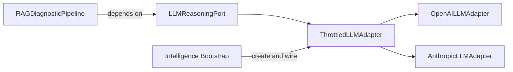
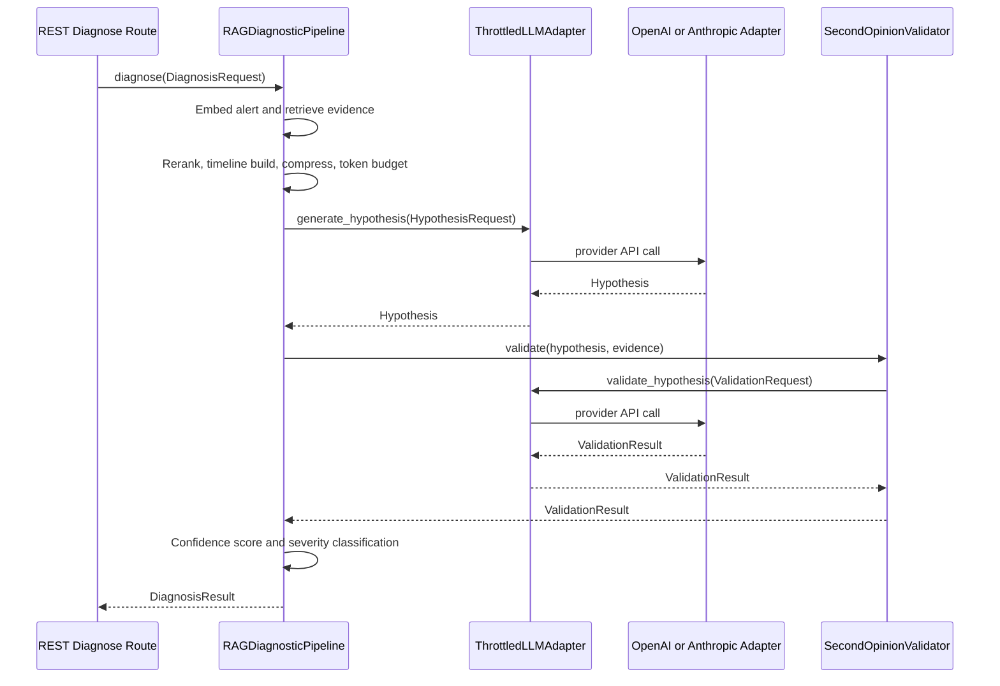

## Scope and sources

This document describes the current implementation in:

- `/Users/faizanhussain/Documents/Project/Practice/AiOps/src/sre_agent/ports/llm.py`
- `/Users/faizanhussain/Documents/Project/Practice/AiOps/src/sre_agent/adapters/llm/openai/adapter.py`
- `/Users/faizanhussain/Documents/Project/Practice/AiOps/src/sre_agent/adapters/llm/anthropic/adapter.py`
- `/Users/faizanhussain/Documents/Project/Practice/AiOps/src/sre_agent/adapters/llm/throttled_adapter.py`
- `/Users/faizanhussain/Documents/Project/Practice/AiOps/src/sre_agent/domain/diagnostics/rag_pipeline.py`
- `/Users/faizanhussain/Documents/Project/Practice/AiOps/src/sre_agent/domain/diagnostics/validator.py`
- `/Users/faizanhussain/Documents/Project/Practice/AiOps/src/sre_agent/adapters/intelligence_bootstrap.py`
- `/Users/faizanhussain/Documents/Project/Practice/AiOps/src/sre_agent/adapters/telemetry/metrics.py`

## 1) Architecture overview

The LLM integration follows Ports and Adapters:

- Port contract: `LLMReasoningPort` in `src/sre_agent/ports/llm.py`
- Concrete adapters:
  - `OpenAILLMAdapter`
  - `AnthropicLLMAdapter`
- Wrapper adapter for backpressure and fairness:
  - `ThrottledLLMAdapter`
- Domain orchestration:
  - `RAGDiagnosticPipeline` depends on `LLMReasoningPort`, not provider SDKs
- Composition root:
  - `create_llm()` and `create_diagnostic_pipeline()` choose provider and wrap with throttle



## 2) Request flow

### Sequence from anomaly to final diagnosis



### Trigger points in code

- Route creates `DiagnosisRequest` and calls `pipeline.diagnose(...)`
- Pipeline creates `HypothesisRequest` and calls `self._llm.generate_hypothesis(...)`
- Validator creates `ValidationRequest` and calls `self._llm.validate_hypothesis(...)`

## 3) Key components

### `LLMReasoningPort` (`src/sre_agent/ports/llm.py`)

```python
class LLMReasoningPort(ABC):
    @abstractmethod
    async def generate_hypothesis(self, request: HypothesisRequest) -> Hypothesis: ...

    @abstractmethod
    async def validate_hypothesis(self, request: ValidationRequest) -> ValidationResult: ...

    @abstractmethod
    def count_tokens(self, text: str) -> int: ...

    @abstractmethod
    def get_token_usage(self) -> TokenUsage: ...

    @abstractmethod
    async def health_check(self) -> bool: ...
```

### `OpenAILLMAdapter` (`src/sre_agent/adapters/llm/openai/adapter.py`)

```python
response = await self._client.chat.completions.create(
    model=self._config.model_name,
    messages=[
        {"role": "system", "content": HYPOTHESIS_SYSTEM_PROMPT},
        {"role": "user", "content": user_prompt},
    ],
    temperature=self._config.temperature,
    max_tokens=self._config.max_tokens,
    response_format={"type": "json_object"},
)
```

### `AnthropicLLMAdapter` (`src/sre_agent/adapters/llm/anthropic/adapter.py`)

```python
response = await self._client.messages.create(
    model=self._config.model_name,
    system=HYPOTHESIS_SYSTEM_PROMPT,
    messages=[{"role": "user", "content": user_prompt}],
    temperature=self._config.temperature,
    max_tokens=self._config.max_tokens,
)
```

### `ThrottledLLMAdapter` (`src/sre_agent/adapters/llm/throttled_adapter.py`)

- Uses `asyncio.Semaphore` for max concurrent calls
- Uses `asyncio.PriorityQueue` for severity-aware dispatch
- Delegates all interface methods to inner adapter, with queueing around generation and validation calls

### Integration with RAG Diagnostic Pipeline

`RAGDiagnosticPipeline` uses LLM at two points:

1. Stage 5 hypothesis generation
2. Stage 6 validation via `SecondOpinionValidator`

Bootstrap wiring sets validator strategy to `ValidationStrategy.BOTH` and wraps LLM in `ThrottledLLMAdapter`.

## 4) Data structures

Definitions in `src/sre_agent/ports/llm.py`:

- `EvidenceContext`
  - `content`, `source`, `relevance_score`
- `HypothesisRequest`
  - `alert_description`, `service_name`, `timeline`, `evidence`, `system_context`, `priority`
- `Hypothesis`
  - `root_cause`, `confidence`, `reasoning`, `evidence_citations`, `suggested_remediation`
- `ValidationRequest`
  - `hypothesis`, `original_evidence`, `alert_description`
- `ValidationResult`
  - `agrees`, `confidence`, `reasoning`, `contradictions`, optional corrected fields
- `TokenUsage`
  - cumulative `prompt_tokens`, `completion_tokens`, computed `total_tokens`

## 5) Prompt construction

### System prompts

Shared constants in `src/sre_agent/adapters/llm/prompts.py`:

- `HYPOTHESIS_SYSTEM_PROMPT`
- `VALIDATION_SYSTEM_PROMPT`

Both enforce JSON output schema and reasoning constraints.

### User prompt assembly

`OpenAILLMAdapter._build_hypothesis_prompt(...)` builds sections:

- `## Alert`
- `## Service`
- optional `## Timeline`
- optional `## Evidence` with per-item source and relevance

`OpenAILLMAdapter._build_validation_prompt(...)` builds:

- Hypothesis summary
- optional original alert
- evidence citations as short snippets (first 150 chars)

### Example hypothesis prompt

```text
## Alert
OOM_KILL: OOM kill on checkout-service service=checkout-service metric=container_memory_working_set_bytes value=1950

## Service
checkout-service

## Timeline
2026-03-17T10:10:01Z pod restart observed

## Evidence
### Evidence 1 (relevance: 0.92, source: runbook/oom-checkout.md)
Set memory limit to 2Gi and reduce worker concurrency during spikes.
```

## 6) API interaction details

### OpenAI

Call: `AsyncOpenAI().chat.completions.create(...)`

Parameters currently passed:

- `model`
- `messages`
- `temperature`
- `max_tokens`
- `response_format={"type": "json_object"}`

### Anthropic

Call: `AsyncAnthropic().messages.create(...)`

Parameters currently passed:

- `model`
- `system`
- `messages`
- `temperature`
- `max_tokens`

## 7) Response parsing

Parsing helpers in `OpenAILLMAdapter`:

- `_strip_code_fences(content)` removes fenced JSON wrappers
- `_parse_hypothesis(content)` parses JSON and maps to `Hypothesis`
- `_parse_validation(content)` parses JSON and maps to `ValidationResult`
- `_normalize_reasoning(...)` converts list reasoning into numbered text

### Parse failure behavior

- OpenAI path:
  - increments `LLM_PARSE_FAILURES`
  - logs warning
  - returns fallback object with low confidence
- Anthropic path:
  - delegates parsing to OpenAI parser helpers
  - increments parse metric and re-raises on parser exception in adapter try/except blocks

### Example expected hypothesis JSON

```json
{
  "root_cause": "Memory leak in checkout worker",
  "confidence": 0.86,
  "reasoning": [
    "RSS increases after deployment",
    "OOMKill events align with traffic bursts"
  ],
  "evidence_citations": [
    "runbook/oom-checkout.md",
    "postmortems/checkout-oom-2025-11.md"
  ],
  "suggested_remediation": "Rollback deployment and cap worker concurrency"
}
```

## 8) Token management

### `TokenUsage`

`TokenUsage.add(prompt, completion)` updates cumulative usage, and `total_tokens` returns sum.

### Counting logic per provider

- OpenAI:
  - uses `tiktoken.encoding_for_model(model_name)`
  - fallback `cl100k_base`
- Anthropic:
  - heuristic approximation `len(text) // 4`

### RAG token budget enforcement

`RAGDiagnosticPipeline._apply_token_budget(...)` uses `self._llm.count_tokens(item.content)` and includes evidence in descending relevance order until `context_budget` is reached.

## 9) Concurrency and rate limiting

### Current mechanism in `ThrottledLLMAdapter`

- default cap `_DEFAULT_MAX_CONCURRENT = 10`
- queue record contains `(priority, seq, future, callable, args)`
- lower numeric priority means higher importance
- sequence counter preserves FIFO for equal priority
- drain loop acquires semaphore before spawning execution, enforcing cap

### Validation by tests

- `tests/unit/adapters/test_throttled_llm_adapter.py` validates:
  - delegation
  - concurrency cap behavior
  - priority ordering under contention
  - exception propagation
- `tests/e2e/test_gap_closure_e2e.py` validates cap in realistic pipeline scenario

## 10) Error handling

### Adapter-level

- Import errors for missing SDKs throw `ImportError` with install guidance
- `health_check()` returns `False` on provider exceptions
- LLM call exceptions bubble through throttle wrapper and are re-raised to caller

### Pipeline-level

`RAGDiagnosticPipeline.diagnose(...)` catches:

- `ConnectionError` and returns fallback diagnosis result
- `TimeoutError` and returns fallback diagnosis result

It also logs and increments `DIAGNOSIS_ERRORS` with specific labels.

## Metrics and observability touchpoints

Prometheus metric definitions in `src/sre_agent/adapters/telemetry/metrics.py` include:

- `LLM_CALL_DURATION`
- `LLM_TOKENS_USED`
- `LLM_PARSE_FAILURES`
- `LLM_QUEUE_DEPTH`
- `LLM_QUEUE_WAIT`
- `DIAGNOSIS_DURATION`
- `DIAGNOSIS_ERRORS`
- `SEVERITY_ASSIGNED`
- `EVIDENCE_RELEVANCE`

Current LLM adapter emissions:

- OpenAI and Anthropic emit call duration and token usage
- Parse failures increment parse failure counter

Context correlation:

- `_current_alert_id` context var is set at diagnose start and reset in `finally`

OpenTelemetry span instrumentation status:

- No explicit `start_as_current_span` or custom span creation is present in current LLM adapter and RAG diagnostic paths

## Current observations

1. `LLMConfig.timeout_seconds` exists but is not applied to provider request calls.
2. `HypothesisRequest.system_context` exists but is not included in prompt builder output.
3. `LLM_QUEUE_DEPTH` and `LLM_QUEUE_WAIT` metrics are defined but not emitted by `ThrottledLLMAdapter`.
