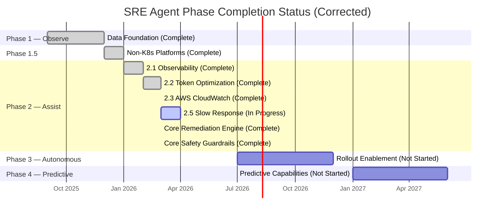
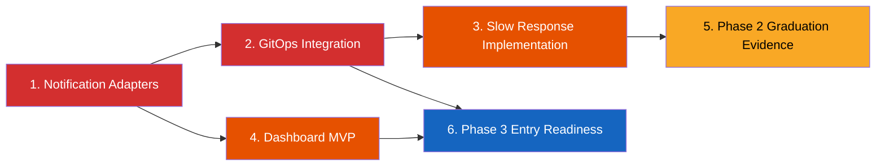

# Phase Status Evaluation Report

**Date:** 2026-03-27
**Author:** Autonomous SRE Agent — Architecture Assessment
**Scope:** Full codebase evaluation against phased rollout roadmap
**Status:** Corrected after Phase 2 action-layer implementation and verification updates

---

## 1. Current Phase Status Assessment

### Phase progression snapshot



### Summary status table

| Phase | Name | Status | Completion | Evidence |
|---|---|---|---|---|
| **1** | Data Foundation (Observe) | ✅ Complete | 100% | Detection stack and canonical model in place |
| **1.5** | Non-K8s Platforms | ✅ Complete | 100% | AWS/Azure operators + resilience layer implemented |
| **2.1** | Observability | ✅ Complete | 100% | OBS tasks complete and instrumented |
| **2.2** | Token Optimization | ✅ Complete | 100% | Compression, reranking, cache, timeline filtering live |
| **2.3** | AWS CloudWatch | ✅ Complete | 100% | [Phase 2.3 verification](../verification/phase_2_3_verification_report.md) |
| **2.5** | Slow Response Detection | 🚧 In Progress | ~30% | Design/spec/tasks complete; implementation pending |
| **2 (Core)** | Intelligence + Action core | 🚧 In Progress | ~85% | RAG + remediation + guardrails + lock backends implemented; integrations pending |
| **3** | Autonomous | 🚧 Entry-gated | ~10% | Core primitives exist; graduation criteria and integrations not complete |
| **4** | Predictive | ❌ Not Started | 0% | No predictive modules in active implementation |

### Cross-reference sources

| Document | Key finding |
|---|---|
| [Project roadmap](../../project/roadmap.md) | Defines Observe → Assist → Autonomous → Predictive |
| [Phase 2.3 verification](../verification/phase_2_3_verification_report.md) | 131/131 tests passed for CloudWatch stream |
| [Phase 2 core verification](../verification/autonomous_sre_agent_phase2_core_verification_report.md) | Remediation/guardrail criteria marked pass |
| [Phase 2 E2E action-lock verification](../verification/autonomous_sre_agent_phase2_e2e_action_lock_verification_report.md) | 7 passed, no unresolved acceptance failures |
| [Phase 2 live demos verification](../verification/autonomous_sre_agent_phase2_action_lock_live_demos_verification_report.md) | Demo flows verified for action orchestration and etcd lock path |

---

## 2. Evidence-based completion verification

### Codebase metrics (as of 2026-03-27)

| Metric | Value |
|---|---|
| Source files (`.py`, excluding `__init__`) | 74+ |
| Source LOC | ~14K |
| Test files | 66 |
| Test functions (`def test_`) | 682 |
| Phase 2.3 verification run | 131/131 passing |
| Phase 2 action-lock E2E verification run | 7/7 passing |

### What is now implemented in Phase 2 core

| Capability | Status | Evidence |
|---|---|---|
| RAG diagnostic pipeline | ✅ | `src/sre_agent/domain/diagnostics/rag_pipeline.py` |
| Severity and confidence classification | ✅ | `src/sre_agent/domain/diagnostics/severity.py`, `confidence.py` |
| Remediation planning and execution | ✅ | `src/sre_agent/domain/remediation/planner.py`, `engine.py` |
| Safety guardrails | ✅ | `src/sre_agent/domain/safety/guardrails.py`, `blast_radius.py`, `kill_switch.py`, `cooldown.py`, `phase_gate.py` |
| Distributed lock managers | ✅ | `src/sre_agent/adapters/coordination/in_memory_lock_manager.py`, `redis_lock_manager.py`, `etcd_lock_manager.py` |
| Kubernetes operator path | ✅ | `src/sre_agent/adapters/cloud/kubernetes/operator.py` |
| Action-lock E2E tests | ✅ | `tests/e2e/test_phase2_action_lock_e2e.py`, `tests/e2e/test_phase2_etcd_action_lock_e2e.py` |

### Remaining gaps in Phase 2

| Remaining component | Status | Impact |
|---|---|---|
| Notification adapters (`slack`, `pagerduty`, `jira`) | ❌ Empty directories | Blocks complete HITL operational flow |
| GitOps adapters | ❌ Directory empty | Blocks rollback PR and GitOps-native remediation path |
| Slow response detection implementation (2.5) | 🚧 Design complete, code pending | Leaves latency-degradation stream incomplete |
| Dashboard runtime (2.7) | ❌ Planned only | Limits operator visibility and approval UX |

---

## 3. Priority-ranked next steps (corrected)

### Critical path



### Priority items

| Priority | Item | Target phase | Effort | Dependencies | Deliverables |
|---|---|---|---|---|---|
| **P0** | Notification adapters | Phase 2.6 | Medium | Action layer core complete | Slack/PagerDuty/Jira integration paths |
| **P0** | GitOps integration | Phase 2 core closeout | Medium | Planner/engine complete | PR-based rollback + sync hooks |
| **P1** | Slow response detection | Phase 2.5 | Medium | Detection stack complete | Spec-to-code completion |
| **P1** | Dashboard MVP | Phase 2.7 | Large | API and notification stabilization | Operator timeline and confidence UI |
| **P2** | Graduation evidence pack | Phase 2 closeout | Medium | P0/P1 streams | Gate report against graduation criteria |

---

## 4. Alignment with roadmap and execution reality

### Timeline comparison

| Milestone | Planned timeline | Actual status | Delta |
|---|---|---|---|
| Phase 1 (Observe) | Months 1-3 | ✅ Complete | On track |
| Phase 1.5 (Non-K8s) | Month 3-4 | ✅ Complete | On track |
| Phase 2 (Assist) | Months 4-6 | 🚧 ~85% | Behind on integration closure |
| Phase 3 (Autonomous) | Months 7-12 | 🚧 Entry-gated | Primitives exist, rollout not started |
| Phase 4 (Predictive) | Year 2+ | ❌ Not started | Expected |

### Corrected deviation narrative

> [!IMPORTANT]
> Action Layer core is no longer missing. Remediation and guardrail implementation now exists and is verified.

> [!WARNING]
> Current delay is integration-heavy, not core-engine absence: notifications, GitOps, and dashboard streams remain incomplete.

### Course corrections

1. Prioritize notifications and GitOps adapters before additional optimization streams.
2. Close Phase 2.5 implementation to reduce latency-class incident blind spots.
3. Produce a consolidated Phase 2 graduation evidence report mapped to defined phase gates.

---

## 5. Evidence inventory (corrected structure summary)

```text
src/sre_agent/
├── domain/detection/                implemented
├── domain/diagnostics/              implemented
├── domain/remediation/              implemented (engine/planner/models/strategies/verification)
├── domain/safety/                   implemented (blast_radius/cooldown/guardrails/kill_switch/phase_gate)
├── adapters/cloud/aws/              implemented
├── adapters/cloud/azure/            implemented
├── adapters/cloud/kubernetes/       implemented (`operator.py`)
├── adapters/coordination/           implemented (in-memory, redis, etcd lock managers)
├── adapters/gitops/                 empty
├── adapters/notifications/slack/    empty
├── adapters/notifications/pagerduty/ empty
├── adapters/notifications/jira/     empty
└── api/                             implemented
```

> [!WARNING]
> Integration test distribution remains lower than the long-term 30% target and should be improved as integration adapters are completed.

---

## 6. March 27 correction addendum

The previous version of this report captured a pre-action-layer snapshot and is superseded by this corrected state.

Implemented and verified as of 2026-03-27:

* Remediation engine and planner
* Safety guardrails and phase-gate primitives
* Distributed lock backends (in-memory, Redis, etcd)
* Kubernetes operator path
* Action-lock E2E and etcd-backed E2E validation

Primary remaining blockers for full Phase 2 closeout:

* Notification adapters
* GitOps integration
* Slow response detection implementation
* Dashboard MVP and graduation evidence packaging
