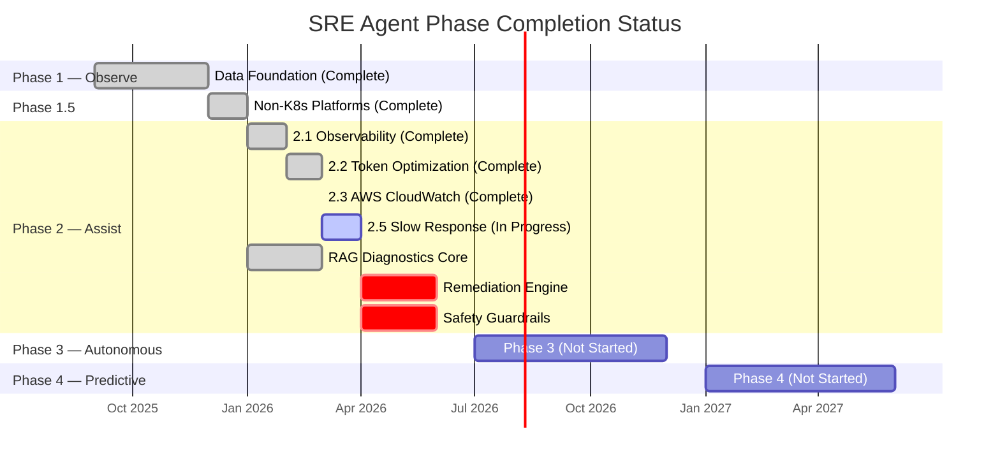
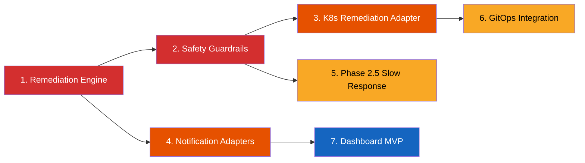

# Phase Status Evaluation Report

**Date:** 2026-03-26
**Author:** Autonomous SRE Agent — Architecture Assessment
**Scope:** Full codebase evaluation against phased rollout roadmap

---

## 1. Current Phase Status Assessment

### Phase Progression Overview



### Summary Status Table

| Phase | Name | Status | Completion | Evidence |
|---|---|---|---|---|
| **1** | Data Foundation (Observe) | ✅ Complete | 100% | 62 acceptance criteria met; 132 domain unit tests |
| **1.5** | Non-K8s Platforms | ✅ Complete | 100% | 8/8 task groups; AWS/Azure operators; resilience layer |
| **2.1** | Observability | ✅ Complete | 100% | All 53 OBS tasks checked ✅ in `tasks.md` |
| **2.2** | Token Optimization | ✅ Complete | 100% | CompressorPort, RerankerPort, cache, timeline filtering implemented |
| **2.3** | AWS CloudWatch | ✅ Complete | 100% | 131/131 tests pass; [verification report](../verification/phase_2_3_verification_report.md) |
| **2.5** | Slow Response Detection | 🚧 In Progress | ~30% | Design + spec complete; implementation not started |
| **2** | Intelligence Layer (Core) | 🚧 In Progress | ~65% | RAG pipeline, severity, confidence, validator exist; remediation + safety EMPTY |
| **3** | Autonomous | ❌ Not Started | 0% | `domain/remediation/` and `domain/safety/` are empty directories |
| **4** | Predictive | ❌ Not Started | 0% | No predictive capabilities implemented |

### Cross-Reference Sources

| Document | Key Finding |
|---|---|
| [roadmap.md](../../project/roadmap.md) | Defines 4 phases: Observe → Assist → Autonomous → Predictive |
| [phase_2_preparation_guide.md](../archive/phase_2_preparation_guide.md) | Confirms Phase 1 (100%) and Phase 1.5 (100%) complete as of Feb 2026 |
| [phase_2_3_verification_report.md](../verification/phase_2_3_verification_report.md) | Phase 2.3 fully verified: 131/131 tests, 47 defects found and resolved |
| [phase_2_2_token_optimization_report.md](phase_2_2_token_optimization_report.md) | Phase 2.2 strategy and implementation documented |
| [phase-2-1-observability tasks.md](../../../openspec/changes/phase-2-1-observability/tasks.md) | All 53 OBS tasks marked ✅ |
| [autonomous-sre-agent specs/](../../../openspec/changes/autonomous-sre-agent/specs) | 16 capability spec folders — baseline requirements |

---

## 2. Evidence-Based Completion Verification

### Codebase Metrics (as of 2026-03-26)

| Metric | Value |
|---|---|
| Source files (`.py`, excl. `__init__`) | 74 |
| Source LOC | ~13,970 |
| Test files | 66 (51 unit, 10 integration, 5 E2E) |
| Test functions (`def test_`) | 682 |
| Tests passing (last full run) | 653 / 663 collected |
| Pre-existing failures | 10 (Phase 1.5 / Phase 2 stale tests) |

---

### Phase 1: Data Foundation (Observe) — ✅ 100%

**Graduation criteria met:** All 62 acceptance criteria satisfied.

| Component | Files | Status | Evidence |
|---|---|---|---|
| Canonical Data Model | `domain/models/canonical.py` (14K), `detection_config.py`, `diagnosis.py` | ✅ | `ServiceLabels`, `CanonicalMetric`, `CanonicalTrace`, `CanonicalLogEntry`, `AnomalyAlert`, `ComputeMechanism` |
| Anomaly Detection | `domain/detection/anomaly_detector.py` (27K) | ✅ | Multi-rule detection: OOM, latency spike, error surge, disk exhaustion, cert expiry |
| Baseline Service | `domain/detection/baseline.py` (7.6K) | ✅ | Statistical baseline tracking with windowing |
| Alert Correlation | `domain/detection/alert_correlation.py` (8.6K) | ✅ | Group co-occurring alerts |
| Signal Correlator | `domain/detection/signal_correlator.py` (9.1K) | ✅ | Cross-signal evidence collection (metrics + traces + logs + eBPF) |
| Dependency Graph | `domain/detection/dependency_graph.py` (8.2K) | ✅ | Service-to-service topology mapping |
| Provider Registry | `domain/detection/provider_registry.py` (7.4K) | ✅ | Pluggable telemetry provider selection |
| Telemetry Port | `ports/telemetry.py` (11.6K) | ✅ | `MetricsQuery`, `TraceQuery`, `LogQuery`, `eBPFQuery` ABCs |
| OTel/Prometheus Adapters | `adapters/telemetry/otel/` | ✅ | Prometheus, Jaeger, Loki adapters |
| New Relic Adapter | `adapters/telemetry/newrelic/` | ✅ | NerdGraph/NRQL query adapter |
| Event Store | `events/in_memory.py` (3.2K) | ✅ | In-memory event sourcing |
| API Layer | `api/main.py` (10.3K), `rest/`, `grpc/` | ✅ | FastAPI + gRPC endpoints |

**Gaps:** None. Phase 1 is fully complete.

---

### Phase 1.5: Non-K8s Platforms — ✅ 100%

| Component | Files | Status | Evidence |
|---|---|---|---|
| `CloudOperatorPort` ABC | `ports/cloud_operator.py` (2.9K) | ✅ | `restart_compute_unit()`, `scale_capacity()`, `is_action_supported()` |
| AWS ECS Operator | `adapters/cloud/aws/ecs_operator.py` (3.7K) | ✅ | `StopTask`, `UpdateService(desiredCount)` |
| AWS Lambda Operator | `adapters/cloud/aws/lambda_operator.py` (3.4K) | ✅ | `PutFunctionConcurrency` |
| AWS EC2 ASG Operator | `adapters/cloud/aws/ec2_asg_operator.py` (3.1K) | ✅ | `SetDesiredCapacity` |
| AWS Resource Metadata | `adapters/cloud/aws/resource_metadata.py` (6.1K) | ✅ | Lambda/ECS/EC2 ASG context |
| AWS Error Mapper | `adapters/cloud/aws/error_mapper.py` (2.5K) | ✅ | Boto3 error → domain error mapping |
| Azure App Service | `adapters/cloud/azure/app_service_operator.py` (4.0K) | ✅ | Restart + instance count scaling |
| Azure Functions | `adapters/cloud/azure/functions_operator.py` (3.9K) | ✅ | Restart + Premium plan scaling |
| Azure Error Mapper | `adapters/cloud/azure/error_mapper.py` (1.9K) | ✅ | Azure SDK error → domain error mapping |
| Cloud Resilience | `adapters/cloud/resilience.py` (8.5K) | ✅ | Circuit breaker + retry with exponential backoff |
| Cloud Operator Registry | `domain/detection/cloud_operator_registry.py` (3.3K) | ✅ | Compute mechanism → operator routing |

**Gaps:** None. Phase 1.5 is fully complete.

---

### Phase 2: Intelligence Layer (Assist) — 🚧 ~65%

Phase 2 is a composite of multiple sub-phases. The Intelligence Layer core (RAG diagnostics, severity classification) is largely implemented. The Action Layer (remediation engine, safety guardrails) is **NOT** implemented.

#### Phase 2.1: Observability — ✅ 100%

All 53 tasks in [tasks.md](../../../openspec/changes/phase-2-1-observability/tasks.md) are marked ✅.

| Capability | Status | Evidence |
|---|---|---|
| Prometheus metrics registry | ✅ | `adapters/telemetry/metrics.py` — 14 metric definitions |
| SLO instrumentation (`/healthz`) | ✅ | Implemented in `api/main.py` |
| Structured logging (structlog) | ✅ | 10 log events instrumented in RAG pipeline |
| Token usage Prometheus counters | ✅ | OpenAI + Anthropic adapters instrumented |
| Correlation ID context variable | ✅ | `contextvars.ContextVar` with structlog processor |
| Prometheus alert rules | ✅ | `infra/prometheus/rules/sre_agent_slo.yaml` — 8 rules |
| Circuit breaker state export | ✅ | Gauge in `resilience.py` |

#### Phase 2.2: Token Optimization — ✅ 100%

| Capability | Status | Evidence |
|---|---|---|
| Evidence compression (LLMLingua) | ✅ | `ports/compressor.py` (1.4K) + `adapters/compressor/llmlingua_adapter.py` (7.0K) |
| Cross-encoder reranking | ✅ | `ports/reranker.py` (1.1K) + `adapters/reranker/cross_encoder_adapter.py` (3.9K) |
| Semantic caching | ✅ | `domain/diagnostics/cache.py` (3.2K) |
| Smart timeline filtering | ✅ | `domain/diagnostics/timeline.py` (5.6K) — `SIGNAL_RELEVANCE` map |
| Lightweight validation prompt | ✅ | Summary-only validation in LLM adapters |
| Structured output (instructor) | ✅ | Pydantic response models in LLM adapters |

#### Phase 2.3: AWS CloudWatch — ✅ 100%

| Capability | Status | Evidence |
|---|---|---|
| CloudWatch Metrics adapter | ✅ | `adapters/telemetry/cloudwatch/metrics_adapter.py` — 20-entry METRIC_MAP |
| CloudWatch Logs adapter | ✅ | `adapters/telemetry/cloudwatch/logs_adapter.py` |
| X-Ray Trace adapter | ✅ | `adapters/telemetry/cloudwatch/xray_adapter.py` |
| CloudWatch Provider | ✅ | `adapters/telemetry/cloudwatch/provider.py` |
| Alert Enricher | ✅ | `adapters/cloud/aws/enrichment.py` (11.1K) |
| Metric Polling Agent | ✅ | `domain/detection/polling_agent.py` (5.6K) |
| Health Monitor | ✅ | `domain/detection/health_monitor.py` (7.5K) |
| Events Router | ✅ | `api/rest/events_router.py` |
| Verification | ✅ | [131/131 tests pass](../verification/phase_2_3_verification_report.md) |

#### Phase 2.5: Slow Response Detection — 🚧 ~30%

| Capability | Status | Evidence |
|---|---|---|
| Design document | ✅ | `openspec/changes/phase-2-5-slow-response-detection/design.md` |
| Specification (BDD) | ✅ | `openspec/changes/phase-2-5-slow-response-detection/spec.md` |
| Tasks defined | ✅ | `openspec/changes/phase-2-5-slow-response-detection/tasks.md` |
| Implementation | ❌ | No source files created yet |

#### Phase 2 Core — RAG Diagnostics & Severity — 🚧 ~80%

| Capability | Status | Evidence |
|---|---|---|
| `DiagnosticPort` ABC | ✅ | `ports/diagnostics.py` (2.1K) |
| `VectorStorePort` ABC | ✅ | `ports/vector_store.py` (3.6K) |
| `LLMReasoningPort` ABC | ✅ | `ports/llm.py` (4.4K) |
| `EmbeddingPort` ABC | ✅ | `ports/embedding.py` (1.8K) |
| RAG Pipeline | ✅ | `domain/diagnostics/rag_pipeline.py` (25.2K) |
| Confidence Scoring | ✅ | `domain/diagnostics/confidence.py` (2.9K) |
| Severity Classification | ✅ | `domain/diagnostics/severity.py` (7.1K) |
| Second-Opinion Validator | ✅ | `domain/diagnostics/validator.py` (4.9K) |
| Knowledge Base Ingestion | ✅ | `domain/diagnostics/ingestion.py` (4.7K) |
| Timeline Constructor | ✅ | `domain/diagnostics/timeline.py` (5.6K) |
| OpenAI LLM Adapter | ✅ | `adapters/llm/openai/` |
| Anthropic LLM Adapter | ✅ | `adapters/llm/anthropic/` |
| Throttled LLM Adapter | ✅ | `adapters/llm/throttled_adapter.py` (8.5K) |
| LLM Prompts | ✅ | `adapters/llm/prompts.py` (2.0K) |
| ChromaDB Vector Store | ✅ | `adapters/vectordb/chroma/` |
| Pinecone Vector Store | ✅ | `adapters/vectordb/pinecone/` |
| Weaviate Vector Store | ✅ | `adapters/vectordb/weaviate/` |
| Sentence Transformers | ✅ | `adapters/embedding/sentence_transformers_adapter.py` (3.1K) |
| Severity Override API | ✅ | `api/severity_override.py` (3.7K) |
| Intelligence Bootstrap | ✅ | `adapters/intelligence_bootstrap.py` (5.7K) |

**Gaps (Phase 2 incomplete):**

| Missing Component | Directory | Status | Impact |
|---|---|---|---|
| Remediation Engine | `domain/remediation/` | ❌ **EMPTY** | Cannot execute remediation actions; blocks Phase 2 ASSIST graduation |
| Safety Guardrails | `domain/safety/` | ❌ **EMPTY** | No blast-radius limits, no kill switch, no cooldown enforcement |
| Kubernetes Remediation | `adapters/kubernetes/` | ❌ **EMPTY** | Cannot restart/scale K8s workloads (the primary remediation target) |
| GitOps Integration | `adapters/gitops/` | ❌ **EMPTY** | Cannot create rollback PRs for deployment regressions |
| Notification Adapters | `adapters/notifications/slack/`, `pagerduty/`, `jira/` | ❌ **Empty dirs** | Cannot deliver HITL approval requests or resolution summaries |

---

### Phase 3: Autonomous — ❌ 0%

No Phase 3 components exist. Phase 3 requires Phase 2 graduation (95% Sev 3-4 automated resolution, zero agent-worsened incidents, 95% Sev 1-2 diagnostic accuracy).

### Phase 4: Predictive — ❌ 0%

No predictive capabilities exist. Phase 4 is Year 2+ scope.

---

## 3. Priority-Ranked Next Steps

### Critical Path Analysis



### Priority Items

| Priority | Item | Target Phase | Effort | Dependencies | Deliverables |
|---|---|---|---|---|---|
| **P0** | Remediation Engine | Phase 2 Core | Large | RAG pipeline (done), Severity (done) | See below |
| **P0** | Safety Guardrails | Phase 2 Core | Large | Remediation Engine | See below |
| **P1** | Kubernetes Remediation Adapter | Phase 2 Core | Medium | `CloudOperatorPort` (done), Remediation Engine | See below |
| **P1** | Notification Adapters | Phase 2.6 | Medium | Remediation Engine (for HITL flow) | See below |
| **P2** | Slow Response Detection | Phase 2.5 | Medium | Anomaly Detector (done) | See below |
| **P2** | GitOps Integration | Phase 2 Core | Medium | Remediation Engine, Safety Guardrails | See below |
| **P3** | Operator Dashboard MVP | Phase 2.7 | Large | API endpoints (partially done) | See below |

---

#### P0-1: Remediation Engine (`domain/remediation/`)

> **Why critical:** The Remediation Engine is the bridge between the Intelligence Layer (diagnosis) and the Action Layer (remediation execution). Without it, the agent can detect and diagnose but cannot act. This blocks ALL Phase 2 ASSIST functionality.

**Concrete Deliverables:**

| File | Purpose |
|---|---|
| `domain/remediation/engine.py` | Core remediation orchestrator: receives diagnosis → selects remediation strategy → validates via safety guardrails → executes via `CloudOperatorPort` or GitOps |
| `domain/remediation/strategies.py` | Remediation strategy definitions: restart, scale, rollback, config change |
| `domain/remediation/planner.py` | Remediation plan builder: maps diagnosis root cause to remediation action |
| `domain/remediation/verification.py` | Post-remediation metric verification: confirm recovery or trigger rollback |
| `ports/remediation.py` | `RemediationPort` ABC |

**Acceptance Criteria:**
- Receives `DiagnosisResult` and produces `RemediationPlan`
- Selects appropriate strategy based on root cause category
- Routes Sev 1-2 to HITL approval, Sev 3-4 to autonomous execution
- Post-action verification confirms metric normalization within timeout
- Event store records full remediation audit trail

---

#### P0-2: Safety Guardrails (`domain/safety/`)

> **Why critical:** Without safety guardrails, the agent cannot safely execute any remediation. This is the #1 trust mechanism and a key differentiator (safety-first architecture).

**Concrete Deliverables:**

| File | Purpose |
|---|---|
| `domain/safety/blast_radius.py` | Blast radius calculator: limits concurrent affected pods/services |
| `domain/safety/kill_switch.py` | Emergency kill switch: halts all autonomous actions instantly |
| `domain/safety/cooldown.py` | Action cooldown enforcement: prevents oscillation loops (per AGENTS.md) |
| `domain/safety/guardrails.py` | Guardrail orchestrator: validates remediation plan against all safety constraints |
| `domain/safety/phase_gate.py` | Phase graduation gate: enforces criteria before phase transition |

**Acceptance Criteria:**
- Blast radius limit: max N pods affected per remediation (configurable)
- Kill switch: activated via API or operator dashboard → all actions halt within 1s
- Cooldown: no repeat action on same resource within TTL (default 15 min)
- Phase gate: validates graduation criteria (accuracy ≥90%, zero destructive FPs, etc.)

---

#### P1-1: Kubernetes Remediation Adapter (`adapters/kubernetes/`)

> **Why:** Kubernetes is the primary deployment target. AWS/Azure cloud operators exist but Kubernetes remediation does not.

**Concrete Deliverables:**

| File | Purpose |
|---|---|
| `adapters/kubernetes/operator.py` | `CloudOperatorPort` implementation for K8s: `kubectl rollout restart`, `kubectl scale` |
| `adapters/kubernetes/rbac.py` | RBAC validation: verify agent has permissions before attempting action |

**Effort:** Medium — follows established `CloudOperatorPort` pattern from AWS/Azure adapters.

---

#### P1-2: Notification Adapters (`adapters/notifications/`)

> **Why:** HITL approval flow for Sev 1-2 requires functional notification channels. Directories exist (`slack/`, `pagerduty/`, `jira/`) but are empty.

**Concrete Deliverables:** As defined in [Phase 2.6 OpenSpec change](../../../openspec/changes/phase-2-6-notification-integrations/tasks.md).

**Effort:** Medium — follows `NotificationPort` / `EscalationPort` pattern from Phase 2.6 design.

---

#### P2-1: Slow Response Detection (Phase 2.5)

> **Why:** Design and spec are complete; implementation is the next step. Extends anomaly detection to cover latency degradation patterns across all compute platforms.

**Concrete Deliverables:** As defined in [Phase 2.5 OpenSpec change](../../../openspec/changes/phase-2-5-slow-response-detection/tasks.md).

**Effort:** Medium — builds on existing anomaly detector infrastructure.

---

#### P2-2: GitOps Integration (`adapters/gitops/`)

> **Why:** Deployment regression rollback via Git revert PR is a core Phase 2 capability. Directory exists but is empty.

**Concrete Deliverables:**

| File | Purpose |
|---|---|
| `adapters/gitops/github.py` | GitHub PR creation for deployment rollback |
| `adapters/gitops/argocd.py` | ArgoCD sync trigger for GitOps-based rollback |
| `ports/gitops.py` | `GitOpsPort` ABC |

**Effort:** Medium — depends on Remediation Engine and Safety Guardrails.

---

#### P3-1: Operator Dashboard MVP (Phase 2.7)

> **Why:** All competitors have dashboards. While not strictly required for Phase 2 graduation, it is critical for operator trust and confidence visualization.

**Concrete Deliverables:** As defined in [Phase 2.7 OpenSpec change](../../../openspec/changes/phase-2-7-operator-dashboard/tasks.md).

**Effort:** Large — new frontend application.

---

## 4. Alignment with Vision

### Roadmap Timeline Comparison

| Milestone | Planned Timeline | Actual Status | Delta |
|---|---|---|---|
| Phase 1 (Observe) | Months 1–3 | ✅ Complete | On track |
| Phase 1.5 (Non-K8s) | Month 3–4 | ✅ Complete | On track |
| Phase 2 (Assist) | Months 4–6 | 🚧 ~65% (Month 6+) | ⚠️ Behind — remediation/safety not started |
| Phase 3 (Autonomous) | Months 7–12 | ❌ Not started | Blocked by Phase 2 completion |
| Phase 4 (Predictive) | Year 2+ | ❌ Not started | Expected |

### Deviations from Planned Sequence

> [!WARNING]
> **Deviation 1: Intelligence Layer advanced ahead of Action Layer.** The RAG pipeline, severity classification, and token optimization (Phase 2.2) are fully implemented, but the Remediation Engine and Safety Guardrails that consume their output are completely empty. This is an inverted dependency — the agent can diagnose but cannot act.

> [!IMPORTANT]
> **Deviation 2: Observability sub-phases (2.1, 2.2, 2.3) completed before core Phase 2 components.** Phase 2.1 (observability), Phase 2.2 (token optimization), and Phase 2.3 (CloudWatch) were all completed before the Remediation Engine and Safety Guardrails. While these sub-phases add value, they optimize a pipeline that doesn't yet have an end-to-end path to action.

> [!NOTE]
> **Positive deviation: Competitive roadmap formalized early.** The competitive analysis and OpenSpec mapping (Phases 2.6–3.3) were completed ahead of schedule, providing clear specifications for future work.

### Course Corrections Recommended

1. **Immediate focus on P0 items** (Remediation Engine + Safety Guardrails). These are the only blockers to Phase 2 ASSIST mode graduation. All Intelligence Layer components are ready to consume.

2. **Close the 10 pre-existing test failures.** The Phase 2.3 verification report identified 10 failing tests from Phase 1.5 and Phase 2 that remain unresolved. These should be fixed before adding more code.

3. **Fill the Kubernetes remediation gap.** The agent has AWS/Azure cloud operators but no Kubernetes remediation adapter — despite Kubernetes being the primary deployment target defined in the architecture.

4. **Prioritize notifications over dashboard.** The HITL approval flow (Sev 1-2 → Slack approval → remediation execution) is a core Phase 2 ASSIST capability. The dashboard is a visibility tool — important but not blocking.

---

## 5. Evidence Inventory

### Source Code Structure

```
src/sre_agent/                          74 files, ~14K LOC
├── ports/                              10 port ABCs (telemetry, diagnostics, llm, embedding,
│                                         vector_store, cloud_operator, compressor, reranker, events)
├── domain/
│   ├── detection/                      13 files (anomaly_detector, baseline, signal_correlator, etc.)
│   ├── diagnostics/                    8 files (rag_pipeline, severity, confidence, validator, etc.)
│   ├── models/                         3 files (canonical, detection_config, diagnosis)
│   ├── remediation/                    ❌ EMPTY
│   └── safety/                         ❌ EMPTY
├── adapters/
│   ├── cloud/aws/                      7 files (ecs, lambda, ec2_asg, enrichment, metadata, errors)
│   ├── cloud/azure/                    4 files (app_service, functions, errors)
│   ├── telemetry/otel/                 OTel/Prometheus/Jaeger/Loki
│   ├── telemetry/newrelic/             NerdGraph/NRQL
│   ├── telemetry/cloudwatch/           CloudWatch metrics/logs/xray
│   ├── telemetry/ebpf/                 eBPF adapter
│   ├── llm/openai/                     OpenAI GPT adapter
│   ├── llm/anthropic/                  Anthropic Claude adapter
│   ├── vectordb/chroma/                ChromaDB adapter
│   ├── vectordb/pinecone/              Pinecone adapter
│   ├── vectordb/weaviate/              Weaviate adapter
│   ├── embedding/                      sentence-transformers adapter
│   ├── compressor/                     LLMLingua adapter
│   ├── reranker/                       Cross-encoder adapter
│   ├── kubernetes/                     ❌ EMPTY
│   ├── gitops/                         ❌ EMPTY
│   └── notifications/                  ❌ slack/, pagerduty/, jira/ dirs exist but EMPTY
├── api/                                FastAPI + gRPC + CLI
├── config/                             Settings, logging, plugin system
└── events/                             In-memory event store
```

### Test Distribution

| Layer | Files | Functions | Standard Target |
|---|---|---|---|
| Unit tests | 51 | ~560 | 60% ✅ |
| Integration tests | 10 | ~80 | 30% (currently ~12% — below target) |
| E2E tests | 5 | ~42 | 10% ✅ |
| **Total** | **66** | **682** | — |

> [!WARNING]
> Integration test coverage remains below the 30% engineering standard target (currently ~12%). This was flagged as P0-1 in the Phase 2 Preparation Guide and has improved but not reached target.
