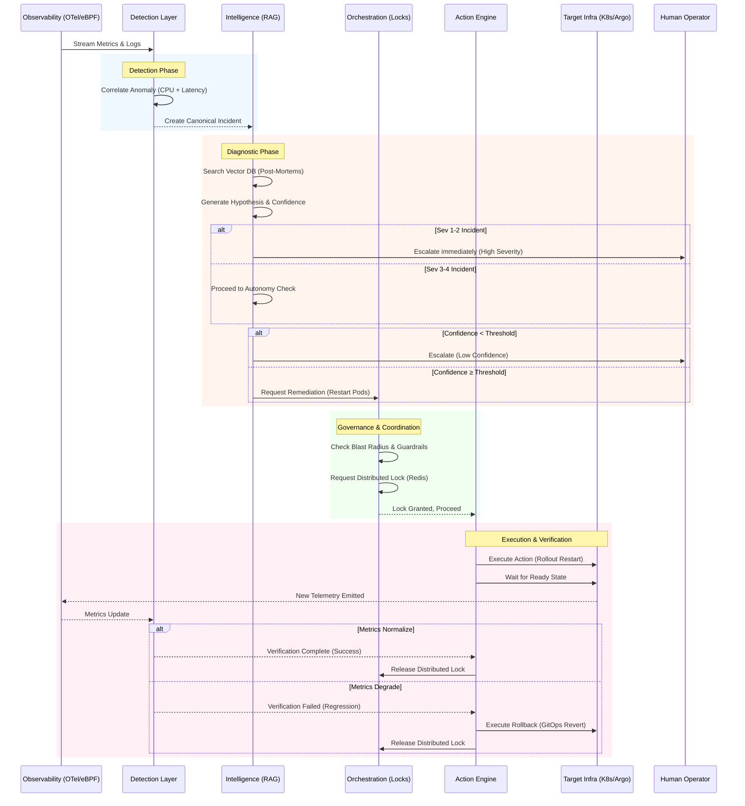

# Autonomous SRE Agent — Master System Document

> **Version:** 1.0.0 | **Date:** 2026-03-14  
> **Classification:** Internal — Engineering & Operations  
> **Audience:** Developers, Operators, SRE Leadership, Stakeholders

---

## Table of Contents

1. [Executive Summary](#1-executive-summary)
2. [System Architecture](#2-system-architecture)
3. [Agent Ecosystem](#3-agent-ecosystem)
4. [Development & Configuration](#4-development--configuration)
5. [Infrastructure & Deployment](#5-infrastructure--deployment)
6. [Operations & Security](#6-operations--security)
7. [API Reference](#7-api-reference)

---

## 1. Executive Summary

### 1.1 What Is the Autonomous SRE Agent?

The **Autonomous SRE Agent** is an AI-powered reliability engineering system that automates the `detect → investigate → diagnose → remediate` pipeline for well-understood infrastructure incidents. It is designed to dramatically reduce **Mean Time to Recovery (MTTR)** by replacing the manual, multi-tool investigation process that SRE teams perform today.

Modern SRE teams manage hundreds of microservices. When incidents occur, engineers manually query multiple observability backends, correlate signals, consult post-mortems, and execute runbooks. This agent automates this entire workflow for **5 well-understood incident types**:

| Incident Type | Detection Signal | Approved Remediation |
|---|---|---|
| **OOM Kill** | Memory pressure >85% for >5 min | Pod restart |
| **High Latency** | p99 latency >3σ for >2 min | HPA scale-up |
| **Error Rate Spike** | Error rate surge >200% | Deployment rollback (GitOps) |
| **Disk Exhaustion** | Disk usage >80% + 24h projection | Log truncation |
| **Certificate Expiry** | Cert expires within 14 days | Cert renewal trigger |

### 1.2 Business Value

- **Machine-Speed Response:** Sub-30-second diagnostic latency from anomaly detection to remediation proposal (SLO target: p99 <30s).
- **Safety-First Design:** Three-tiered guardrails framework, hard-coded blast radius limits, and RAG-grounded diagnostics eliminate LLM hallucination risk.
- **Multi-Cloud Portability:** Provider-agnostic hexagonal architecture with adapters for AWS (ECS, EC2, Lambda), Azure (App Service, Functions), and Kubernetes.
- **Multi-Agent Coordination:** Redis/etcd distributed locks prevent conflicts between SRE, FinOps, and SecOps automated agents.

### 1.3 Current Phase & Roadmap

| Phase | Status | Description |
|---|---|---|
| **Phase 1: Data Foundation** | ✅ Complete | Telemetry ingestion, anomaly detection, canonical data models |
| **Phase 1.5: Cloud Portability** | ✅ Complete | AWS/Azure cloud operator adapters, resilience patterns |
| **Phase 2: Intelligence Layer** | ✅ Complete | RAG diagnostics, LLM reasoning, severity classification |
| **Phase 3: Autonomous Remediation** | 🔲 Next | GitOps remediation, Kubernetes actions, human-in-the-loop |
| **Phase 4: Predictive** | 🔲 Planned | Proactive scaling, architectural recommendations |

**Current test status:** 496+ passing tests | Python 3.11+ | MIT License

---

## 2. System Architecture

### 2.1 Architectural Principles

The system is built on two foundational principles:

1. **Hexagonal Architecture (Ports & Adapters):** The core domain logic never directly calls external APIs. All communication with external systems flows through abstract `Port` interfaces implemented by swappable `Adapter` classes. This ensures vendor-agnosticism, testability, and extensibility.

2. **Safety-First, RAG-Grounded:** The agent relies on structural evidence retrieved from a vector database of historical post-mortems and strict blast-radius limits — never on LLM self-reported confidence alone.

### 2.2 Five-Layer Architecture

The agent operates across five primary layers:

```
┌───────────────────────────────────────────────────────────────────┐
│                        OPERATOR LAYER                            │
│  Dashboard (React/Next.js) │ Slack │ PagerDuty │ Jira            │
├───────────────────────────────────────────────────────────────────┤
│                      ORCHESTRATION LAYER                         │
│  Phased Rollout SM │ Severity Classifier │ Agent Coordinator     │
├───────────────────────────────────────────────────────────────────┤
│                      INTELLIGENCE LAYER                          │
│  LLM Reasoning │ RAG Pipeline │ Vector DB │ Confidence Scoring   │
├───────────────────────────────────────────────────────────────────┤
│                        ACTION LAYER                              │
│  K8s API │ ArgoCD/GitOps │ cert-manager │ Safety Guardrails      │
├───────────────────────────────────────────────────────────────────┤
│                       DETECTION LAYER                            │
│  ML Anomaly Detection │ Alert Correlation │ Dependency Graph     │
├───────────────────────────────────────────────────────────────────┤
│                       INGESTION LAYER                            │
│  OpenTelemetry Collector │ eBPF Programs │ Signal Correlator     │
├───────────────────────────────────────────────────────────────────┤
│                      INFRASTRUCTURE                              │
│  Kubernetes │ Linux (eBPF-capable) │ etcd/Redis │ Git/GitHub     │
└───────────────────────────────────────────────────────────────────┘
```

| Layer | Status | Subsystems |
|---|---|---|
| **Observability (Ingestion)** | ✅ Implemented | OpenTelemetry Collector, Prometheus/Loki, eBPF signals |
| **Detection** | ✅ Implemented | Baselining, anomaly scoring, multi-dimensional correlation |
| **Intelligence** | ✅ Implemented | RAG diagnostic pipeline, LLM reasoning, severity classification |
| **Action** | 🔲 Planned | Safety gating, remediation execution |
| **Operator** | 🔲 Planned | Dashboard, notifications, human-in-the-loop |

### 2.3 Data Flow — Incident Lifecycle



### 2.4 Provider Abstraction Layer

The core domain logic communicates exclusively through canonical data models (`CanonicalMetric`, `CanonicalTrace`, `CanonicalLogEntry`, `ServiceGraph`) via abstract `Port` interfaces. Specific `Adapter` implementations translate these to vendor-specific APIs.

```
┌─────────────────────────────────────────────────────────┐
│              Agent Core (provider-agnostic)              │
│  Anomaly Detection │ RAG Diagnostics │ Remediation       │
│                                                          │
│  Uses ONLY canonical data model — never calls provider   │
│  APIs directly                                           │
├──────────────────────┬───────────────────────────────────┤
│   Canonical Data Model (metrics, traces, logs, events)   │
├──────────────────────┴───────────────────────────────────┤
│         Provider Abstraction Layer (plugin interface)     │
├─────────────────────┬────────────────────────────────────┤
│  OTel Adapter       │  CloudWatch Adapter                │
│  ├─ Prometheus API  │  ├─ CloudWatch Metrics             │
│  ├─ Jaeger/Tempo    │  ├─ CloudWatch Logs                │
│  ├─ Loki API        │  ├─ X-Ray Traces                   │
│  └─ Trace-derived   │  └─ AWS Health Events              │
│     dep. graph      │                                     │
└─────────────────────┴────────────────────────────────────┘
```

**Implemented Telemetry Adapters:**

| Adapter | Metrics | Traces | Logs | Status |
|---------|---------|--------|------|--------|
| OTel (Prometheus/Jaeger/Loki) | PromQL | Jaeger API | LogQL | ✅ Implemented |
| CloudWatch | GetMetricData | X-Ray API | FilterLogEvents | ✅ Implemented |
| New Relic (NerdGraph) | NRQL | NerdGraph | NerdGraph | ✅ Implemented |

**Implemented Cloud Operator Adapters:**

| Cloud Service | Adapter | Operations |
|---|---|---|
| AWS ECS | `ECSOperator` | Stop task, update service |
| AWS EC2/ASG | `EC2ASGOperator` | Set desired capacity |
| AWS Lambda | `LambdaOperator` | Put function concurrency |
| Azure App Service | `AppServiceOperator` | Restart, scale |
| Azure Functions | `FunctionsOperator` | Restart, scale |

### 2.5 Source Code Structure

```
src/sre_agent/
├── ports/                    # Abstract interfaces (Hexagonal Architecture)
│   ├── telemetry.py          # MetricsQuery, TraceQuery, LogQuery, TelemetryProvider
│   ├── cloud_operator.py     # CloudOperatorPort (remediation actions)
│   ├── llm.py                # LLMPort (hypothesis generation & validation)
│   ├── embedding.py          # EmbeddingPort (text-to-vector conversion)
│   ├── vector_store.py       # VectorStorePort (similarity search)
│   ├── diagnostics.py        # DiagnosticPort (RAG pipeline interface)
│   ├── compressor.py         # CompressorPort (evidence compression)
│   ├── reranker.py           # RerankerPort (cross-encoder reranking)
│   └── events.py             # EventBus, EventStore (CQRS)
│
├── domain/                   # Core business logic (ZERO external dependencies)
│   ├── models/               # Pydantic canonical models (CanonicalMetric, etc.)
│   ├── detection/            # AnomalyDetector, BaselineService, AlertCorrelationEngine
│   │                         # MetricPollingAgent, AWSHealthMonitor, SignalCorrelator
│   └── diagnostics/          # RAGDiagnosticPipeline, DiagnosticCache, TimelineConstructor
│                             # SeverityClassifier, token optimization
│
├── adapters/                 # External integrations
│   ├── cloud/                # AWS (ECS, EC2, Lambda) + Azure (AppService, Functions)
│   │                         # Resilience patterns (CircuitBreaker, retry)
│   ├── telemetry/            # Prometheus, Jaeger, Loki, CloudWatch, X-Ray adapters
│   ├── llm/                  # OpenAI GPT-4o-mini, Anthropic Claude adapters
│   ├── embedding/            # SentenceTransformers adapter
│   ├── vectordb/             # ChromaDB adapter
│   ├── compressor/           # LLMLingua compression adapter
│   ├── reranker/             # Cross-encoder reranker adapter
│   ├── bootstrap.py          # Cloud operator wiring
│   └── intelligence_bootstrap.py  # Intelligence layer wiring (LLM+VectorDB+Embedding)
│
├── api/                      # External-facing interfaces
│   ├── main.py               # FastAPI application (/healthz, /metrics, /diagnose, etc.)
│   ├── cli.py                # Click CLI for operator interaction
│   ├── severity_override.py  # Severity override service
│   └── rest/                 # Routers: diagnose, severity_override, events
│
├── events/                   # Event sourcing (CQRS pattern)
│   └── in_memory.py          # InMemoryEventBus, InMemoryEventStore
│
└── config/                   # Configuration management
    ├── settings.py           # AgentConfig, FeatureFlags, CloudWatchConfig, etc.
    ├── logging.py            # Structured logging (structlog) + correlation ID
    ├── plugin.py             # Plugin registration system
    ├── health_monitor.py     # Component health monitoring
    └── provider_registry.py  # Telemetry provider registry
```

### 2.6 Technology Stack

| Category | Technologies |
|---|---|
| **Core Logic** | Python 3.11+, Pydantic v2, structlog, Click |
| **API** | FastAPI, Uvicorn |
| **Async** | anyio, httpx |
| **Observability** | OpenTelemetry (OTLP), eBPF (Cilium/bcc), Prometheus, Jaeger |
| **Intelligence** | OpenAI (GPT-4o-mini), Anthropic (Claude), ChromaDB, SentenceTransformers, tiktoken |
| **Cloud Operators** | AWS (boto3) — ECS, EC2, Lambda · Azure (azure-mgmt) — App Service, Functions |
| **Coordination** | Redis (distributed locks) |
| **Metrics Export** | prometheus-client (12 registered metrics) |
| **Testing** | pytest, pytest-asyncio, pytest-cov, LocalStack Pro, testcontainers |
| **Linting** | Ruff (E, F, I, N, W, UP, B, SIM, BLE), mypy (strict) |
| **Build** | setuptools ≥68 |

---

## 3. Agent Ecosystem

### 3.1 Multi-Agent Architecture

The Autonomous SRE Agent operates within a shared infrastructure environment alongside hypothetical specialized agents. All agents adhere to strict coordination protocols to prevent conflicting actions.

| Agent | Role | Mission | Priority Level |
|---|---|---|---|
| **SecOps Agent** | Security Operations | Detect anomalous access, unauthorized escalations, CVE exploitations; execute quarantines | **Level 1** (Override) |
| **SRE Agent** *(this system)* | Site Reliability | Detect, diagnose, and remediate infrastructure incidents to minimize MTTR | **Level 2** (Medium) |
| **FinOps Agent** | Cost Optimization | Identify over-provisioned resources and safe down-scaling opportunities | **Level 3** (Low) |

**Priority Resolution:** SecOps > SRE > FinOps. During active incidents, reliability trumps cost optimization.

### 3.2 Distributed Lock Protocol

All agents coordinate via a Redis/etcd-backed **Multi-Agent Lock Protocol** to prevent contradictory actions (e.g., SRE scaling up while FinOps scales down).

**Lock Schema:**

```json
{
  "agent_id": "sre-agent-prod-01",
  "resource_type": "deployment",
  "resource_name": "checkout-service",
  "namespace": "prod",
  "compute_mechanism": "KUBERNETES",
  "resource_id": "deployment/checkout-service",
  "provider": "kubernetes",
  "priority_level": 2,
  "acquired_at": "2024-03-01T12:00:00Z",
  "ttl_seconds": 180,
  "fencing_token": 948271
}
```

**Key Coordination Mechanisms:**

| Mechanism | Description |
|---|---|
| **Priority Preemption** | Higher-priority agents (e.g., SecOps) can preempt lower-priority locks. Revoked agents abort and queue retry. |
| **Cooling Off Period** | After action completion, a cooldown key (default 15 min) prevents repeated actions on the same resource. |
| **Fencing Tokens** | Strictly increasing tokens prevent stale lock holders from executing actions after preemption. |
| **Human Supremacy** | Human operators with elevated credentials can override any agent lock or trigger the global Kill Switch. |

### 3.3 AI Integration & LLM Framework

The project integrates with LLMs and autonomous agent frameworks through several configuration directories:

| Directory | Purpose |
|---|---|
| `.agent/` | Contains agent **skills** (OpenSpec apply/archive/explore/propose) and **workflows** (slash commands for spec-driven development). |
| `.claude/` | Houses Claude-specific **commands** for custom agent interactions within the Claude AI environment. |
| `.specify/` | Contains **memory** (Agent Constitution, persistent context), **scripts**, and **templates** for the Spec Kit planning framework. |

The **Agent Constitution** ([.specify/memory/constitution.md](.specify/memory/constitution.md)) defines the fundamental rules and behavioral constraints the agent must follow — serving as the ethical and operational "North Star" for all autonomous decision-making.

### 3.4 RAG Diagnostic Pipeline

The intelligence layer implements a multi-stage **Retrieval-Augmented Generation (RAG)** pipeline:

```
1. Alert Ingestion       → Receive canonical anomaly alert
2. Context Embedding     → Convert alert context to vector via SentenceTransformers
3. Vector Search         → Query ChromaDB for similar historical post-mortems
4. Cross-Encoder Rerank  → Rerank results by relevance (Phase 2.2)
5. Timeline Construction → Build anomaly-type-aware signal timeline
6. Evidence Compression  → Compress evidence to fit token budget (Phase 2.2)
7. LLM Hypothesis        → Generate root cause hypothesis via GPT-4o-mini/Claude
8. Validation            → Independent LLM validation cross-check
9. Severity Classification → Multi-dimensional Sev 1-4 scoring
10. Semantic Cache Store  → Cache diagnosis for recurring incidents (Phase 2.2)
```

**Token Optimization Features (Phase 2.2):**
- Semantic diagnostic cache with configurable TTL (default 4h)
- Cross-encoder reranking of vector search results
- Anomaly-type-aware signal filtering (5 incident categories)
- Evidence compression via LLMLingua (with extractive fallback)
- Lightweight validation (≤150 chars per citation, ~68% token reduction)

---

## 4. Development & Configuration

### 4.1 Prerequisites

- **Python** 3.11+
- **Docker** (for integration tests and dependency services)
- **Git**
- **Node.js** v24+ (for OpenSpec CLI, optional)

### 4.2 Local Setup

```bash
# 1. Clone the repository
git clone https://github.com/your-org/autonomous-sre-agent.git
cd autonomous-sre-agent

# 2. Install everything (creates venv if needed)
scripts/dev/run.sh setup

# 3. Configure environment variables
cp .env.example .env
# Edit .env with your API keys (OPENAI_API_KEY or ANTHROPIC_API_KEY)

# 4. Run the API server
scripts/dev/run.sh server            # Production mode
scripts/dev/run.sh server --reload   # Dev mode with auto-reload

# 5. API docs available at:
#    http://localhost:8080/docs
```

### 4.3 Configuration Management

#### [config/agent.yaml](config/agent.yaml) — Agent Configuration File

The primary configuration file supports the following sections:

```yaml
# Provider selection
telemetry_provider: otel        # "otel" | "newrelic"
cloud_provider: none            # "aws" | "azure" | "none"

# OTel backend URLs
otel:
  prometheus_url: "http://prometheus:9090"
  jaeger_url: "http://jaeger:16686"
  loki_url: "http://loki:3100"
  otel_collector_url: "http://otel-collector:4317"

# Anomaly detection thresholds
detection:
  latency_sigma_threshold: 3.0
  latency_duration_minutes: 2
  error_rate_surge_percent: 200.0
  memory_pressure_percent: 85.0
  disk_exhaustion_percent: 80.0
  cert_expiry_warning_days: 14

# Performance SLO targets
performance:
  alert_latency_seconds: 60
  rag_query_timeout_seconds: 30
  max_concurrent_rag_queries: 10
  max_concurrent_remediations: 3

# Feature flags (opt-in capabilities)
features:
  ebpf_enabled: true
  multi_dimensional_correlation: true
  cloudwatch_adapter: false       # Enable CloudWatch telemetry
  bridge_enrichment: false        # Enable pre-diagnosis alert enrichment
  background_polling: false       # Enable proactive metric polling
  xray_adapter: false             # Enable X-Ray trace adapter

log_level: INFO
environment: development
```

#### Environment Variables

```dotenv
# LLM API Keys (at least one required)
ANTHROPIC_API_KEY=<ANTHROPIC_API_KEY>
OPENAI_API_KEY=<OPENAI_API_KEY>

# SRE Agent API Authentication
SRE_AGENT_API_TOKEN=

# CORS (comma-separated allowed origins)
SRE_CORS_ORIGINS=http://localhost:3000

# Environment
ENVIRONMENT=development

# Telemetry
OTEL_EXPORTER_OTLP_ENDPOINT=http://localhost:4317

# LocalStack (for local AWS testing)
AWS_ACCESS_KEY_ID=test
AWS_SECRET_ACCESS_KEY=test
LOCALSTACK_ENDPOINT=http://localhost:4566
TOKENIZERS_PARALLELISM=false
```

#### Configuration Dataclasses (in [settings.py](src/sre_agent/config/settings.py))

| Config Class | Fields | Description |
|---|---|---|
| `AgentConfig` | All top-level settings | Root configuration object |
| `OtelConfig` | `prometheus_url`, `jaeger_url`, `loki_url` | OTel backend endpoints |
| `CloudWatchConfig` | `region`, `metric_poll_interval_seconds`, `log_fetch_window_minutes` | CloudWatch integration settings |
| `EnrichmentConfig` | `fetch_metrics`, `fetch_logs`, `fetch_traces`, `fetch_resource_metadata` | Pre-diagnosis enrichment toggles |
| `AWSHealthConfig` | `enabled`, `poll_interval_seconds`, `regions` | AWS Health event polling |
| `FeatureFlags` | 12 boolean flags | Feature gate toggles |
| `DetectionConfig` | Anomaly thresholds | Detection tuning parameters |

### 4.4 Dependencies & Build System

The project uses **setuptools** for packaging with optional dependency groups:

```toml
[project]
name = "sre-agent"
version = "0.1.0"
requires-python = ">=3.11"

# Core dependencies always installed
dependencies = [
    "pydantic>=2.0", "pyyaml>=6.0", "structlog>=24.0", "click>=8.0",
    "anyio>=4.0", "httpx>=0.27",
    "prometheus-api-client>=0.5", "prometheus-client>=0.20",
    "opentelemetry-api>=1.20", "opentelemetry-sdk>=1.20",
    "aiokafka>=0.10", "python-dotenv>=1.0",
]

# Optional extras (installed with pip install sre-agent[group])
[project.optional-dependencies]
aws = ["boto3>=1.34"]
azure = ["azure-identity>=1.15", "azure-mgmt-web>=7.0", ...]
intelligence = ["chromadb>=0.4", "sentence-transformers>=2.2", "openai>=1.0", "anthropic>=0.20"]
dev = ["pytest>=8.0", "pytest-asyncio>=0.23", "pytest-cov>=5.0", "ruff>=0.3", "mypy>=1.8"]
```

### 4.5 Contribution Guidelines

> **Non-Negotiable Rule:** Safety, determinism, and auditability above all else.

#### Before Writing Code

1. Read the **Agent Constitution** ([.specify/memory/constitution.md](.specify/memory/constitution.md))
2. Read the **CONTRIBUTING.md** guide
3. Check the relevant specs in `openspec/changes/autonomous-sre-agent/specs/`

#### PR Checklist

- [ ] Specs updated (if modifying behavior)
- [ ] Documentation updated (if altering architecture)
- [ ] Tests passing — 100% for `domain/`, >85% for `adapters/`
- [ ] Linting clean (`ruff`, `mypy` strict mode)
- [ ] Conventional Commit format (`feat:`, `fix:`, `docs:`)

#### Safety-Critical Rules

- **No new remediation action** without blast-radius limit tests
- **No direct API calls** to infrastructure — must go through an idempotent `Port` interface
- **No domain code** may import from `adapters/` — hexagonal architecture is strictly enforced
- **No raw LLM logic** driving actions without RAG grounding and secondary validation

#### Documentation Standards

- Architecture diagrams must use **Mermaid.js** (no proprietary formats)
- Documents follow a 3-stage lifecycle: `DRAFT` → `APPROVED` → Semantic Versioned
- Docs require PR approval from at least two Staff Engineers for `APPROVED` status

---

## 5. Infrastructure & Deployment

### 5.1 Local Development Dependencies

External services required for development and testing are orchestrated via Docker Compose:

```bash
# Start all dependencies
docker compose -f docker-compose.deps.yml up -d

# Or use the helper script
scripts/dev/setup_deps.sh start

# Stop all dependencies
scripts/dev/setup_deps.sh stop
```

**Containerized Services:**

| Service | Image | Port(s) | Purpose |
|---|---|---|---|
| **LocalStack Pro** | `localstack/localstack-pro:latest` | `4566` | AWS API emulation (ECS, EC2, Lambda, IAM, S3, SecretsManager) |
| **Prometheus** | `prom/prometheus:v2.51.0` | `9090` | Metrics collection and querying |
| **Jaeger** | `jaegertracing/all-in-one:1.55` | `16686`, `4317-4318` | Distributed trace backend (OTLP-enabled) |

> **Note:** LocalStack Pro requires a `LOCALSTACK_AUTH_TOKEN` in your `.env` for full AWS service emulation (EC2 ASG, ECS). See [LocalStack Pro Guide](docs/testing/localstack_pro_guide.md).

### 5.2 Kubernetes Deployment

The agent runs as a unified deployment within the management Kubernetes cluster.

**Compute Requirements:**

| Resource | Base | Peak | Notes |
|---|---|---|---|
| CPU | 2 vCPU | Scales linearly | Concurrent incident correlation load |
| Memory | 4 GB RAM | 8 GB | Spikes during RAG context window generation |
| Storage | 50 GB Ephemeral | — | Localized vector DB caching + temp log aggregation |

**Infrastructure Directories:**

| Path | Contents |
|---|---|
| `infra/k8s/` | Kubernetes manifests (deployment, services, RBAC, sample services) |
| `infra/local/` | Local development configuration |
| `infra/prometheus/` | Prometheus configuration (`prometheus.yml`) and SLO alert rules |

### 5.3 Prometheus SLO Alert Rules

**File:** `infra/prometheus/rules/sre_agent_slo.yaml`

8 alert rules + 1 recording rule for SLO monitoring:

| Alert | Condition | Severity |
|---|---|---|
| `DiagnosisLatencySLOBreach` | p99 diagnosis latency >30s | Critical |
| `LLMAPIErrors` | LLM API error rate rising | Warning |
| `LLMParseFailureSpike` | JSON parse failure rate spike | Warning |
| `ThrottleQueueSaturation` | LLM queue depth saturated | Warning |
| `EvidenceQualityDrop` | Evidence relevance scores degrading | Warning |
| `LLMTokenRateTooHigh` | Token consumption rate excessive | Warning |
| `EmbeddingColdStartHigh` | Embedding model cold start >10s | Info |
| `CircuitBreakerOpen` | Cloud adapter circuit breaker tripped | Critical |

### 5.4 CI/CD Pipeline (Planned)

Every PR to `main` triggers a four-gate pipeline:

| Gate | Target | Failure Action |
|---|---|---|
| **Gate 1: Static Analysis** | `ruff`, `mypy` (strict), `bandit` | Blocks merge |
| **Gate 2: Unit Testing** | `pytest tests/unit --cov=src` (90% global, 100% domain) | Blocks merge |
| **Gate 3: Integration Testing** | `pytest tests/integration` (testcontainers) | Blocks merge |
| **Gate 4: E2E & Chaos** | `pytest tests/e2e` (ephemeral k3d cluster) | Blocks merge |

**Deployment Pipeline:**
1. Merge to `main` → auto semantic version tag
2. Docker image build → Sigstore/Cosign signing → private registry push
3. Auto PR to `infra-config` repo upgrading Helm chart `image.tag`
4. GitOps sync (ArgoCD/Flux) — no direct production applies permitted

---

## 6. Operations & Security

### 6.1 Service Level Objectives (SLOs)

| SLO | Target | SLI |
|---|---|---|
| **Availability** | 99.99% / month (4.32 min downtime) | `HTTP 200` health check response rate (`/healthz` every 10s) |
| **Diagnostic Latency** | p99 < 30 seconds | Time from `ANOMALY_DETECTED` to `REMEDIATION_ACTION_PROPOSED` |
| **Safe Actions** | 99.9% | Ratio of successful remediations (no rollback, no human fix needed) |

**Error Budget Exhaustion Consequences:**
1. Halt all feature development immediately
2. Automatic phase regression (e.g., Autonomous → Assist mode)
3. 100% engineering capacity diverted to reliability sprint

### 6.2 Observability — Emitted Metrics

12 Prometheus metrics registered in a centralized registry (`adapters/telemetry/metrics.py`):

| Metric | Type | Labels |
|---|---|---|
| `sre_agent_diagnosis_duration_seconds` | Histogram | `service`, `severity` |
| `sre_agent_diagnosis_errors_total` | Counter | `error_type` |
| `sre_agent_severity_assigned_total` | Counter | `severity`, `service_tier` |
| `sre_agent_evidence_relevance_score` | Histogram | — |
| `sre_agent_llm_call_duration_seconds` | Histogram | `provider`, `call_type` |
| `sre_agent_llm_tokens_total` | Counter | `provider`, `token_type` |
| `sre_agent_llm_parse_failures_total` | Counter | `provider` |
| `sre_agent_llm_queue_depth` | Gauge | — |
| `sre_agent_llm_queue_wait_seconds` | Histogram | — |
| `sre_agent_embedding_duration_seconds` | Histogram | — |
| `sre_agent_embedding_cold_start_seconds` | Gauge | — |
| `sre_agent_circuit_breaker_state` | Gauge | `provider`, `resource_type` |

**Structured Logging:** All log events use `structlog` with correlation ID propagation (`alert_id` bound to every event during diagnosis). RAG pipeline emits 8 named events: `diagnosis_started`, `embed_alert`, `vector_search_complete`, `token_budget_trim`, `llm_hypothesis_start`, `validation_start`, `confidence_scored`, `diagnosis_completed`.

### 6.3 Safety Guardrails Framework

Three-tiered safety framework ensuring bounded blast radius:

#### Tier 1: Action Execution Guardrails

| Guardrail | Scope | Limit | Rationale |
|---|---|---|---|
| Max concurrent pod restarts | per-namespace | 3 | Prevent cascading failures |
| Max fleet-wide restarts | global | 10% of total | Protect cluster capacity |
| Confidence threshold (escalate) | global | < 0.70 | Immediate human escalation |
| Confidence threshold (propose) | global | ≥ 0.70, < 0.85 | Human approval required |
| Confidence threshold (act) | global | ≥ 0.85 | Autonomous action (Phase 3) |
| Cooling off period | per-resource | 15 min | Prevent oscillation |
| Max scale-up factor | per-deployment | 2x current | Prevent infinite scaling |
| Max rollback depth | global | 1 Git commit | Protect database migrations |
| Action timeout | per-action | 180 seconds | Release lock on hang |

#### Tier 2: Knowledge & Reasoning Guardrails
- Mandatory RAG citations for root-cause hypotheses
- Second-opinion LLM validation cross-check
- Knowledge base TTL (90 days staleness recalculation)

#### Tier 3: Security & Access Limitations
- Least-privilege Kubernetes RBAC service accounts
- Multi-agent distributed locking (Redis/etcd)
- Externalized secret management (Vault/AWS Secrets Manager)

### 6.4 Failure Modes & Dependencies

| Dependency | Criticality | Failure Behavior |
|---|---|---|
| Kubernetes API | Critical | Agent halts remediation. **Fails closed** (safe). |
| OTel Collector | Critical | Agent stops receiving signals. **Fails closed**. |
| LLM API Provider | High | Cannot diagnose new incidents. Falls back to static PagerDuty routing. |
| Vector DB | High | Cannot execute RAG. Same as LLM failure. |
| Distributed Lock (Redis) | Critical | Cannot acquire safety locks. Agent **refuses to act**. |

### 6.5 Security Posture

#### What Is Currently Secure

| Area | Status |
|---|---|
| Secret storage in source | ✅ Zero hardcoded credentials |
| Environment variable pattern | ✅ All keys sourced from `os.environ` |
| `.gitignore` coverage | ✅ `.env` and `.env.*` excluded |
| Dependency supply chain | ✅ Pinned versions in `pyproject.toml` |
| HITL guardrail | ✅ Auto-remediation blocked pending human override |
| LLM flood protection | ✅ `ThrottledLLMAdapter` semaphore |
| Multi-agent lock schema | ✅ Priority-based preemption |

#### Known Security Findings

| ID | Finding | Severity | Phase Target |
|---|---|---|---|
| SEC-001 | No authentication on control-plane API | 🔴 Critical | Phase 3 sprint 1 |
| SEC-006 | Prompt injection via alert description | 🟠 High | Phase 3 sprint 1 |
| SEC-002 | No CORS policy | 🟠 High | Phase 3 sprint 1 |
| SEC-004 | No per-endpoint rate limiting | 🟠 High | Phase 3 sprint 1 |
| SEC-003 | No HTTPS enforcement | 🟠 High | Phase 3 sprint 2 |
| SEC-005 | `InMemoryEventStore` resets on restart | 🟡 Medium | Phase 3 sprint 2 |
| SEC-007 | Singleton not thread-safe (no asyncio.Lock) | 🟡 Medium | Phase 3 sprint 1 |
| SEC-008 | `health_check()` makes live LLM API call | 🟢 Low | Phase 3 sprint 1 |

#### Threat Model (STRIDE)

Key threats addressed in the [threat model](docs/security/threat_model.md):

| Category | Primary Threat | Mitigation |
|---|---|---|
| **Spoofing** | Forged telemetry with prompt injection | Strict metric parsing, planned NLP sanitization filter |
| **Tampering** | Vector DB poisoning | Read-only agent access; ingestion requires human PR approval |
| **Repudiation** | Untraceable destructive actions | CQRS event sourcing; planned immutable WORM S3 audit trail |
| **Information Disclosure** | Secret leakage to external LLMs | Planned DLP scrubbing middleware in LLM adapter |
| **Denial of Service** | Telemetry flooding / agent OOM | Bounded queues, token-bucket rate limiting per namespace |
| **Elevation of Privilege** | K8s RBAC sandbox escape | Minimum ClusterRole permissions; denied access to Secrets/Roles |
| **Prompt Injection** | Malicious instructions in logs | XML-delimited prompt architecture; NLP verb stripping; Tier 1 guardrails |

### 6.6 Testing Strategy

**Current Test Suite:** 496+ passing tests.

| Layer | Count | Scope |
|---|---|---|
| **Unit Tests** | ~450 | Pure domain logic, no I/O, mocked ports |
| **Integration Tests** | ~30 | Adapter ↔ real backends (LocalStack, testcontainers) |
| **E2E Tests** | ~16 | Full pipeline in k3d cluster |

**Test Pyramid Targets (Phase 3+):**

```
                    ┌───────────┐
                    │  Chaos &  │  ← 5%
                    │   Soak    │
                   ┌┴───────────┴┐
                   │    E2E      │  ← 10%
                  ┌┴─────────────┴┐
                  │  Contract &   │  ← 5%
                 ┌┴──────────────┴─┐
                 │   Integration    │  ← 25%
                ┌┴──────────────────┴┐
                │      Unit Tests     │  ← 55%
                └─────────────────────┘
```

**Coverage Targets:**
- Global: ≥ 90% (CI gate — blocks merge)
- `domain/` package: 100%
- `adapters/` package: ≥ 85%
- `api/` package: ≥ 80%

**Registered pytest markers:** `unit`, `integration`, `e2e`, `chaos`, `contract`, `performance`, `slow`, `soak`

**Running Tests:**

```bash
scripts/dev/run.sh test:unit    # Unit tests (~400 tests, fast, no deps)
scripts/dev/run.sh test:e2e     # E2E tests
scripts/dev/run.sh test         # Full suite (501 tests)
scripts/dev/run.sh coverage     # Tests with coverage report
scripts/dev/run.sh test:integ   # Integration tests (requires LocalStack Pro)
```

---

## 7. API Reference

### 7.1 REST API Endpoints

The agent exposes a FastAPI server on port **8080**. Interactive API docs available at `/docs`.

#### Health & Metrics

| Method | Path | Description |
|---|---|---|
| `GET` | `/healthz` | Deep readiness probe checking vector store, embedding, and LLM adapter availability. Returns `200` (ok) or `503` (degraded with per-component detail). |
| `GET` | `/metrics` | Prometheus text exposition format (`prometheus_client.generate_latest()`) |

#### Diagnosis

| Method | Path | Description |
|---|---|---|
| `POST` | `/api/v1/diagnose` | Submit an anomaly alert for RAG-based diagnosis. Returns root cause hypothesis, confidence score, severity, and suggested remediation. |

#### Severity Overrides

| Method | Path | Description |
|---|---|---|
| `POST` | `/api/v1/incidents/{alert_id}/severity-override` | Override severity classification for a specific incident. |
| `DELETE` | `/api/v1/incidents/{alert_id}/severity-override` | Revoke an active severity override. |

#### System Control

| Method | Path | Description |
|---|---|---|
| `POST` | `/api/v1/system/halt` | **[Planned]** Global kill switch — immediately halt all autonomous remediations. |
| `POST` | `/api/v1/system/resume` | **[Planned]** Resume operations — requires dual-authorization sign-off. |

#### AWS EventBridge Integration

| Method | Path | Description |
|---|---|---|
| `POST` | `/api/v1/events/aws` | Receive EventBridge rule deliveries. Validates `source` against supported AWS services. |
| `GET` | `/api/v1/events/aws/recent` | Query stored events with optional `source`, `service`, `limit` filters. |

### 7.2 Escalation Payload Schema

When the agent encounters a Sev 1/2 incident or lacks confidence to act, it POSTs an escalation payload (to PagerDuty/Slack):

```json
{
  "alert_id": "uuid",
  "anomaly_type": "latency_spike | error_rate_surge | memory_pressure | ...",
  "service_target": {
    "service": "checkout-service",
    "namespace": "prod",
    "compute_mechanism": "KUBERNETES"
  },
  "severity": 1,
  "diagnostic_summary": "Root cause hypothesis text...",
  "confidence_score": 0.72,
  "proposed_remediation": "Scale HPA min replicas to 5",
  "action_required": true,
  "interactive_links": {
    "approve_action": "https://agent.internal/api/v1/approve/...",
    "reject_action": "https://agent.internal/api/v1/reject/...",
    "view_dashboard": "https://grafana.internal/d/sre-agent/..."
  }
}
```

### 7.3 Multi-Agent Coordination API

**Action Intent (Lock Request):**

```json
{
  "intent_id": "uuid",
  "agent_id": "sre-agent-prod-01",
  "priority_level": 2,
  "target_resource": {
    "resource_type": "deployment",
    "resource_name": "checkout-service",
    "namespace": "prod"
  },
  "proposed_action": "rollout_restart",
  "estimated_duration_seconds": 120
}
```

**Resource Acted Upon (published after successful modification):**

```json
{
  "event_id": "uuid",
  "agent_id": "sre-agent-prod-01",
  "timestamp": "2024-03-01T12:03:00Z",
  "target_resource": {
    "resource_type": "deployment",
    "resource_name": "checkout-service",
    "namespace": "prod"
  },
  "action_executed": "rollout_restart",
  "new_state": "restarted",
  "cooling_off_ttl_seconds": 900
}
```

### 7.4 Internal Telemetry Contracts

The agent requires these attributes on all ingested OTel signals:

| Attribute | Type | Required | Notes |
|---|---|---|---|
| `service.name` | string | ✅ | Logical service name |
| `k8s.namespace.name` | string | ✅ (K8s) | Kubernetes namespace |
| `cloud.resource_id` | string | ✅ (Non-K8s) | ARN or Azure Resource URI |
| `cloud.platform` | string | ✅ (Non-K8s) | e.g., `aws_lambda` |

---

## Appendix: Project Evolution Summary

### Phase 1 (2024-12)
Canonical data models, TelemetryPort abstraction, Prometheus/Jaeger/Loki adapters, BaselineService, AnomalyDetector (6 types), AlertCorrelationEngine, domain event bus, eBPF adapter. **177 unit tests.**

### Phase 1.5 (2025-01)
AWS ECS/EC2/Lambda operators, Azure App Service/Functions operators, New Relic NerdGraph adapter, cloud operator registry, retry/circuit-breaker resilience, serverless cold-start suppression, error mappers.

### Phase 2.0 (2025-03)
RAG diagnostic pipeline (ChromaDB + SentenceTransformers + OpenAI/Anthropic), severity classification, confidence scoring, evidence-based reasoning.

### Phase 2.1 (2026-03-09)
Centralized Prometheus metrics registry (12 metrics), `/healthz` deep probe, `/metrics` endpoint, HTTP request logging middleware, LLM token counters, correlation ID propagation, Prometheus SLO alert rules, circuit breaker state gauge, embedding metrics, Anthropic code-fence JSON parser fix. **417 tests.**

### Phase 2.2 (2026-03-11)
Token optimization — CompressorPort, RerankerPort, DiagnosticCache, anomaly-type-aware signal filtering, lightweight validation prompts. **448 tests.**

### Phase 2.3 (2025-07-15)
AWS data collection improvements — CloudWatch Metrics/Logs/X-Ray adapters, AlertEnricher, MetricPollingAgent, AWSHealthMonitor, EventBridge integration, resource metadata fetcher, CloudWatchProvider composite. **496+ tests.**

---

*This document was generated from a comprehensive analysis of the `autonomous-sre-agent` codebase on 2026-03-14.*
