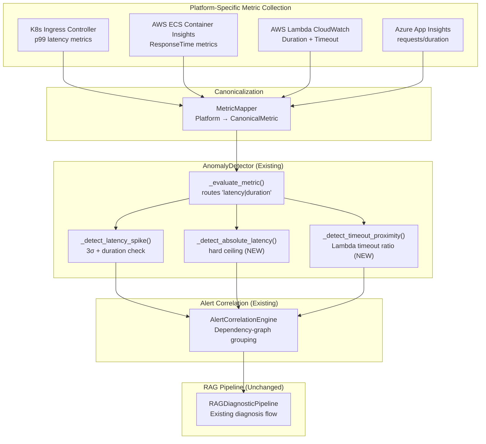

# Phase 2.5 — Slow Response Detection (Design Document)

**Status:** PROPOSED  
**Author:** SRE Agent Engineering Team  
**Last Updated:** 2026-03-17

---

## Context

The Autonomous SRE Agent already detects latency spikes via `AnomalyDetector._detect_latency_spike()` in `src/sre_agent/domain/detection/anomaly_detector.py`. This rule triggers when a metric containing `duration` or `latency` in its name exceeds Nσ from the rolling baseline for a configured duration (default: 3σ for 2 minutes). Cold-start suppression is already implemented for `ComputeMechanism.SERVERLESS` (Phase 1.5).

However, this detection is **platform-agnostic** — it operates on generic `CanonicalMetric` values without understanding **platform-specific response time semantics**:

| Gap | Impact |
|-----|--------|
| No **Kubernetes** Ingress/Gateway p99 metric collection | Relies on app-emitted latency only; misses infrastructure-level bottlenecks |
| No **AWS ECS** Container Insights latency metrics | Task-level response time degradation undetected |
| **AWS Lambda** duration-vs-timeout ratio not evaluated | A function at 90% of its timeout is a ticking bomb; current detection only fires after σ breach |
| No **Azure App Service** response time metric mapping | App Insights metrics not ingested into the canonical pipeline |
| No **absolute threshold** complement to statistical detection | A 3σ spike on a 2ms baseline (→ 8ms) is irrelevant; a 3σ spike on a 500ms baseline (→ 2000ms) is critical |

This phase introduces **platform-aware slow response detection** that maps platform-specific metrics into the existing pipeline and adds an absolute-threshold fallback alongside the existing σ-based algorithm.

---

## Goals

1. **Platform-specific metric collection** — Define canonical latency metric mappings for Kubernetes (Ingress controller p99), AWS ECS (Container Insights `ResponseTime`), AWS Lambda (Duration / Timeout ratio), and Azure App Service (Application Insights `requests/duration`).
2. **Hybrid detection algorithm** — Supplement the existing 3σ statistical detection with a configurable absolute-threshold ceiling (e.g., p99 > 2000ms = always alert, regardless of baseline).
3. **Lambda timeout proximity detection** — New detection rule: alert when function duration exceeds `timeout_proximity_percent` (default 80%) of the configured Lambda timeout.
4. **Integrate with existing alert correlation** — Slow response alerts use the existing `AlertCorrelationEngine` for incident grouping via the dependency graph.
5. **Maintain 60-second detection SLO** — As specified in `openspec/changes/autonomous-sre-agent/specs/performance-slos/spec.md` ("alert SHALL be generated within 60 seconds of the threshold being crossed").

## Non-Goals

1. **Trace-based latency detection** — Distributed tracing analysis (span-level bottleneck identification) is out of scope; Phase 3+ concern.
2. **Auto-tuning detection thresholds** — ML-based threshold optimization is a future item; this phase uses operator-configurable values.
3. **Remediation actions** — No new `CloudOperatorPort` methods. Slow response alerts feed into the existing RAG Diagnostic Pipeline which determines appropriate remediation.
4. **Synthetic monitoring / active probing** — External health checks are out of scope; detection uses only passively collected metrics.
5. **Modifying `RAGDiagnosticPipeline`** — Slow response alerts produce `AnomalyAlert` objects identical in shape to existing alerts; no pipeline changes needed.

---

## Architecture

### Detection Flow



### Component Integration

The design extends 3 existing components with minimal surface area:

| Component | Change Type | Description |
|-----------|-------------|-------------|
| `DetectionConfig` | **Extend** | Add 4 new fields for absolute threshold and timeout proximity |
| `AnomalyDetector` | **Extend** | Add 2 new detection methods (`_detect_absolute_latency`, `_detect_timeout_proximity`) |
| `AnomalyType` | **Extend** | Add `SLOW_RESPONSE` and `TIMEOUT_PROXIMITY` enum values |
| `MetricPollingAgent` | **Extend** | Add platform-specific latency metrics to the watchlist |
| `AlertCorrelationEngine` | **No change** | Slow response alerts use existing correlation |
| `RAGDiagnosticPipeline` | **No change** | Consumes `AnomalyAlert` as-is |

---

## Platform-Specific Considerations

### Kubernetes — Ingress Controller p99

**Metric source:** Prometheus scrape of Ingress controller (nginx-ingress, envoy, Istio Gateway)  
**Canonical mapping:**
- `nginx_ingress_controller_request_duration_seconds_bucket{le="..."}` → compute p99 via histogram quantile
- Mapped to `CanonicalMetric(name="http_request_duration_p99", ...)`

**Detection:** Uses existing `_detect_latency_spike()` (3σ + duration) plus new `_detect_absolute_latency()` (hardcoded ceiling).

**Consideration:** During HPA scale-up events, transient latency spikes are expected. The existing deployment suppression window (`suppression_window_seconds=30`) handles this. Per `AGENTS.md`, the SRE Agent (Priority 2) must respect Multi-Agent Lock Protocol — if a FinOps Agent holds a lock on an HPA resource, the SRE Agent will not attempt to scale. However, detection itself is passive (read-only) and never requires locks.

### AWS ECS — Container Insights

**Metric source:** CloudWatch Container Insights → `ResponseTime` (task-level)  
**Canonical mapping:**
- `ResponseTime` → `CanonicalMetric(name="ecs_response_time_ms", ...)`
- Already collected by `CloudWatchMetricsAdapter` if `ecs_response_time` is added to `METRIC_MAP`

**Detection:** Same hybrid (σ + absolute). Container Insights metrics arrive at ~60s intervals, within the 60s detection SLO.

### AWS Lambda — Duration vs. Timeout

**Metric source:** CloudWatch `Duration` (ms) + `GetFunctionConfiguration` timeout  
**Canonical mapping:**
- `Duration` → `CanonicalMetric(name="lambda_duration_ms", ...)`  (already in `METRIC_MAP`)
- `Timeout` fetched via `AWSResourceMetadataFetcher.fetch_lambda_context()` (already implemented, Phase 2.3)

**Detection — Timeout Proximity:** New rule `_detect_timeout_proximity()`:
- If `metric.value / function_timeout_ms >= config.timeout_proximity_percent / 100`, fire alert.
- **Cold-start suppression** reuses existing `cold_start_suppression_window_seconds` (Phase 1.5, AC-1.5.3).

**Edge case:** Cold starts inflate duration metrics. The existing suppression window (default 15s) filters these.

### Azure App Service — Application Insights

**Metric source:** Azure Monitor → `requests/duration` (avg response time)  
**Canonical mapping:**
- `requests/duration` → `CanonicalMetric(name="appservice_response_time_ms", ...)`
- Requires a new entry in a future `AzureMonitorMetricsAdapter` (or manual polling)

**Detection:** Same hybrid algorithm. No cold-start suppression needed (App Service has warm instances via Always On).

**Edge case:** During slot swaps (deployment), transient latency spikes are expected. Deployment correlation (`_check_deployment_correlation`) handles this.

---

## Detection Algorithm

### Hybrid Threshold Model

Phase 2.5 uses a **two-tier** detection model:

```
Tier 1: Statistical (existing) — σ-based
  IF deviation_sigma >= config.latency_sigma_threshold (default 3.0)
  AND sustained for >= config.latency_duration_minutes (default 2 min)
  THEN fire LATENCY_SPIKE alert

Tier 2: Absolute ceiling (new) — hard threshold
  IF current_value >= config.slow_response_absolute_threshold_ms (default 2000ms)
  AND sustained for >= config.slow_response_duration_seconds (default 60s)
  THEN fire SLOW_RESPONSE alert

Tier 3: Timeout proximity (Lambda only) — ratio-based
  IF current_value / timeout_ms >= config.timeout_proximity_percent (default 80%)
  THEN fire TIMEOUT_PROXIMITY alert (no duration requirement)
```

**Rationale:** Statistical detection (Tier 1) catches deviations from normal behavior but is blind to absolute SLA violations. A service with a 2ms baseline spiking to 8ms (4σ) may not matter, while a 500ms baseline spiking to 2000ms (3σ) is critical. The absolute threshold (Tier 2) catches user-facing SLA breaches directly. Timeout proximity (Tier 3) is unique to serverless — a function using 85% of its timeout is at high risk of cascading timeouts.

### False Positive Suppression

- **Deployment suppression:** Existing `_should_suppress()` filters transient spikes during deployments (AC-3.4.1, AC-3.4.2).
- **Cold-start suppression:** Existing Lambda suppression window (Phase 1.5).
- **HPA scale-out transients:** The 60s duration requirement for absolute threshold (Tier 2) filters most scale-out transients.
- **Multi-Agent Lock Protocol:** Detection is passive (read-only metrics). Only remediation actions require locks. No conflict with FinOps agents during detection.

---

## Alert Correlation

Slow response alerts integrate with the existing `AlertCorrelationEngine` via the standard `AnomalyAlert` interface:

1. Alert is created with `anomaly_type=AnomalyType.SLOW_RESPONSE` (or `LATENCY_SPIKE` for Tier 1)
2. `AlertCorrelationEngine.process_alert()` checks time-window + dependency-graph correlation
3. If a slow response alert on service A and an error rate surge on upstream service B occur within 120s and B→A exists in the dependency graph, they are grouped into a single `CorrelatedIncident`
4. Root cause heuristic identifies the deepest downstream service as the likely origin

No changes to `AlertCorrelationEngine` are required.

---

## Performance Impact

| Concern | Analysis |
|---------|----------|
| **Detection latency** | New rules add <1ms computation per metric eval. Dominated by baseline lookup (already optimized). Well within 60s SLO. |
| **Memory overhead** | New `_active_conditions` entries for absolute threshold tracking: ~100 bytes per service×metric. Negligible. |
| **Metric collection** | Platform-specific metrics are fetched by the existing `MetricPollingAgent` at configurable intervals (default 60s). No additional network overhead beyond adding metric names to the watchlist. |
| **Alert volume** | Absolute thresholds may produce alerts that statistical detection would not. The deployment suppression window and duration requirements mitigate alert storms. |

---

## Risks / Trade-offs

| Risk | Mitigation |
|------|------------|
| Absolute threshold too aggressive → false positives | Make configurable per-service via `set_service_sensitivity()` (AC-3.5.1). Default 2000ms is intentionally conservative. |
| Platform metric collection lag > 60s SLO | CloudWatch Container Insights publishes at ~60s intervals. Document that ECS detection latency is bounded by this interval. |
| Lambda timeout value unknown at detection time | Cache timeout via `AWSResourceMetadataFetcher` (already implemented). Fall back to statistical-only if timeout unavailable. |
| Azure App Service metrics not yet collected | Mark Azure as "requires `AzureMonitorMetricsAdapter`" — implementation deferred to Phase 2.6 if adapter not ready. Kubernetes/AWS coverage ships first. |

---

## References

- Anomaly Detector: `src/sre_agent/domain/detection/anomaly_detector.py`
- Detection Config: `src/sre_agent/domain/models/detection_config.py`
- Alert Correlation: `src/sre_agent/domain/detection/alert_correlation.py`
- Performance SLOs: `openspec/changes/autonomous-sre-agent/specs/performance-slos/spec.md`
- Phase 1.5 Cold-Start: `openspec/changes/phase-1-5-non-k8s-platforms/tasks.md` (Task 3.2)
- Multi-Agent Lock Protocol: `AGENTS.md`
